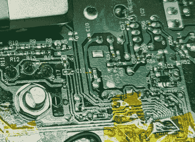

# 调幅/调频收音机获得蓝牙升级

> 原文：<https://hackaday.com/2021/02/02/am-fm-radio-gets-bluetooth-upgrade/>

对许多商业广播电台来说，它已经失去了它的光彩，留下了不可知数量的完全可用的 AM/FM 收音机处于休眠状态。但是他们不需要。正如[Dan Gebhardt]在他最近的黑客文章中所展示的，[将蓝牙音频接收器集成到便携式收音机中可能比你想象的更容易](http://thermal.blue/2020/12/23/adding-bluetooth-apt-x-low-latency-to-am-fm-radio.html)。

对于这个项目，[Dan]想要确保没有原始功能丢失。收音机仍然在 AM/FM 波段上工作，但现在只需轻轻一按开关，他就可以通过 Apt-X 低延迟蓝牙接收器收听他传来的音频。听起来链接足够快，他甚至可以用它作为无线扬声器来看电视，这对于引入明显延迟的廉价芯片组来说并不总是可能的。

Isolating the audio trace.

诀窍是追踪接收器 IC，这是一种硅实验室芯片[，类似于我们以前在一些 DIY 无线电项目中看到的芯片](https://hackaday.com/2020/02/12/all-band-radio-uses-arduino-and-si4730/)。看了一眼数据手册，他就知道是哪些引脚在传输音频信号，跟着这些引脚在电路板上走了一圈后，他找到了一个方便的地方，在它进入音量控制之前切断了线路。从那里只是一个 SPDT 滑动开关布线的问题，允许他选择哪个设备通过收音机的音频硬件。

当他把所有东西都拆开的时候，[丹]去掉了 Apt-X 原来的 300 mAh 脂肪袋，用一个连接到收音机电池盒的 DC-DC 转换器取而代之。这使得他可以使用同一套可充电镍氢电池运行所有硬件，并且大大提高了蓝牙接收器的运行时间。

至于将 Apt-X 物理集成到收音机外壳中，我们能说什么呢？[丹]承认这是有点粗糙，但后来的重点是永远不要进入选美比赛的东西。这对他的目的来说已经足够了，最终这才是最重要的。