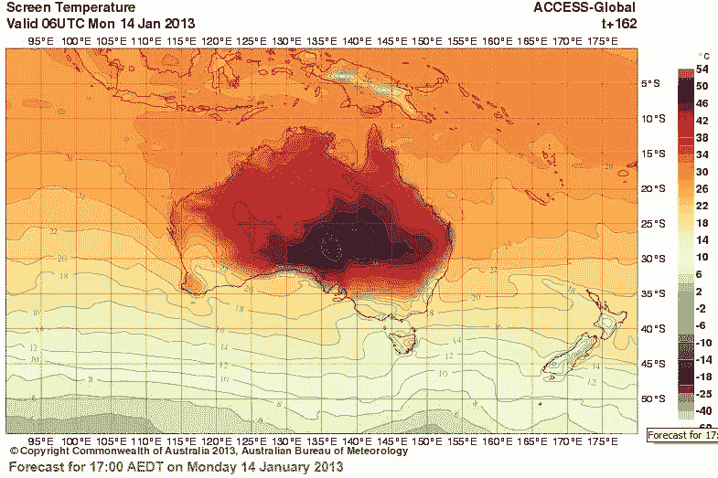
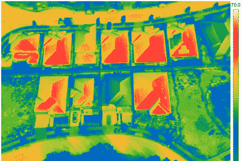
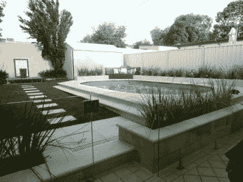

# 为世界各地城市的热危机设计解决方案

> 原文：<https://hackaday.com/2021/03/16/design-solutions-for-the-heat-crisis-in-cities-around-the-world/>

1999 年，Smash Mouth 推出了热门歌曲 *All Star，*称“我们滑的冰越来越薄，水越来越热，所以你还不如游泳。”从那以后，全球气温持续上升，看不到尽头。政治意愿无法带来任何重大变化，世界仍有望突破科学家提出的硬性限制。

因此，热浪变得更加频繁，强度更大，使许多弱势人群处于危险之中，每年造成数千人死亡。这个问题在城市更为严重，那里的建筑和道路比自然景观吸收更多的太阳热量。这被称为[热岛效应，](https://www.epa.gov/heatislands/learn-about-heat-islands)城市温度通常比周围的自然区域高几度。[这已经足够重要，以至于专家们担心一些城市可能在几十年内变得不适合居住。](https://www.abc.net.au/news/science/2021-01-24/heatwaves-sydney-uninhabitable-climate-change-urban-planning/12993580)显然，这对目前生活在上述城市的人来说非常不方便。问题有多严重，能做些什么？

## 热量必须转移到某个地方

In 2013, Australia added pink and purple colors to its heatmaps to mark ever-higher summer temperatures.

像澳大利亚悉尼这样的城市开始面临高达 50 摄氏度的夏季环境温度，在室外呆上几分钟都是无法忍受的。更糟糕的是，地表温度可能远远超过这个水平。

It’s often too hot to play outside in the summer in many cities, particularly as playground equipment can deliver painful burns.

沥青路和停车场可以达到 80 摄氏度，这使得在海滩上很难走回你的车。游乐场的表面温度甚至更高，可能会在大热天烫伤不知情的孩子。在如此高的温度下，像风扇这样简单的解决方案并没有多大作用；强大的空调是度过夏天的关键。如果家里没有合适的设备，许多人会选择在购物中心逗留更长时间。

然而，这不是一个可以简单地用空调赶走的问题。电网并不总是能够承受压力，特别是在发展中国家，能源使用的增加只会进一步推动碳排放到大气中，有可能加剧这一问题。相反，城市必须寻求用其他方式来解决过热问题。有两种主要的方法来解决这个问题——降低温度水平，让城市更好地应对过热。

## 通过建筑材料和绿色空间减少热量

Traditional dark-coloured roofs absorb a lot of heat from the sun. Modern alternatives include lighter colors and special treatments to reduce heat absorption.

降低温度水平可以用简单的技术来完成，但是要达到大的效果是困难的。用颜色较浅或热反射性更强的材料覆盖屋顶，可以减少建筑物吸收的热量，从而减少向周围环境辐射的热量。加州已经在这方面采取了措施，通过其第 24 条法规，强制规定了新屋顶和翻新的最低要求。这有一个额外的好处，那就是保持单个建筑本身的凉爽，也减少了空调的负荷。研发涂层来减少道路吸收的热量的研究正在进行中。其他缓解措施包括增加城市绿地。树木和草可以对周围环境产生降温效果，但是，它们必须得到适当的灌溉。在许多现代城市，空间非常宝贵，建筑师们正在尝试用植物覆盖“绿色”建筑。然而，维护可能会很困难，[而且植物可能会有虫害的风险。](https://theconversation.com/green-buildings-can-bring-fresh-air-to-design-but-they-can-also-bring-pests-147838)这些措施都很有用，但模型显示效果有限——仅仅降低了几度的环境温度。表面处理和绿化可能足以防止你跑出去取邮件时烫伤脚，但这解决不了更大的问题。

## 为更热的条件设计

During week-long heatwaves, pools can become useless as a way to cool off as the water acts as a heat sink, sitting at over 34 degrees even at night.

拿出更大的枪包括适应城市在更高的温度下更宜居。这可能涉及一系列广泛的措施。它可以小到在火车站建造遮荫棚来遮挡阳光，也可以大到在地下建造住宅和商业建筑来保持凉爽。

这在澳大利亚的库伯佩迪镇是有先例的。1916 年作为一个蛋白石矿镇建立，它经常面临超过 45°C(113°F)的温度。随着蛋白石繁荣的消退，许多以前的地下矿变成了住宅、旅馆和商店。地下建筑可以比外面的环境温度低 10-20 度，这是一个很大的收获，但代价是很少甚至没有自然光和更复杂的建筑。期望将现有的整个城市沉入地下是不现实的，但是也有更简单的方法。安装高效的空调和良好的隔热材料可以在一定程度上使现有建筑更适合居住，尽管这是以更高的能源成本为代价的。

不管采取什么措施，没有一个是便宜的或银弹。一些城市将迎接挑战，而另一些城市将随着居民在更适宜居住的空间寻求舒适而出现人口外流。人类以前曾放弃城市进行破坏，这很可能会再次发生——但这次是因为一个全新的原因。