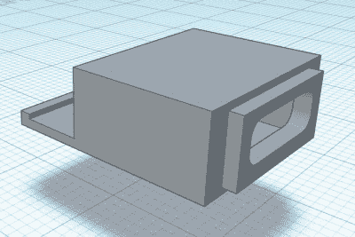

# ThinkPad 上的 USB-C 充电，一步一步来

> 原文：<https://hackaday.com/2021/01/30/usb-c-charging-on-your-thinkpad-one-step-at-a-time/>

黑客喜欢他们的 ThinkPads。它们很容易操作，有很好的文档记录，并且提供了大量的升级潜力。对于更大胆的，也有一个广泛的社区开发的修改可用。例如，[【Berry Berry Sneaky】最近整理了一份关于将常见的 ThinkPad 矩形充电端口(也用于 ThinkBooks 和其他联想机器上)更换为 USB-C 电源传输的分步指南](https://www.reddit.com/r/thinkpad/comments/l5g9cj/convert_a_lenovo_laptop_with_square_power_input/)。

 现在要明确的是，这并不是一个新概念。但是在[免费分享 3D 打印适配器](https://www.thingiverse.com/thing:4737868)的 STL，提供完整的零件清单，并提供如何将所有零件组装在一起的清晰说明之间，【贝瑞贝瑞鬼祟】已经做了一件了不起的工作，使这种特殊的修改尽可能地平易近人。对于一个普通的 PDC004 功率传输“触发”模块和一点 PETG 灯丝的成本，你可以在闪亮的新 USB-C 充电器的列表中添加另一个设备。

虽然并非绝对必要，但[Berry Berry Sneaky]建议在打开机箱之前，为自己的特定机器准备一根替换的 DC 输入电缆。这将让你提前组装好所有的东西，从而加快安装速度。它还可以让你保持原来的矩形电源插孔完好无损，这样如果出现问题或者你决定整个[统一充电的事情不是你所希望的](https://hackaday.com/2020/06/23/usb-c-is-taking-over-when-exactly/)时，你可以把它换回来。

不是 ThinkPad 大军的一员？别担心。我们已经看到人们对使用这些可配置的 USB-C 触发模块将各种设备升级到新的电力传输标准非常感兴趣，或者有时为他们的旧移动设备组装定制电池充电器。