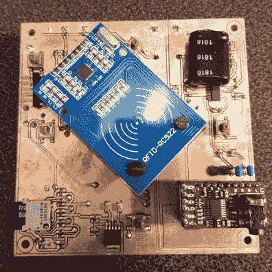
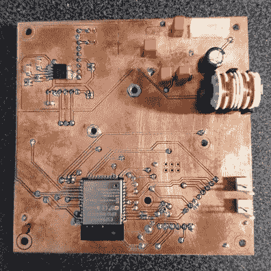

# 年轻人的 ESP32 点唱机使用 RFID 来排列歌曲

> 原文：<https://hackaday.com/2021/02/02/youngsters-esp32-jukebox-uses-rfid-to-queue-tunes/>

尽管今天的孩子有惊人的本领来弄清楚现代手机和平板电脑，但为小手提供一个简单的物理用户界面还是有好处的。为此， [[Martin Hierholzer]组装了一个异想天开的点唱机，他两岁的女儿可以用它来听她最喜欢的歌曲。只有几个简单的按钮，没有显示屏可供阅读，并且能够使用嵌入 3D 打印人物的 RFID 标签来停止和开始歌曲，对于刚刚掌握与技术互动的微小人类来说，这是一个完美的界面。](https://github.com/mhier/LauraBox)

虽然树莓派可能是这个项目更明显的选择，但[Martin]决定走 ESP32 路线以提高能效。流行的微控制器功能强大，足以播放 MP3，其集成的 WiFi 连接允许播放器偶尔从网络下载新曲目。他添加了一个微型 SD 插槽来提供一些大容量存储，一个 PCM5102 I2S DAC 和一个 PAM8403 放大器来处理音频方面的事情，以及一个 MFRC522 RFID 接收器，可以拾取放置在播放器顶部的标签。电源由从 USB 电池组中回收的部件提供，一切都装在定制的 PCB 上。

    

ESP32 相对较低的功率要求意味着点唱机在活跃使用时可以让聚会持续许多小时(甚至几天)。当 RFID 令牌被移除并且没有歌曲可播放时，一些聪明的编码将芯片踢入低功率模式，以大大延长播放器的待机时间。[Martin]说它可以休眠几个月而无需充电，考虑到我们之前在 ESP32 上看到的一些令人印象深刻的电池消耗壮举，我们对此并不怀疑。

即使你家里没有年轻的音乐爱好者，马丁为这个项目收集的文档也绝对值得一看。无论是他如何配置服务器端以向播放器推送歌曲和固件更新，他如何争论 ESP32 的超低功耗协处理器(ULP)，还是用于生产迷人外壳的木工技巧，你都肯定会学到一两个技巧。

黑客和创造者的孩子似乎总是得到最酷的东西，我们期待看到马丁接下来会有什么。毕竟，孩子们长得很快，很快他的女儿就要去[了，需要一些新的东西来娱乐她](https://hackaday.com/2013/07/17/make-your-own-electronic-childrens-toys/)。