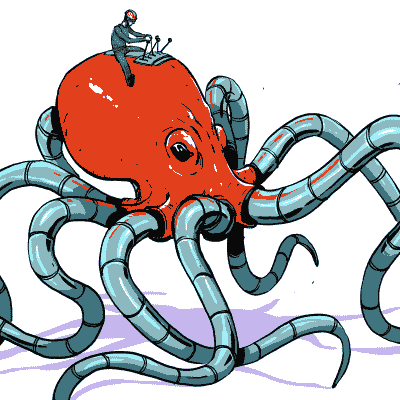

# 算算，还是试一试？

> 原文：<https://hackaday.com/2021/01/30/run-the-math-or-try-it-out/>

本周，我在读约书亚·瓦斯奎兹关于绞盘方程式的精彩文章。这是对一个方程的简短而实用的介绍，除非你在做一些*非常*奇怪的事情，否则它涵盖了你在设计必须转弯或摆动的绳索或缆绳时需要知道的关于摩擦力的一切。想象一下自行车拉索，或者在约书亚的例子中，一个可移动的龙头牙套。事实证明，这是有数学依据的！

 基本上，你越是在静止的东西上缠绕一根缆绳或绳子，你需要处理的摩擦就越多。去年春天，当我和儿子用绳子随意爬树时，我很好地利用了这一点。事实证明，在相当有摩擦的树皮上缠绕四五圈攀岩绳就足以支撑一个成年人的重量，比如说，绳子的另一端除了绳子本身的重量之外，什么也支撑不住。我还在最近的一个墙壁绘图仪机器人设计中使用了这种效果，它使用简单的电缆编织代替了无处不在的同步带。

在这些情况下，我都没有用我的袖珍计算器算出绞盘方程式:四圈几乎总是足够了。但是通过钻研数学和物理，我获得了更多的洞察力。基本上，摩擦力是一个指数，角度乘以指数中电缆的摩擦系数。那又怎样？所以，当你攀爬时，下一个转弯会成倍地增加重量。树皮的紧实度也同样重要。你可能从经验中直觉地知道这一点，但是有数字是很好的。

更好的是，通过计算得到的洞察力是*不重要的。树的半径下降，所以你可以选择一个胖树枝或瘦树枝，只要它能承受你的重量！)脂肪分支弯曲不太剧烈，这使你每厘米的摩擦力更小，但每圈也有更多的厘米，它们相互抵消。所以，选择一棵更胖、更粗糙的树，而不是一棵更瘦、更光滑的树。我从来没想过！*

在 Hackaday，我们是通过实践进行粗略学习的超级粉丝。这能行吗？试试吧！(如果它不应该，但它做到了，这是一个黑客。)但了解基础数学和物理也有很多好处。许多人认为数学就是处理数字，但我发现对你的问题中哪些变量重要，哪些根本不重要的更深层次的直觉更加有用。在良好的物理/数学直觉的指导下，边做边学是两全其美的事情。它可以减少你的薄荷 HP-48G 的磨损。

This article is part of the Hackaday.com newsletter, delivered every seven days for each of the last 200+ weeks. It also includes our favorite articles from the last seven days that you can see on [the web version of the newsletter](https://mailchi.mp/hackaday.com/hackaday-newsletter-649368). Want this type of article to hit your inbox every Friday morning? [You should sign up](http://eepurl.com/gTMxQf)!