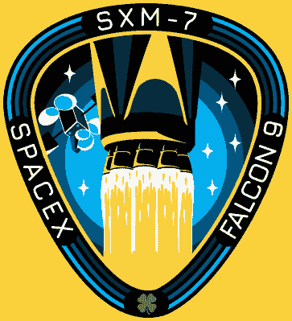
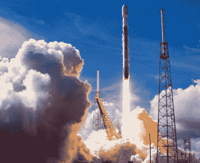
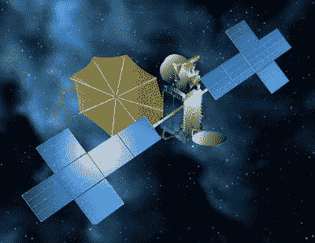

# 天狼星 XM 卫星失败提醒人们太空是有风险的(卫星保险是一件事)

> 原文：<https://hackaday.com/2021/02/01/sirius-xm-satellite-failure-a-reminder-that-space-is-risky-and-that-satellite-insurance-is-a-thing/>

很容易想象，一旦航天器离开地球大气层并处于稳定的轨道上，任务中最危险的阶段就结束了。毕竟，那是我们集体关闭直播流，将注意力转回地球事务的时候。一旦发射的火焰和愤怒结束，所有的兴奋都结束了。从那时起，它只是在真空的太空中默默地航行了几年。最坏的情况会是什么？

 不幸的是，卫星广播提供商 Sirius XM 刚刚收到一个严厉的提醒，在你摆脱地球的粗暴束缚后，仍有许多事情可能出错。尽管 SpaceX 猎鹰 9 号在 2020 年 12 月初进行了完美的发射，据报道，它平安无事地到达了地球上方约 35，786 公里(22，236 英里)的地球静止轨道上的指定位置，但他们全新的 SXM 7 号广播卫星似乎遇到了严重的麻烦。

SXM 7 号的主承包商 Maxar 技术公司表示，他们目前正试图确定这颗 7000 公斤重的卫星出了什么问题。在一份声明中，这家总部位于科罗拉多州的航空航天公司声称，他们专注于“安全地完成卫星的调试并优化其性能。”但是 Sirius XM 在 1 月 27 日提交给美国证券交易委员会的文件中使用的语言明显更加悲观。没有提到让 SXM-7 上线，相反，该公司明确表示，他们现有的卫星舰队将能够维持对客户的服务，直到可以发射替代品。

那么发生了什么，更重要的是，SXM 7 号还有希望吗？两家公司都没有公布任何具体细节，考虑到这笔资金的数额，公众很可能在一段时间内无法了解整个故事。但是我们可以根据我们所知道的进行一些推理，并对事情的发展做出一些预测。

## 故事到此为止

我们知道发射顺利进行。首先，Sirius XM 已经明确表示，他们不会把 SpaceX 牵扯进来。此外，按照商业发射提供商的惯例，整个任务都是现场直播的。如果整流罩或有效载荷分离过程中出现某种问题，可能会对 SXM 7 号造成物理损坏，全世界都会看到。

SXM-7 heading to space on December 13th

我们还知道，SXM 7 号在与猎鹰 9 号上面级分离后运行正常。助推器将卫星送入地球静止转移轨道，但它是航天器自己的机载推进系统负责运载它走完剩下的路。如果卫星完全失败，或者对地面控制人员没有反应，它将永远不会到达预定轨道。

飞船本身呢？顾名思义，SXM 7 号是该类型的第七颗卫星，所有这些卫星都是基于 Maxar 的模块化 SSL-1300 总线的某种排列。这是一个非常受欢迎的平台，自 20 世纪 80 年代末推出以来，已成为近 150 颗当前或计划中的通信和气象卫星的基础。其中，只有少数经历过重大系统故障。简而言之，这是一个成熟的、为人熟知的航天器。系统性问题虽然不是不可能，但似乎不太可能。

## 到达时死亡

发射后不久，天狼星 XM 发布了一份新闻稿，宣布 SXM 7 号安全进入轨道，运行正常。然后，它开始了为期两周的地球静止轨道之旅，最近在 1 月 14 日，[Maxar 的博客上的一篇文章说，航天器工作正常](https://blog.maxar.com/space-infrastructure/2021/your-favorite-siriusxm-channel-brought-to-you-from-space)，很快将投入使用。但这从未发生过。

Rendering of SXM-7 in orbit and fully deployed.

在这一点上，我们不能肯定地说，为什么 SXM-7 在游戏中失败得这么晚。但是，如果地面控制人员控制了飞船，并能够操纵它进入轨道，那么有理由认为故障与它的商业应用能力有关。

一些人认为，该卫星的大型不可折叠反射器未能打开，这对其向消费者 XM 无线电接收器使用的微型天线传送流媒体音频的能力至关重要。或者潜在的问题是在卫星的一个强大的无线电中；要么 SXM 7 号无法接收天狼星 XM 上传的音频广播，要么它无法将其传回地球。

1 月 27 日，公司发言人明确表示，尽管出现了故障，天狼星 XM 仍然控制着卫星，并可以操纵它。这其实是一个很重要的细节。首先，它证实了这并不是一次彻底的失败，飞船仍然完好无损。但这也意味着，如果卫星无法上线，它将能够将自己移入“墓地轨道”。由于只有有限数量的地球同步轨道可用，因此必须及时移除不起作用的卫星。虽然最近已经展示了通过回收车[重新定位失效通信卫星的能力](https://hackaday.com/2020/03/17/northrop-grumman-tests-space-tow-truck/)，但这是一项昂贵而复杂的操作，应该尽可能避免。

## 承保的损失

虽然 SXM-7 的失败肯定会让 Sirius XM 公司非常失望，但该公司操作卫星舰队的务实方法应该会使它不会成为一个暂时的挫折。他们的主要 XM-3 和 XM-4 卫星仍然处于良好的健康状态，如果需要，轨道备份随时准备接管。另一颗卫星 SXM 8 号也将于今年晚些时候加入舰队。但是除了这些实际的考虑之外，该公司也小心翼翼地在财务上保护自己。

在美国证券交易委员会的文件中，Sirius XM 透露，他们为 SXM 7 号购买了一份 2.25 亿美元的保险，不仅涵盖了发射，还涵盖了商业运营的第一年。虽然对于许多任务来说，对发射期间被毁的飞行器进行补偿就足够了，但这个案例是一个完美的例子，说明了为什么在商业风险的长期成功有可能受到威胁的情况下，将覆盖范围延长到航天器的使用寿命是重要的。

虽然潜在的保险赔付在短期内对 Sirius XM 的股东来说可能是个好消息，但它最终会加剧一个已经存在多年的全行业问题。由于可以收取保费的投保人相对有限，为航天器投保是一项异常冒险的任务。例如，2019 年 7 月阿拉伯联合酋长国一颗军用卫星的损失导致的 4.1 亿多美元的赔付抵消了整个行业当年的保费。

传统上，这不是一个很大的问题，但随着发射变得更便宜和更频繁，保险公司被索赔的可能性增加了。从逻辑上讲，这应该导致保费上涨，但由于航天器保险不是强制性的，如果保险公司不小心的话，他们可能会把自己定价在市场之外。看看新客户的涌入是否能在未来几十年平衡这一等式，或者目前形式的太空保险概念是否最终只不过是太空商业羽翼未丰时期的一个有趣的历史脚注，这将是有趣的。