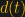
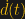
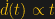
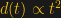
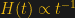
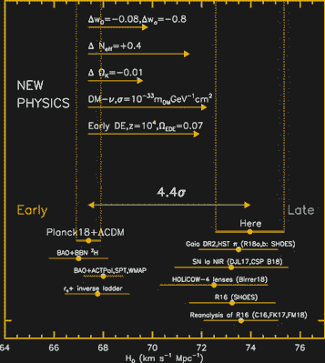

# 宇宙膨胀的速度有多快？哈勃常数的两个值之谜

> 原文：<https://hackaday.com/2021/03/25/how-fast-is-the-universe-expanding-the-riddle-of-two-values-for-the-hubble-constant/>

在过去的几十年里，我们对宇宙的理解取得了巨大的进步。不久前，“精确天文学”被认为是一个矛盾的说法。如今，地球上的卫星实验和强大的望远镜能够以惊人的精度测量我们宇宙的特性。例如，我们知道宇宙年龄的不确定性只有 0.3%，尽管我们仍然不知道暗物质或暗能量的来源，但我们已经以优于 1%的精度确定了它们的丰度。

然而，有一个值天文学家很难确定:我们的宇宙膨胀的速度有多快。或者，更准确地说，天文学家使用了多种方法来估算哈勃常数，而不同的方法非常接近两个不同的值！这显然不可能是真的，但还没有人想出如何调和这些结果，进一步的观察只是提高了精确度，加深了冲突。很可能我们需要新的天文学或新的物理学来解决这个难题。

## 膨胀宇宙的发现

20 世纪 20 年代，埃德温·哈勃利用威尔逊山天文台新建的望远镜研究被称为星云的模糊物体。当时，天文学家正在争论这些星云是我们银河系内的恒星云，还是完全不同的星系。哈勃在这些星云中发现了亮度缓慢减弱和消失的恒星。这些被称为造父变星，Henrietta Levitt 以前研究过，他表明恒星的内在亮度和它的变化周期之间有密切的关系。这意味着造父变星可以被用作所谓的标准烛光，标准烛光指的是绝对亮度已知的物体。由于一个物体的亮度随着距离的增加而降低有一个简单的关系，哈勃能够通过比较它们的表观亮度和内在亮度来计算造父变星的距离。他指出造父星并不位于我们的星系内，星云实际上是遥远的星系。

哈勃还通过观察多普勒效应引起的谱线红移来测量这些遥远星系远离我们的速度。他发现星系离我们越远，它离我们越远，这可以用一个简单的线性关系来描述。

参数 H [0] 就是所谓的哈勃常数。后来，比利时牧师和物理学家乔治·勒梅特意识到哈勃测量的速度-距离关系是宇宙膨胀的证据。由于空间本身的膨胀导致其他星系远离我们，我们不在任何特权位置，但在宇宙中的任何其他地方都可以测量到相同的影响。一种有时通过在气球上画点来说明的效果，当气球膨胀时，点以取决于它们的距离的速度彼此远离。最好不要认为宇宙学红移是由真实速度引起的，因为上面等式中的参数`v`很容易超过光速。

由于天文距离通常以兆帕斯卡秒(Mpc)来度量，相当于 326 万光年，所以哈勃常数用(千米/秒)/兆帕斯卡来表示。H [0] 的值约为 70 (km/s)/Mpc 也可以表示为 7%/Gyr，意思是十亿年后两个物体之间的距离会增加 7%。

## 哈勃常数不是常数

尽管我们提到了哈勃常数，但这有点用词不当，因为它的值是随着时间变化的。我们称之为哈勃参数 H(t ),而 H [0] 就是今天 H(t)的值。我们现在知道宇宙正在加速膨胀，那么这对哈勃常数意味着什么呢？有人可能会认为它会变大，但实际上它正在减少，这可以用一点数学来显示。我们可以用两点之间的距离及其时间导数来表示哈勃参数:

如果我们有一个加速膨胀，我们得到，从而得到。这意味着 H(t)随时间而减小。任何星系的速度都会随着时间的推移而增加，因为它离得更远。然而，如果我们观察一个固定的距离，经过这个点的不同星系的速度会随着时间的推移而降低。

我们怎么知道我们生活在一个加速的宇宙中？证据来自于 20 世纪 90 年代末对遥远超新星红移的测量。与造父变星类似，1a 型超新星可以用作标准烛光(即它们的距离可以从它们的表观亮度推导出来)。由于爆炸的恒星通常是非常明亮的物体，所以从很远的地方就能看到它们。

观察非常遥远的超新星也意味着观察遥远的过去，所以当哈勃常数改变时，当来自超新星的光开始向我们传播时，它会有不同的值。当绘制超新星的距离与红移的关系图时，我们会看到高红移偏离了哈勃-勒梅特定律的线性关系。在 20 世纪 90 年代，天文学家期望看到减速宇宙的证据，因为他们认为由于物质施加的引力，膨胀应该放缓。令人惊讶的是，他们发现了加速膨胀，这是另一种形式的物质或能量相斥的证据。

爱因斯坦最初在他的广义相对论方程中引入了这样一种力，称为宇宙常数，用希腊字母λ(λ)表示。具有讽刺意味的是，它被引入是为了产生一个静态的宇宙，所以当哈勃发现宇宙膨胀时，爱因斯坦放弃了这个想法(“[我最大的错误](https://physicstoday.scitation.org/do/10.1063/PT.6.3.20181030a/full/)”)。后来，暗能量一词被用来指代加速膨胀的力量。

## 大爆炸的回声

我们怎么知道其他恒星离我们有多远？天文学家构建了一个宇宙距离阶梯，使用不同的方法连续增加距离测量。在梯子的底部是附近的恒星，它们的距离可以通过测量[视差](https://en.wikipedia.org/wiki/Parallax)直接确定——由于观察者视角的变化，物体位置的明显移动。这个测量结果可以用来校准造父变星的距离，然后用来校准到 1a 型超新星的距离，1a 型超新星的亮度[取决于其他物理属性](https://astronomy.swin.edu.au/cosmos/C/Cepheid+Variable+Stars)。

除了上面描述的距离阶梯测量，还有其他方法来确定哈勃常数。对我们宇宙性质的最精确测量之一来自对宇宙微波背景辐射(CMB)的观测。射电天文学家彭齐亚斯和威尔逊在排除了他们看到的信号是由筑巢在天线中的鸽子引起的之后，偶然发现了 CMB。这种无处不在的电磁辐射源在微波区域达到峰值，产生于大爆炸后约 38 万年。在此之前，宇宙是一个不透明的等离子体，因为光会不断地从自由电子和质子上反弹回来。一旦等离子体冷却到大约 3000K，电子与质子结合形成中性氢原子，光可以自由传播，因此宇宙变得透明。

这种由于宇宙膨胀而红移的光现在可以被观测为 CMB。由于 CMB 光子在最后一次散射后可以自由移动，它们包含了宇宙大爆炸后 38 万年的快照。通过对 CMB 的测量和与宇宙学模型的比较，就有可能提取出重要的参数，比如前面提到的暗物质和暗能量的数量，或者哈勃常数。

## 宇宙膨胀的速度是否超过了应有的速度？

Beginning at left, astronomers use the NASA/ESA Hubble Space Telescope to measure the distances to Cepheid variables by their parallax. Once the Cepheids are calibrated, astronomers move beyond our Milky Way to nearby galaxies (shown at centre). They look for Cepheid stars in galaxies that recently hosted Type Ia supernovae and use the Cepheids to measure the luminosity of the supernovae. They then look for supernovae in galaxies located even farther away.
Credit: [NASA, ESA, A. Feild (STScI), and A. Riess (STScI/JHU)](https://esahubble.oimg/opo1812a/), CC BY 4.0

目前，对 CMB 最精确的测量是由普朗克卫星进行的。它的观测结果与当前的宇宙学标准模型一致，即λCDM 模型，其中λ代表宇宙常数形式的暗能量，CDM 代表冷暗物质。由[普朗克测量](https://www.aanda.org/articles/aa/full_html/2020/09/aa33910-18/aa33910-18.html)得出的哈勃常数为 H[0]=(67.4±0.5)km/s/Mpc。

然而，距离阶梯测量给出的值要高 10%左右。在这种情况下，最精确的值是由 SH0ES 团队得出的，他们使用银河系和大麦哲伦星云中邻近造父变星的已知距离来校准河外 1a 型超新星的距离，如图所示。与普朗克测量值[相比，它们得到的 H 值[0]=(74.03±1.42)km/s/Mpc 要高得多。这两个值之间的张力为 4.4 个标准偏差，这相当于由于偶然因素导致的<概率为 0.001%。](https://iopscience.iop.org/article/10.3847/1538-4357/ab1422/meta)

The difference between distance ladder-based measurements of H0 and the value derived by CMB and BAO measurements. The arrows indicate how the value of H0 would be altered by new physics.
Credit: [A. G. Riess, et al.](https://iopscience.iop.org/article/10.3847/1538-4357/ab1422/meta)

当然，许多人试图将这种差异归因于两个实验中任何未解释的错误，但都没有成功。此外，差异不仅存在于这两个实验之间，还存在其他距离阶梯测量，它们都指向更高的 H [0] 值。

让整个情况更加奇怪的是，普朗克[测量的 CMB 最近被阿塔卡马宇宙学望远镜](https://arxiv.org/abs/2007.07289)所证实，该望远镜测量的哈勃常数与普朗克的值一致。此外，CMB 的测量还得到了所谓的[重子声波振荡(BAO](https://en.wikipedia.org/wiki/Baryon_acoustic_oscillations) )结合其他天文数据的观测支持。一般来说，人们可以观察到从早期宇宙(CMB，BAO)得出的 *H* [0] 的值低于从距离阶梯测量得到的值的趋势，距离阶梯测量使用具有低得多的红移的物体，从而捕捉到宇宙的更近的状态。

重要的一点是，CMB 测量是依赖于模型的，这意味着 *H* [0] 是在 CDM 模型描述我们的宇宙的假设下得出的。因此，对这种差异的一个令人兴奋的解释将是超越当前宇宙学标准模型的新物理学。在对 H [0] 差异的许多新的物理学解释中，有一种观点认为暗能量不仅仅是一个常数，而且是与时间相关的。其他理论包括相互作用的暗物质或新的相对论粒子。然而，从图中可以看出，这些想法都不能完全解决哈勃的紧张。

## 测量宇宙膨胀的新技术

其他确定哈勃常数的技术包括测量引力透镜的时间延迟。[强引力透镜](https://hackaday.com/2020/04/21/searching-for-alien-life-with-the-sun-as-gravitational-telescope/)可以为位于它们后面的物体创建多个图像。由于图像具有不同的光路，所以这些图像到达时也存在时间延迟，这可以在物体亮度变化时测量。通过对透镜的引力势进行建模，并知道透镜和源的红移，就有可能从这种时间延迟测量中提取哈勃常数。哈勃望远镜( *H*

将来，对哈勃常数的完全独立的测量可能会让这个谜团更加清晰。其中之一就是使用引力波的“标准警报器”。在这种情况下，绝对距离可以直接从引力波测量中确定，而红移可以从电磁辐射的同时观测中确定。使用引力波的优点是可以直接确定源的绝对距离，而无需任何中间距离测量。因此，我们在宇宙距离阶梯中可能存在的任何系统误差都不会影响结果。

该方法用于从引力波事件 [GW170817](https://www.nature.com/articles/nature24471) 和 [GW190521](https://arxiv.org/abs/2009.14199) 中提取哈勃常数，然而，由于误差棒较大，结果与 CMB 和距离梯测量结果一致。幸运的是，随着越来越多的引力波事件被探测到，这种不确定性将会缩小，因此在未来几年，我们很可能会倾向于高或低的 H [0] 值。

一方面，哈伯张力是我们对宇宙的理解中令人讨厌的不一致之处，而我们对宇宙的理解已经得到很好的确认。另一方面，这可能是对新物理学令人兴奋的一瞥。因此，让我们保持希望，未来的观察将解决这个难题，并导致新的启示。