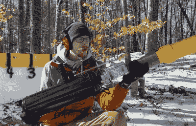

# 扭曲的茶叶发射器以每小时 104 英里的速度刷新

> 原文：<https://hackaday.com/2021/02/04/twisted-tea-launcher-refreshes-at-104-mph/>

几周前，一段视频在社交媒体上疯传，描述了一个相当令人讨厌的人收到了一个旁观者提供的社会规范的“冲击提醒”，这个旁观者手持一罐扭曲的茶。这个视频成为了许多迷因的灵感，但也许没有比这个空气炮更复杂的技术了，这个空气炮由[Greg Bejtlich]建造，以每小时超过 100 英里的速度发射 24 盎司的硬冰茶。

It’s all fun and games until somebody brings out the weaponized bead seater.

从技术上讲，我们现在看到的是两种不同的黑客。第一个是气动发射器，使用低成本的易贝轮胎胎圈座组装而成。这些工具旨在向轮胎中释放大量空气，以便轮胎可以正确地安装在轮辋上，但只需从五金店购买几根 PVC 管，就可以将其变成即兴的研钵。它甚至有一个方便的扳机和一个手柄来帮助控制后坐力。尽管正如你在休息后的视频中看到的，它仍然对[Greg]来说有点太有活力了。

对于炮弹，[格雷格]已经 3D 打印了一个鼻锥和尾翼，可以卡在 24 盎司的罐子上，希望使它们在空气动力学上更加稳定。慢动作视频似乎表明他们不是非常有效，但他们肯定看起来令人印象深刻。在罐子离开枪口后展开的弹簧加载控制表面可能是答案，尽管在某些时候你必须问自己，为了一个互联网迷因，你愿意走多远。

不言而喻，你绝对不应该尝试在你的后院点燃罐装酒精冰茶。但是发射器本身可能对天线放样或投掷土豆有用。

 [https://www.youtube.com/embed/dFopqMB3g90?version=3&rel=1&showsearch=0&showinfo=1&iv_load_policy=1&fs=1&hl=en-US&autohide=2&wmode=transparent](https://www.youtube.com/embed/dFopqMB3g90?version=3&rel=1&showsearch=0&showinfo=1&iv_load_policy=1&fs=1&hl=en-US&autohide=2&wmode=transparent)

感谢埃里克的提示。]