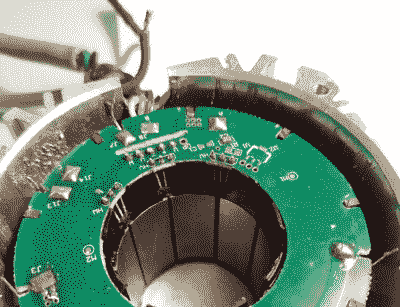

# 电机控制器逆向工程释放烟雾

> 原文：<https://hackaday.com/2021/02/05/motor-controller-reverse-engineering-releases-smoke/>

它可能是为缝纫机设计的，但[Haris Andrianakis]发现他的进口 DC 有刷电机足以应对为他的迷你车床提供动力的挑战。当然，总有改进的空间，所以[他开始对电机控制器](http://www.candrian.gr/index.php/reverse-engineering-sewing-servo-motor-controller/)进行逆向工程，以实现他心中的一些调整。不幸的是，事情发生了意想不到的变化，当他的 AVR 编程器插入电路板的 ISP 插座时，不仅释放出可怕的魔法烟雾，而且实际上触发了断路器，使他的工作台陷入黑暗。

Studying how the Hall-effect sensors in the motor are wired.

仔细检查后，发现电路板的高压端与其数字逻辑之间没有隔离。当[哈里斯]通过编程器将他的计算机连接到它时，来自控制器整流器的 330 VDC 通过 USB 总线短路，触发了漏电断路器(ELCB)。好消息是，他的电脑经受住了考验，甚至主板本身似乎也完好无损。但是对于他试图与之交互的微控制器来说，这种冲击肯定太大了，因为控制器不再起作用了。

现在完全投入，[哈里斯]开始一部分一部分地规划控制器的其余部分。在他的博客文章中，他直观地屏蔽了 PCB 的各个区域，以便读者更容易理解原理图与物理电路板的关系。这是一个很好的技巧，在你自己的逆向工程冒险中值得记住。

最后，[Haris]似乎很好地掌握了棋盘上大多数组件的意图。这很好，因为现在让它再次工作意味着更换 MCU 并从头开始编写新的固件。或者，也许他会从这个控制器中吸取经验教训，然后[组装他自己的定制硬件](https://hackaday.com/2021/01/06/custom-controller-makes-turbomolecular-pump-suck/)。不管是哪种情况，我们都会关注他关于这个话题的下一篇文章。