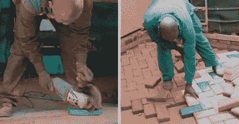

# 这些塑料铺路材料是地球的救星

> 原文：<https://hackaday.com/2021/02/07/these-plastic-pavers-are-earth-savers/>

塑料垃圾无处不在，塑料产品的需求和生产似乎都没有尽头。那么，现在难道不是尝试将塑料工业的所有废物都善加利用的时候了吗？肯尼亚的材料工程师 Nzambi Matee 是这样认为的。她厌倦了看到塑料在内罗毕的街道上乱扔，她看到了一个同时解决两个问题的机会——清理街道并用塑料铺路。

[【Nzambi】三年前，她辞去了石油行业数据分析师的工作，用她所有的积蓄为讨厌的塑料问题](https://www.unenvironment.org/youngchampions/news/story/building-blocks-greener-nairobi)寻求解决方案。她在母亲的后院建了一个实验室，并开始用塑料和沙子做实验，将它们融合在一起制成积木。

经过大约一年的反复试验，她发现了哪些塑料有用，哪些没用。然后，她发明了一种机器来生产沙塑糊，并将其冲压成坚固的铺路砖。她的公司 Gjenge Makers 从工厂免费获得大部分塑料，否则工厂将不得不付费处理这些塑料。与混凝土路面砖相比，砖块坚固、轻质，几乎坚不可摧。在休息后的视频中，有一个镜头是[Nzambi]在地上扣球以展示其韧性。

现在，她的公司每天生产大约 1500 台这样的铺路机。[Nzambi]和她的团队也计划开始制造积木。这种材料的熔点高于 350 摄氏度，似乎非常适合这一用途。

想做的不仅仅是回收塑料，但不知道如何做？你可以从把塑料瓶变成绳子开始，然后 T2 用绳子制作扫帚和刷子之类的东西。

 [https://www.youtube.com/embed/QbZKP4UAtL8?version=3&rel=1&showsearch=0&showinfo=1&iv_load_policy=1&fs=1&hl=en-US&autohide=2&wmode=transparent](https://www.youtube.com/embed/QbZKP4UAtL8?version=3&rel=1&showsearch=0&showinfo=1&iv_load_policy=1&fs=1&hl=en-US&autohide=2&wmode=transparent)

感谢提示，[foamyguy]！