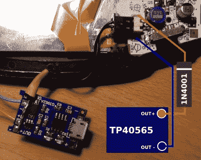

# GBA 获得自制 USB 充电升级

> 原文：<https://hackaday.com/2021/02/06/gba-gets-homebrew-usb-c-charging-upgrade/>

当然，有现成的套件可以为任天堂古老的 Game Boy Advance 添加可充电电池和 USB-C 兼容性，但[【HorstBaerbel】认为他可以以很低的价格组装类似的东西](https://lektiondestages.art.blog/2021/02/02/simple-game-boy-advance-micro-usb-usb-c-li-ion-battery-power-supply-aka-the-cheapjuice/)。另外，他也不用等发货了。最终的结果可能不那么完美，但对于一个本质上是垃圾箱的构建来说，这无疑是令人印象深刻的。

 展会的明星是广受欢迎的 TP4056 锂离子充电器模块。[HorstBaerbel]采用了更常见的 micro USB 版本，但如果您想拥抱未来，这些板也可采用 USB-C。该模块可以很好地安装在原来的电池盒中，同时还能为 1，000 mAh 的袋状电池留出空间。充满电的电池的 4.2 V 输出对 Game Boy 来说有点太高了，所以他使用了二极管的正向压降将其降低到更容易接受的 3.5 V。

自然，这确实浪费了大量能源，特别是与商业产品中使用的 DC-DC 转换器相比，如 [CleanJuice](https://handheldlegend.com/products/cleanjuice-game-boy-advance-li-ion-rechargeable-battery-module) ，但它仍然提供了可观的 7 小时运行时间。这一修改的唯一问题似乎是，当 GBA 的低电量灯亮起时，你只有五分钟的时间来保存你的进度并关闭；但是没有一点刺激的生活算什么？

虽然不像这些年来我们看到的其他 GBA 修改那样极端，但这个项目是任天堂标志性的 Game Boy 系列的[似乎无限黑客潜力的又一个例子。](https://hackaday.com/2020/08/05/the-game-boy-as-a-midi-synthesiser/)