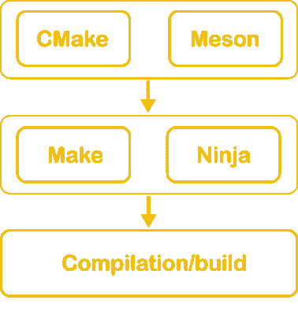
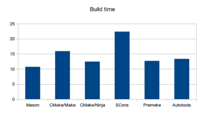

# 问黑客日:你最喜欢的构建工具是什么？会被篡夺吗？

> 原文：<https://hackaday.com/2021/03/11/ask-hackaday-whats-your-favourite-build-tool-can-make-ever-be-usurped/>

你在编译代码的时候做什么？调出 Hackaday？查查埃隆马斯克的身家？研究速度更快的电脑的价格？或者您想知道是什么花费了这么长时间，并决定切换您的构建系统？

登上飞船，思考制作文件、垄断和忍者的魔力。我想听听你用什么来构建你的软件。2021 年我们还应该用`make`吗？在评论中加入争论。

## 究竟什么是构建工具？

假设你已经写好了你的 C++程序，用 g++或 clang++或你的本周最佳编译器编译了它，并且陶醉于软件的魔力。生活是美好的。一旦你构建了你的程序，添加了来自其他文件和库的代码，这些 g++命令就开始变得有点长，因为你不得不把许多不同的东西链接在一起。此外，您每次都必须重新编译每个文件，即使您可能只对其中一个文件做了小的更改。

人们很早就意识到这很糟糕，我们可以做得更好。他们开始制作自动化软件，可以跟踪编译依赖关系，跟踪自上次编译以来哪些代码被调整，并结合这些知识来自动优化编译的内容——确保您的计算机尽可能完成最少的工作。

## 回车:GNU Make

著名的贝尔实验室[的另一个产品](https://hackaday.com/2019/02/19/bell-labs-skunk-works-and-the-crowd-sourcing-of-innovation/)，`make`是由【Stuart Feldman】编写的，以回应一位同事的沮丧，他浪费了一个上午调试一个意外地没有更新的可执行文件。`Make`解决了我上面提到的问题——它跟踪源和输出之间的依赖关系，并为您运行复杂的编译命令。几十年来，`make`一直无处不在，这是有充分理由的:Makefiles 非常通用，可以用于从 web 开发到低级嵌入式系统的任何事情。事实上，我们已经详细描述了如何使用`make`在 [AVR](https://hackaday.com/2016/03/15/embed-with-elliot-microcontroller-makefiles/) 或 [ARM](https://hackaday.com/2016/03/22/embed-with-elliot-arm-makefile-madness/) micros 上进行开发。`Make`也不局限于代码，你可以用它来跟踪任何文件的依赖和变化——自动图像/音频处理管道有人知道吗？

但是，事实证明编写 Makefiles 并不有趣。你并没有给你的项目添加功能，你只是强迫你的计算机运行已经写好的代码。许多人(包括作者在内)试图尽可能少地在编辑器中打开 Makefile，通常更愿意“借用”他人的工作模板并使用它。

问题是，一旦项目变大，Makefiles 也会变大。有一段时间我们相处得很好——毕竟，编写一个没有人理解的超级复杂的 Makefile 确实会让你感觉强大和聪明。但是最终，人们想出了一个主意:如果我们能让一些软件为我们生成 Makefiles 文件会怎么样？

## CMake、介子、自动工具等

是的，有相当多的项目只关心生成配置文件，纯粹是为了输入到其他软件中。听起来很蠢，对吧？但是当你记得人们有不同的电脑时，这实际上很有意义。像`CMake`这样的工具允许你编写一个高级的项目描述，然后自动为你想使用的任何构建平台生成配置文件——比如 Makefiles 或者 Visual Studio 解决方案。出于这个原因，大量的开源项目使用`CMake`或类似的工具，因为你可以在最后一步插入你选择的构建系统——每个人都很高兴。

除此之外，很难判断每个人是否快乐。正如我们所知，当人们无私地花时间编写和维护高质量的开源软件时，其他人在网上对他们非常友好，不会抱怨，也不会写关于他们永远不会再使用它的 27 个原因的消极攻击性博客帖子。开个玩笑！

我在这里得到的是，很难判断对无处不在的软件的流行观点，因为不管质量如何，超过临界质量，总会有干草叉暴民和替代品。首次出现于 1976 年，至今仍占据许多项目的大部分份额。终极问题:它仍然存在是因为它是好软件，还是仅仅因为惯性？

不管怎样，今天它最大的竞争对手——顺带替代者——是忍者。

## 忍者

Examples of popular build tools at different abstraction levels

[忍者](https://ninja-build.org/)是谷歌的【埃文·马丁】创造的，当时他正在开发 Chrome。它现在也被用于构建 Android，并被大多数从事 LLVM 工作的开发人员使用。Ninja 的目标是在增量编译方面比`make`更快:只改变代码库的一小部分就重新编译。正如[埃文写的](http://neugierig.org/software/blog/)，仅仅减少几秒钟的迭代时间就能对程序员的效率和他们的情绪产生巨大的影响。该项目的最初动机是在所有目标都已经更新的情况下重新构建 Chrome(无操作构建)大约需要 10 秒钟。使用忍者，不到一秒钟。

Ninja 大量使用并行化，目标是轻便快速。但是其他所有出现的构建工具也是如此——为什么 Ninja 有什么不同呢？根据 Evan 的说法，这是因为它没有屈服于编写一个新的无所不能的构建工具的诱惑——例如替换掉`CMake`和`Make`——而是只替换掉 Make。

Source: The Meson Build System – A Simple Comparison. Apache 2.0

这意味着它的输入文件是由更高层次的构建系统生成的(不是手工编写的)，因此可以很容易地与 CMake 和其他系统的后端集成。

事实上，虽然手写你自己的`.ninja`文件是可能的，但是不建议这样做。忍者自己的文档中写明“*相比之下【制作】，忍者几乎没有特色；仅仅是那些正确构建所必需的。[……]Ninja 本身不太可能对大多数项目有用。”*

上面你可以看到一个中型项目中增量构建时间的差异。这两个基于忍者的系统显然是赢家。请注意，对于从头构建整个代码库，Ninja 不会比其他工具更快——处理 1 和 0 没有捷径可走。

在他对忍者成败的[反思中，埃文写道:](http://neugierig.org/software/blog/2020/05/ninja.html)

忍者设计的讽刺之处在于没有任何东西阻止其他人这样做。Xcode 或 Visual Studio 的构建系统(例如)也可以做同样的事情:预先做一些工作，然后对结果进行快照，以便快速重新执行。我认为很少有人在这方面取得成功的原因是，混合各层实在太诱人了。”

不可否认，这种方法是成功的，随着时间的推移，越来越多的项目使用 Ninja。简单来说，如果你已经在用`CMake`，我看不出有多少理由你不会在 2021 年用忍者代替`make`。但我想知道你的想法。

## 轮到你了

不可能写出今天所有的构建工具。所以我想听听你的意见。你从`make`转到忍者了吗？你发誓自动工具，巴克或[还是别的什么东西](https://en.wikipedia.org/wiki/List_of_build_automation_software)？`make`会消失吗？会不会有一种工具能让它们都黯然失色？下面让我知道。