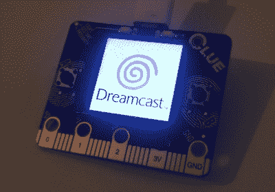

# 复原的梦幻组合是 SEGA 粉丝的梦想成真

> 原文：<https://hackaday.com/2021/02/11/restored-dreamcast-is-a-sega-fans-dream-come-true/>

[布伦·萨顿]是 SEGA 的梦幻剧的长期粉丝，在 1999 年 10 月欧洲上映时急切地抢购一部。但是经过多年的忽视和大约十年前有些问题的油漆工作，他决定是时候打扮一下他的老朋友了。他本可以只是清洗一下机器就完事了，但他抓住机会用实用和装饰性的诡计修补了控制台的内部。

第一步是让系统看起来更新鲜一点。去除他年轻时用拨浪鼓涂的银色金属漆并不顺利，所以他最终在易贝买了一个破损的捐赠控制台，这样他就有了一个新的外壳。捐献者因年老而泛黄，但涂上一层过氧化物霜并在廉价的紫外线下照射几个小时后，它就变得很白了。现在他有了一个新案子，[布伦]把注意力转向了内部组件。

 那些可能热衷于 Dreamcast 自制游戏的人可能已经知道【Those 最后一款家用游戏机有几个升级模块。最流行的一种是用一个装满你最喜欢的游戏 ISOs 的 SD 卡代替光驱。你还可以得到一个现代的高效电源，以及一个电路板，用一个适合 CR2032 的插槽取代原来的焊接时钟电池。[布伦]把他们都扔了进去，确保了几年的游戏幸福。

但是他还没有完成。他还想为他新改进的控制台增加一些视觉效果。经过一番考虑，他小心翼翼地把 Dreamcast 盖子上的标志剪了下来，并在下面安装了一个 Adafruit 线索板。在 CircuitPython 驱动的电路板上安装了一些精心制作的 gif，控制台现在有了一个华丽的全动画徽标，您可以在休息后的视频中看到。

[Bren]真的可以通过将可用 RAM 增加一倍至令人垂涎的 32mb 来将他的主机提升到一个新的水平，但考虑到对这一特别大胆的修改的有限软件支持，我们将让它顺其自然。

 [https://www.youtube.com/embed/KYCEzaGYQtg?version=3&rel=1&showsearch=0&showinfo=1&iv_load_policy=1&fs=1&hl=en-US&autohide=2&wmode=transparent](https://www.youtube.com/embed/KYCEzaGYQtg?version=3&rel=1&showsearch=0&showinfo=1&iv_load_policy=1&fs=1&hl=en-US&autohide=2&wmode=transparent)

