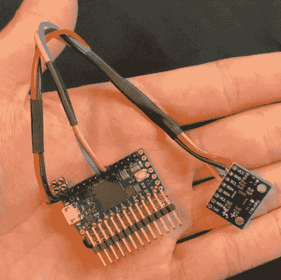

# DRehmFlight:为你奇怪的飞行装置定制飞行稳定

> 原文：<https://hackaday.com/2021/02/15/drehmflight-customizable-flight-stabilisation-for-your-weird-flying-contraptions/>

廉价而强大的遥控马达和电子设备的出现使得几乎任何人都可以建造遥控飞行器。软件通常是更大的挑战，这导致了像 BetaFlight 和 Ardupilot 这样的开源包的开发。这些软件包非常强大，但是如果您有非常规的需求，就不容易修改。[Nicholas Rehm]在攻读硕士学位时面临这一挑战，因此他创造了 [dRehmFlight，这是一种可定制的垂直起降飞机飞行控制器](https://hackaday.io/project/174768-drehmflight-vtol)。休息后的视频概述。

dRehmFlight runs on Teensy 4.0 with a MPU6050 or MPU9250 IMU

[Nicholas]近十年来一直在建造独特的垂直起降飞机，他特别想要易于修改和试验的飞行稳定软件。看着 dRehmFlight [代码](https://github.com/nickrehm/dRehmFlight)，我们认为他成功了。主飞行控制器包是少于 1600 行的单个文件。即使对于一个没有经验的程序员来说，它的注释也很好，很容易理解。还提供了一份详细的 PDF 手册，对所有函数和重要变量进行了全面描述，并提供了几个教程来帮助您入门。还包括用于与加速度计和 RC 齿轮接口的库。它运行在一个 [600 Mhz Teensy 4.0](https://hackaday.com/2019/08/07/new-teensy-4-0-blows-away-benchmarks-implements-self-recovery-returns-to-smaller-form/) 上，所有的编程都可以从 Arduino IDE 中完成。

[Nicholas]已经多次用几架独特的飞机展示了 dRehmFlight 的能力，如我们前阵子报道的[腹部扑腾遥控星际飞船](https://hackaday.com/2020/12/13/rc-starship-perfects-its-skydiving-routine/)，一架[垂直起降四旋翼双翼飞机](https://www.youtube.com/watch?v=rk4tUKM6bd0&list=PLTSCOv-lGtMYf6SePuTPN-6iSvGNNPGsI&index=7) , [垂直起降 F35](https://www.youtube.com/watch?v=0u8NN25Lzow&list=PLTSCOv-lGtMYf6SePuTPN-6iSvGNNPGsI&index=5) ，以及标题图片中看到的[直升机](https://www.youtube.com/watch?v=uP87-yU1l6I&list=PLTSCOv-lGtMYf6SePuTPN-6iSvGNNPGsI&index=3)。dRehmFlight 可能没有 BetaFlight 的赛车无人机性能，或 Ardupilot 的高级自动驾驶功能，但它非常适合让非常规飞机起飞。

 [https://www.youtube.com/embed/tlD0C5CrWcA?version=3&rel=1&showsearch=0&showinfo=1&iv_load_policy=1&fs=1&hl=en-US&autohide=2&wmode=transparent](https://www.youtube.com/embed/tlD0C5CrWcA?version=3&rel=1&showsearch=0&showinfo=1&iv_load_policy=1&fs=1&hl=en-US&autohide=2&wmode=transparent)

