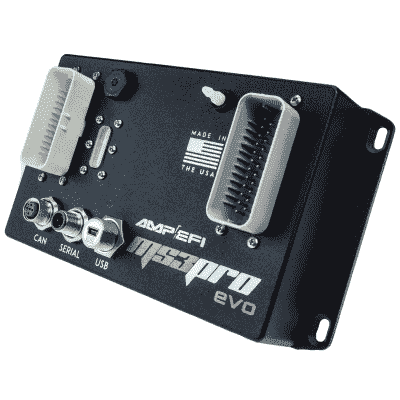
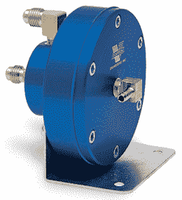
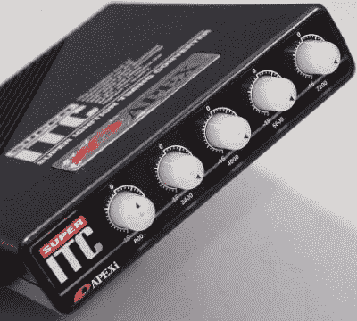

# 如何以廉价的 90 年代方式制造涡轮汽车

> 原文：<https://hackaday.com/2021/05/07/how-to-build-a-turbo-car-the-cheap-90s-way/>

如果你想让你的汽车引擎产生更多的动力，涡轮增压器是一个很好的方法。利用废气中的废弃能量，将更多的空气注入发动机，这是大幅提升马力的最佳方式之一。

然而，与更大的排气或温和的凸轮交换等更简单的改装不同，在自然吸气、燃油喷射发动机上安装涡轮增压器通常需要完全更换发动机管理系统，尤其是在老款汽车上。这并不便宜，让许多人坚持使用带有工厂可调 ECU 的涡轮增压汽车，或者完全放弃。在 20 世纪 90 年代，售后 ECU 甚至更贵，导致许多人完全避免使用它们。取而代之的是，爱好者们用创造性的方法让他们的 turbo builds 以低廉的价格成为现实，今天几乎没有什么能阻止你做同样的事情。

## 燃料和正时

The best solution is to use an aftermarket ECU for full control over fuel and timing, but this can be cost prohibitive.

安装涡轮增压器通常需要进行发动机管理大修的原因是，需要大幅改变发动机的燃油和正时图。带有燃油喷射的普通自然吸气(NA)发动机可以测量进入的气流和发动机上的负载，并使用该信息来确定正确的燃油喷射量以及何时点燃火花塞。

然而，随着涡轮增压器的安装，安娜发动机通常低于大气压力的进气压力在增压条件下变为正值，这可能会完全混淆普通 ECU。在最好的情况下，它恢复到“开环”控制方法，忽略其压力或进入发动机的气流读数。它使用一个基础表来决定喷射多少燃料以及何时点火，只基于发动机转速和节气门位置。随着涡轮增压器迫使比 ECU 预期更多的空气进入发动机，空气/燃料比将严重变稀，很可能导致爆燃，其中气缸中的空气/燃料充量爆燃，而不是以平稳恒定的速率燃烧。这会在短时间内损坏或摧毁发动机。

A typical rising rate fuel pressure regulator. The two ports on the back are the fuel inlet and outlet, while the port on the front is the boost reference, connected to the intake manifold.

因此，要正确运行以前自然吸气汽车上的涡轮增压器，必须注入更多的燃料，以匹配进入进气口的额外空气。毕竟，这就是权力收益的来源。做到这一点的最佳方式是使用定制的 ECU，允许完全控制燃料和正时图。这使得发动机能够调整到最佳性能，以应对爆炸和损坏的限制，并提供稳定、可重复的性能。然而，还有其他更基本的方法来完成这项工作——增加燃油流量和控制正时——而不必麻烦地更换整个 ECU。

就燃料而言，这种廉价、低技术含量的解决方案被称为升速燃料调节器。这种调节器与增压水平成比例地增加燃料轨中的压力。这通常是按比例完成的，例如，10:1 的上升率调节器将为每 1 psi 的增压额外提供 10psi 的燃料压力。较高的压力会使喷油器在相同的工作循环下输送更多的燃油。这使得在涡轮增压器加速并提供增压时增加进入发动机的燃油流量成为可能，而无需对 ECU 中的燃油图进行任何更改。这些装置可以很便宜地得到，通常带有各种可更换的隔膜来改变比率，并在一定程度上调整燃料输送，尽管远不如适当调整的燃料图精细。

The Apexi Super-ITC was a popular ignition timing controller from the 1990s. The high cost of aftermarket ECUs in this time period led to the popularity of such “piggyback” solutions.

从时间上来说，有几种方法可以避免爆炸。在可以进行这种调整的汽车上，最便宜的方法是简单地将发动机的基本正时降低到一个较低的水平。这将保持时间全面降低，有望避免爆炸时，运行在高转速和高增压水平。然而，这意味着在较低转速和较低负荷的情况下，汽车将以次优的时间运行，并会牺牲功率和驾驶性能，并可能导致发动机怠速不良。这对于廉价的赛车来说是可以接受的，但是对于一辆街道驾驶的赛车来说可能是令人沮丧的。

或者，定时盒，或点火定时控制器，可以连接到汽车上。它们由一个微控制器组成，监控进气温度、转速、发动机位置和增压等信号。当正时箱检测到增压时，它会截获来自发动机位置传感器的信号，并将其欺骗回 ECU，从而改变 ECU 触发点火脉冲的时间。受欢迎的车型包括用于马自达 Miata 的 Bipes ACU，以及用于各种 JDM 汽车的 Apexi S-ITC。通常，这些计时盒也被用来调整涡轮增压汽车运行更大的涡轮和其他重大升级。正时箱通常通过 DIP 开关、LED 显示屏和旋钮提供一定程度的调节，可以设置这些来确定保持发动机不爆燃所需的正时延迟的准确水平。

## 欧洲货币单位互换已成为首选黑客

在研究这些设备时，你会注意到一件事，那就是绝大多数关于这项技术的论坛帖子都是 2005 年以前的。这是因为随着技术的进步，售后 ECU 的价格已经下降到足以使它们成为更具吸引力的选择。正确调整燃油和正时图的能力，相对于试图推动和刺激库存 ECU 提供大量额外的燃油和更少的正时，通常会使汽车行驶更平稳，更可靠，更不容易爆炸。它也更容易调整。但是，这些部分在场景中仍然有一席之地。它们被用于绝对最低预算的构建，[如破产和增加的项目，](https://www.youtube.com/watch?v=b8NEbbMeqkU)或[在赛车系列中，如 24 小时的柠檬，其特点是严格的预算限制。](https://motoiq.com/frankenmiata-turbocharging/)这些技术也与增压天然气发动机以及化油器发动机上的涡轮增压相关，尽管用上升速率调节器取代了[增压参考化油器](http://www.superchevy.com/how-to/engines-drivetrain/1511-how-to-modify-a-carburetor-for-boost/)，用正时拦截器取代了[增压就绪点火系统](https://www.youtube.com/watch?v=uD4rvEgOBbs)。

现代发动机管理系统可能是调整增压发动机的最可靠、最准确的方法，但这不是唯一的方法。然而，不要指望从更广泛的汽车社区获得太多的帮助，如果你试图这样做。这些技巧和技术在很大程度上已经被扔进了历史的垃圾箱，所以你可能会发现自己在钻研旧的手册，不得不盲目地进行故障诊断。但是如果金钱，比赛规则，或者仅仅是用传统方式做事的纯粹刺激让你处于这种情况，我们希望这个指南能给你成功的最好机会。祝你好运，快乐的痛苦！