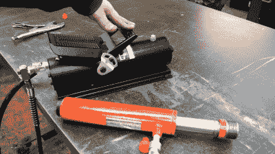

# 一种液压台虎钳，在工作台上制作

> 原文：<https://hackaday.com/2021/02/16/a-hydraulic-bench-vise-made-on-the-bench/>

当我们坐下来看一个构建视频，看到它来自[从头开始的研讨会]，我们知道这将是一个好的视频，充满了大量无偿的金属争论，并承诺在最后以一个巧妙而有用的方式呈现一个研讨会。自制的[液压台虎钳](https://www.youtube.com/watch?v=TnZ_LL7uokk)是那个特定车间的最新产品，所以请观看休息时间下方的视频。

 与我们所期待的传统老虎钳中的丝杠不同，这款老虎钳使用了一个液压牵引缸及其由压缩空气驱动的压缩机。一个坚固的虎钳架由厚钢板制成，围绕着气缸，经过仔细的焊接和打磨，以确保光滑的表面。结果是，夹紧力非常大，动作非常平稳快速，不会像传统方式那样悬在长凳边缘。液压管藏在长凳的一个洞里，脚踏泵放在地板上看不见的地方。

用铁匠训练过的眼睛看这个老虎钳，它提出了一个问题，如果它里面的东西被锤打，它会如何表现。悬垂的老虎钳在锤打时容易裂开，所以有可能这款平板安装的老虎钳会好一点。无论哪种方式，它都是任何工作室的资产。

说到老虎钳，[从零开始的车间] [就是我们去年早些时候看到磁性老虎钳的地方](https://hackaday.com/2020/05/01/scratch-built-magnetic-vise-stays-where-you-need-it/)。

 [https://www.youtube.com/embed/TnZ_LL7uokk?version=3&rel=1&showsearch=0&showinfo=1&iv_load_policy=1&fs=1&hl=en-US&autohide=2&wmode=transparent](https://www.youtube.com/embed/TnZ_LL7uokk?version=3&rel=1&showsearch=0&showinfo=1&iv_load_policy=1&fs=1&hl=en-US&autohide=2&wmode=transparent)

