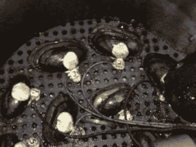

# 蛤蜊网

> 原文：<https://hackaday.com/2021/02/18/internet-of-clams/>

传感器不仅仅局限于电气、机械或化学领域。直到 1986 年，金丝雀还被用作一氧化碳探测器，一些国家元首还在使用食物品尝器。这些所谓的[哨兵物种](https://en.wikipedia.org/wiki/Sentinel_species)已经为人所知并被使用了几十年，如果不是几百年的话。但是最近使用蛤蜊检测水污染的项目提供了实时的电子反馈。他们使用的物种是*ligametina Actinonaias*，毫无疑问，你还记得，它在 2010 年 1 月被威斯康星大学的贻贝项目宣布为“本月贻贝”。它们通常被称为 mucket 蛤蜊或 mucket 贻贝，对水污染特别敏感——可以说，它们在受到污染的水中会保持沉默。

Clam Sensor Wiring Mississippi River Project

密西西比河沿岸的几个城市早在 2015 年就安装了基于蛤蜊的传感器，另一个系统于 2011 年安装在阿纳卡斯蒂亚河河口。波兰导演茱莉亚·佩克拉[制作了一部纪录片](https://www.thefirstnews.com/article/documentary-turns-life-saving-clams-used-to-detect-water-pollution-at-warsaw-pumping-station-into-internet-stars-13119)，讲述了安装在华沙附近维萨河上的迪比克水处理厂的基于蛤蜊的传感器，该水处理厂自 1994 年开始运行。她的纪录片名为“Gruba Kaka(胖凯西)”，而[在 2020 年想象科学电影第 13 届年度电影节上获得了体内奖](http://imaginesciencefilms.org/isff13-winners)(见下面的预告片)。

如第一张照片所示，每个蛤壳上都安装了一个简单的电触点，当外壳被夹住时，它会通过底部触点闭合电路。密西西比河沿岸的系统使用多种蛤蜊，明尼苏达州的明尼阿波利斯有 11 种，伊利诺斯州的魔线有 16 种。波兰的系统使用八个蛤蜊，当四个或更多蛤蜊一致时，系统自动关闭并提醒操作员。这些蛤蜊只工作三个月，之后它们会被标记为退休，这样它们就不需要再服务了。

我们以前写过一个蛤蜊形状的水下传感器，也报道过用 T2 蛤蜊做电池的可能性。这种生物传感技术通过[ [嵌入式调频播客#357](https://embedded.fm/episodes/357) ]引起了我们的注意。

 [https://www.youtube.com/embed/bhu26Q-CMec?version=3&rel=1&showsearch=0&showinfo=1&iv_load_policy=1&fs=1&hl=en-US&autohide=2&wmode=transparent](https://www.youtube.com/embed/bhu26Q-CMec?version=3&rel=1&showsearch=0&showinfo=1&iv_load_policy=1&fs=1&hl=en-US&autohide=2&wmode=transparent)

