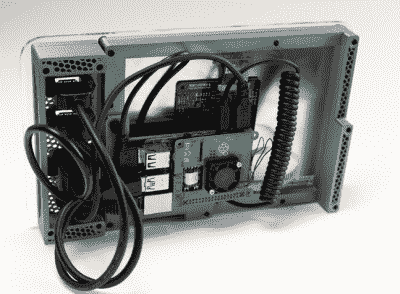
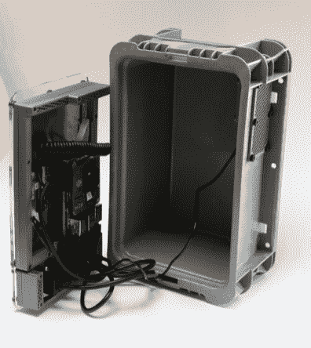
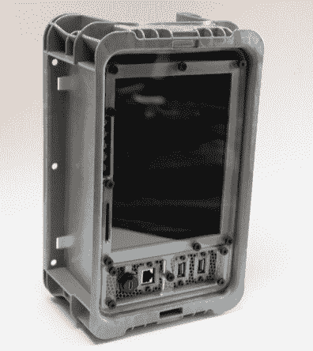

# 这种可堆叠码头便携式准备隆隆作响

> 原文：<https://hackaday.com/2021/02/17/this-stackable-pi-portable-is-ready-to-rumble/>

桌面 3D 打印和强大的单板计算机(如 Raspberry Pi)的激增导致了小型定制计算设备的绝对爆炸。无论你是否认为这些拼凑起来的设备足够接近吉布森最初的愿景，可以称之为 cyberdecks，这是一个不同寻常的转变，让我们更接近赛博朋克文学和电影中流行的“高科技，低生活”哲学。

 【杰伊·多舍尔】一段时间以来一直站在这场运动的前沿，创作了几个非常受欢迎的设计。[他的最新作品更倾向于赛博朋克精神](https://back7.co/home/introducing-the-kuiper-deck)中更实用的方面，灵感更多来自*广阔*的砂砾，而不是*星际迷航*企业-D 的舒适内饰。作为过去几年经验教训的高潮，新的*柯伊伯甲板*比他以前的设计更便宜也更容易建造，至少部分是因为你不再需要出去买一个昂贵的鹈鹕箱。

像他以前的设计一样，*柯伊伯甲板*大量使用 3D 打印部件。但是这一次，[Jay]使用了一系列更小的部件，用螺栓固定在丙烯酸面板上。这不仅意味着该项目兼容更广泛的机器，[如 Prusa Mini](https://hackaday.com/2019/10/13/prusa-unveils-new-mini-printer-shakes-up-the-competition/) ，而且也更容易打印，因为更大的部件有令人讨厌的翘曲倾向。不利的一面是，你需要一些方法来使丙烯酸面板切割成型，尽管如果你没有任何方法在当地制造，你可以通过他买一个。

[Jay]找到了麦克马斯特·卡尔(McMaster Carr)以 12 美元的价格出售的重型可堆叠塑料手提包，取代了他以前用作围栏的鹈鹕箱。不是特别好看，也不防水。但这也是重点。如果你只是想组装一台小型电脑，你可以在商店里到处扔，而不必担心坏了，鹈鹕的情况总是有点过头了。

    

电子产品的材料清单也很少，主要包括 Raspberry Pi 4、冷却风扇和 Pimoroni 的 10 英寸液晶显示器。所有的东西都用螺丝固定在面板的后面，用预制的电缆连接，组装起来非常简单。也就是说，如果你想把一些定制的东西放在一起，如移动软件定义的无线电设备，外壳内仍然有足够的空间来放置定制的硬件。

[【Jay】在 2015 年](https://hackaday.com/2015/08/13/raspberry-pi-field-unit-rpfu/)创造了最初的树莓 Pi 现场单元，但直到他[在 2019 年](https://hackaday.com/2019/11/11/a-mobile-terminal-for-the-end-of-the-world/)推出了经过修订的树莓 Pi 恢复套件，将树莓 Pi 粘在鹈鹕箱子里的想法才成为黑客迷因。这听起来像是*柯伊伯甲板*将是他现在关于这个主题的最后一句话，但它是一个安全的赌注，我们将会看到人们在未来几年内将类似的构建组合在一起。