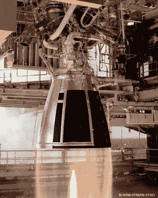
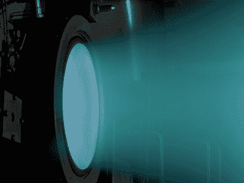
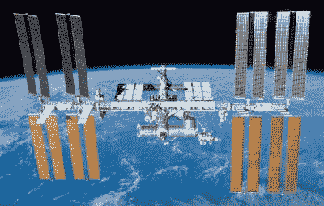

# 太空推进:从科幻小说中分离事实

> 原文：<https://hackaday.com/2021/04/19/space-propulsion-separating-fact-from-science-fiction/>

不幸的是，科幻小说的一个不幸特性是它是虚构的。我们发现自己迄今为止被限制在这个我们称之为地球的星球上，而不是在恒星和无数星系之间翱翔。只有少数几个人曾经到达过地球上唯一的月球，而且在经过几十年的旅行后，只有两个无人探测器离开了地球的太阳系。足以让人绝望的是，我们永远也不会接近科幻小说似乎向我们承诺的美好未来。

然而，也许并非所有的希望都破灭了。在过去的几十年里，我们改进了我们的化学火箭，正在试验各种类型的核火箭，离子推进器是现代卫星以及太阳系内任务的常见特征。即使围绕 [EMDrive](https://en.wikipedia.org/wiki/EmDrive) 的炒作像它出现时一样迅速消失，经过多年的改进， [Alcubierre](https://en.wikipedia.org/wiki/Alcubierre_drive) 超光速驱动器仍然是一个诱人的可能性。

即使物理学与我们渴望在星际间生活的愿望背道而驰，我们目前的机会看起来如何？让我们来看看我们今天所拥有的推进方法，以及我们能以不同程度的把握期待什么。

## 近地轨道的统治者

RS-68 rocket engine under test at NASA Stennis Space Center in 2000.

说到把东西送入地球轨道并保持在那里，我们做得相当好。自从 20 世纪上半叶火箭发动机的早期以来，我们已经有了许多改进和新技术。我们开发了新的固体和液体燃料，并学会了使用[自燃](https://en.wikipedia.org/wiki/Hypergolic_propellant)以及低温燃料。这使得发射新卫星和新探测器进入绕地球轨道和行星间转移轨道的过程实际上成了例行公事。

一旦脱离地球的引力井，或者安全地进入环绕地球的轨道，由于地球的引力不再是一个问题，一种能够减少蛮力的推进方法就足够了。这就是离子推进器大放异彩的地方:使用相对少量的推进剂和来自太阳能电池板或 RTG 等其他来源的电力，他们设法以离子束的形式产生大量的推力。因为离子推进器有很高的比冲，所以它们的燃料利用效率很高，但缺点是推力很小。

这让我们看到了火箭和太空推进的核心问题:在所需能量和消耗的燃料之间平衡性能。尽管化学火箭可以很容易地扩大规模，使用更多的燃料来获得更大的推力，但它的比冲相当糟糕，这意味着每燃烧一单位燃料，燃料中包含的大部分能量都被浪费了，即没有用于推进目的。

比冲(I [sp] )以秒为单位定义，其中指示值规定了火箭发动机或等效装置使用可用推进剂为火箭提供推力的时间。这决定了推力的持续时间，从而决定了总加速度。此外，随着推进剂的消耗，化学火箭会变得更轻，导致相同推力的加速度随着时间的推移而增加。因此，[推重比](https://en.wikipedia.org/wiki/Thrust-to-weight_ratio)决定了火箭的性能。

作为一个直接的比较，一个化学火箭，如 SpaceX 的猎鹰 9 号，配备了[梅林 1D(全推力)发动机](https://en.wikipedia.org/wiki/Merlin_(rocket_engine_family))，在真空中的 I [sp] 为 311 秒，在海平面上为 282 秒。与此同时，离子推进器的 I [sp] 不是以秒计，而是以周甚至月到年计。尽管卫星或探测器中的离子推进器的推进力只有化学火箭的一小部分。与此同时，离子推进器的推重比非常低，这使得它无法从地球的重力井中提起一张纸。

## 超越地球轨道

Exhaust side of NASA’s Evolutionary Xenon ion Thruster (NEXT).

使用这些化学火箭和离子推进器，我们可以让卫星和国际空间站保持在轨道上，即使它们在较低的轨道上，那里的大气阻力是一个问题。正如美国、中国和阿联酋最近展示的那样，通过让[号【希望】号](https://en.wikipedia.org/wiki/Emirates_Mars_Mission) ( *号【米萨巴尔】号* ) &号[号【田文-1】号](https://www.planetary.org/space-missions/tianwen-1) (Q *号【问天】号*)轨道飞行器环绕火星，以及在火星土壤上的“坚忍”号火星车，我们已经非常擅长于旅行到太阳系中至少一个离我们最近的邻居。

太阳系内的大多数旅行都利用了轨道力学，目前欧空局的 BepiColombo 任务就是一个最好的例子。BepiColombo 不是沿着从地球到水星的直线旅行，而是跨越七年，在此期间，BepiColombo 将使用重力辅助:基本上使用我们太阳系各种行星和太阳的重力，以便获得和失去速度，以及改变其围绕太阳的轨道，以便最终与水星对齐，并将自己停在轨道上。

这也表明，这里的另一个重要因素是时间。不考虑在太阳系内或太阳系外旅行可能需要多长时间，利用地球和其他行星的重力辅助是一种有效且非常高效的太空旅行方式。旅行者号探测器已经成功地以这种方式离开了太阳系，仅用了大约四十年的时间。当然，在科学任务之外，当人们开始考虑像[一代飞船](https://en.wikipedia.org/wiki/Generation_ship)这样的东西时，抛弃时间因素只是一种选择。

就像在地球上一样，我们喜欢旅行得更快，浪费更少的时间。毕竟，举例来说，当一个人可以乘飞机去东方时，谁愿意被困在好望角的帆船上进行长达数月的航行呢？同样，我们也在寻找在太空中更快旅行的方法。

## 走向核化

有几个可能的目的地，我们想更快地旅行:其中之一当然是火星，但我们太阳系的其他行星也感兴趣，如木星的卫星欧罗巴。在这里，我们的化学火箭和离子推进器都遇到了一个大问题:一个不能提供足够长时间的推力，另一个不能提供足够的推力。一个可能的解决方案可以追溯到 20 世纪 50 年代，以核推进的形式。

许多人可能都知道 DARPA 的猎户座项目(Project Orion )( T1 ),该项目使用了核脉冲推进(T2)技术(T3 ),可以在四周内往返火星。虽然该项目从未启动，但基于 NPP 的新概念已经开始实施。这里大部分最新的研究集中在以某种方式使用核聚变来产生高速排气。我们在[核热火箭](https://en.wikipedia.org/wiki/Nuclear_pulse_propulsion)的总体范围中看到了类似的东西，核电站是其中的一部分，重点已经从裂变转向聚变。有些，像[直接聚变驱动](https://en.wikipedia.org/wiki/Direct_Fusion_Drive)，可以认为本质上是一种改进的离子推进器。

PFRC-2 device during a magnetic field pulse at Princeton in 2016.

DFD 和其他一些概念是美国国家航空航天局目前正在研究的概念，旨在削减前往火星和其他目的地的旅行时间，包括 T2 猎户座 T3(宇宙飞船)。DFD 使用普林斯顿场反向配置( [PFRC](https://en.wikipedia.org/wiki/Princeton_field-reversed_configuration) )实验的发现，以比今天的离子推进器显著更高的水平提供连续推力。这将使它适合星际旅行，预计旅行时间为四年，前往太阳系边缘的冥王星。

当然，这些都不会让太阳系外的星际旅行变得容易得多。

## 轻视事物

在这个宇宙中，只有少数事情是确定的。其中之一就是空间很大，更不用说很空旷了。另一个是物体有质量，还有一个是光速(c)存在。后两者结合起来决定了一个物体可以加速的极限。考虑到一些挑战，比如让一个人在他的一生中到达最近的恒星系统([半人马座阿尔法星](https://en.wikipedia.org/wiki/Alpha_Centauri)，4.37 光年)，这是有问题的。

作为最遥远的人造物体，旅行者 1 号正以 1/18000 的光速行驶，这意味着它将能够在大约 80000 年后到达半人马座阿尔法星。然而，正如我们将看到的，这里的解决方案不是简单地加速，因为这会产生两个新问题。第一个是纯粹的动能，因为加速到相当一部分光速所需的能量比任何一种目前或未来的推进方法所能产生的能量都要大。

Astronauts on the International Space Station experience time 0.01 seconds slower per Earth year than people on Earth’s surface.

第二个问题是广义相对论定义的( [GR](https://en.wikipedia.org/wiki/General_relativity) )。简单地说，如果一个物体经历加速度，那么这个物体的参考系和任何外部观察者的参考系就开始偏离。这种[引力时间膨胀](https://en.wikipedia.org/wiki/Gravitational_time_dilation)效应在视觉表现上意味着，对于一个外部观察者来说，一个正在加速的物体所持有的时钟变慢了，反之亦然，一个外部观察者的时钟似乎比他们所持有的时钟走得快。

虽然这种时间膨胀的影响在地球上相对较小(例如，国际空间站的宇航员与地球上的人相比)，但残酷的事实是，我们根本不想大幅加速。也就是说，除非我们希望处理这样的情况，以 0.6c 速度飞行的宇宙飞船上的人自己会在一次任务中经历数周的时间，而在地球上几十年已经过去了。这使得即使是零零碎碎的太空无人探测器也变得相对毫无意义。

一个潜在的解决方案在于曲速驱动器的概念，也称为阿尔库比耶驱动器及其衍生物。这种方法本质上允许某人有效地超越光速(FTL)，而不改变他们的有效重力，从而不改变他们的参考系。这也避免了对大量能量的需求。

## 物理曲速驱动器

The ‘Phoenix’ warp-capable ship from Star Trek, built around a converted ICBM.

FTL 硬盘几乎是科幻小说中的一个主要部分，有多种形式。其中，[曲速驱动器](https://en.wikipedia.org/wiki/Warp_drive)是为数不多的既基于科学理论又经历了几十年研究和改进的产品之一。其核心原理非常简单:“曲速驱动”在物体周围建立了一个时空外壳(“曲速场”)，然后它就可以移动，而不必增加动能。它的有效速度将受限于它扭曲时空的速度。

关于这一主题的最新文献是 Bobrick 等人的[介绍物理曲速驱动器](https://arxiv.org/abs/2102.06824)，它通过过去几十年的文献工作，同时为可以想象的不同曲速驱动器类型创建了一个分类系统。

最重要的是，它涵盖了一个关于阿尔库比耶驱动的假设——因为它需要大量的负质量——仅仅是基于对基本理论的缺乏理解。实际上，这意味着负质量要求可以被降低甚至完全消除，而且在物理学领域内，到目前为止没有任何东西可以阻止人类建造实际的物理曲速驱动器，并开始穿越银河系和更远的 FTL 之旅。

## 太空:最后的边疆？

这样看来，至少科幻小说的某些部分可以在不久的将来成为科学事实，在最初的《星际迷航》系列中描绘的[星际飞船](https://memory-alpha.fandom.com/wiki/Warp_drive)([托斯](https://en.wikipedia.org/wiki/Star_Trek:_The_Original_Series)、 [TNG](https://memory-alpha.fandom.com/wiki/Star_Trek:_The_Next_Generation) 和 [VOY](https://memory-alpha.fandom.com/wiki/Star_Trek:_Voyager) )站在[联邦](https://memory-alpha.fandom.com/wiki/United_Federation_of_Planets)一边，为人类的未来提供了一个诱人的模板。有趣的是，在《星际迷航》宇宙中，直到 2063 年[一位](https://memory-alpha.fandom.com/wiki/2063)[发明家](https://memory-alpha.fandom.com/wiki/Zefram_Cochrane)才开始测试第一个曲速驱动器。

幸运的是，我们自己的时间表将会是什么样子仍然是一个待价而沽的问题。我们是否真的能在四十年后制造出曲速引擎，如果我们真的能制造出曲速引擎，我们会发现什么，这些都是悬而未决的问题。当我们发现自己在回忆 60 年前尤里·加加林历史性的太空飞行时，展望未来几十年将会发生什么是令人兴奋的。