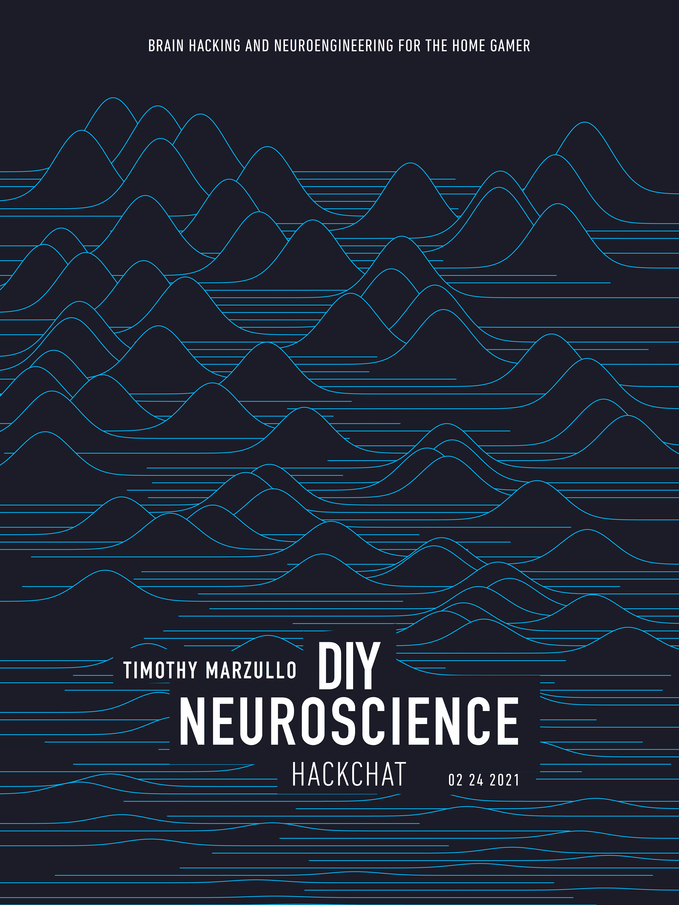

# DIY 神经科学黑客聊天

> 原文：<https://hackaday.com/2021/02/22/diy-neuroscience-hack-chat/>

加入我们太平洋时间 2 月 24 日星期三中午与[蒂莫西·马祖罗](https://hackaday.io/hacker/1172014-tim)的 [DIY 神经科学黑客聊天](https://hackaday.io/event/177155-diy-neuroscience-hack-chat)！

看一部关于好莱坞黄金时代的疯狂科学家的电影，很有可能在其他场景中，你会看到人脑漂浮在装有电极和奇特机器的混浊液体罐中。当然，这些都是虚构的，但是比喻是有效的，因为它们是基于真理的核心，我们这些观众知道我们的大脑和神经系统的其他部分确实依靠电力工作。或者更准确地说，我们神经系统中的可兴奋组织以穿过细胞膜的电位波的形式在它们之间传递电化学信号。

研究这个锁在我们头脑中的电气世界是一项挑战，但绝不是不可能的追求。可用的信号可以被拾取、放大、数字化和记录，以帮助我们理解当我们思考、感觉、移动、睡觉、醒来或只是做其他事情时发生了什么。神经科学在观察这些信号方面已经取得了巨大的进步，但是进行这项工作的设备在很大程度上仍然是拥有充足预算的大型大学和教学医院的领域，使得业余神经科学家没有运气。

Tim Marzullo 是后院大脑的创始人之一，他希望改变这一切。在密歇根大学攻读神经科学博士学位期间，他和格雷格·盖奇寻找让每个人都能负担得起神经科学研究工具的方法。其结果是神经元尖峰盒，一种低成本的生物放大器，可以利用活神经元的动作电位“尖峰”。像这样的开源工具已经帮助教育工作者将神经科学实验引入 STEM 学生，甚至帮助其他科学家建立新颖、低成本的实验。

Tim 将加入我们的 Hack Chat，谈论 DIY 神经科学和设计使之成为可能的仪器。当我们揭开对我们大脑如何工作的无知的面纱时，带上你的“疯狂科学家”问题，一次一个神经元。

 我们的黑客聊天是 [Hackaday.io 黑客聊天群发消息](https://hackaday.io/messages/room/2369)中的社区直播活动。本周，我们将在太平洋时间(UTC-8)2 月 24 日星期三中午 12:00 坐下来讨论。如果时区束缚了你，我们有[一个方便的时区转换器](https://www.timeanddate.com/countdown/generic?iso=20210224T12&p0=224&msg=DIY+Neuroscience+Hack+Chat&font=cursive)。

点击右边的那个发言气泡，你会被直接带到 Hackaday.io 上的黑客聊天群，不用等到周三；随时加入，你可以看到社区在谈论什么。

