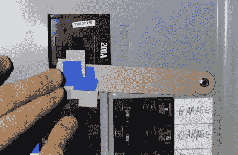

# 如何设计定制的发电机联锁板

> 原文：<https://hackaday.com/2021/02/22/how-to-design-a-custom-generator-interlock-plate/>

如果停电时你把发电机接到家里的主配电板上，你需要确保主断路器已经关闭。否则，当电力恢复时，你(或线路工人)将会过得很糟糕。有一些商用联锁板可以防止发电机和主断路器同时打开，但由于它们往往很贵，[【how tolou】决定自己做一个。](https://www.youtube.com/watch?v=v352CF9ivko)

这个项目最难的部分是设计模板。它需要仔细塑造，以便其静止位置可以防止发电机的断路器在正常情况下被打开，但一旦主电源被关闭并移开，您应该能够将其抬起，并有足够的空间来翻转较低的断路器。用胶带和一些纸板在断路器盒上花一些时间是找到正确形状的最简单的方法。

Making a template with thin cardboard.

在休息之后的视频中，[HowToLou]展示了他的特定应用的理想形状，这应该有助于您理解这个想法。这涉及到很多变量，尤其是断路器的尺寸和位置，所以花时间制作正确的模板至关重要。

一旦你有了形状，你就可以随心所欲地制作盘子了。[HowToLou]用手从一块薄铝片上切下他的，但你当然可以 3D 打印它，甚至用 CNC 从一块更厚的金属上切下它。重要的是，它足够硬，如果有人在黑暗中摸索它，他们不能将它弯曲。

不言而喻，自制的联锁装置是不符合标准的，但是即使没有任何检查员在你的配电盘周围嗅来嗅去，安装这样的东西也是明智的预防措施。仲冬是一个糟糕的时间[意识到当电网断电时你没有任何办法安全地为你的家供电](https://hackaday.com/2021/02/16/trouble-with-the-texas-power-grid/)，所以关键是在你真正需要它之前准备好这样的东西*。*

 [https://www.youtube.com/embed/v352CF9ivko?version=3&rel=1&showsearch=0&showinfo=1&iv_load_policy=1&fs=1&hl=en-US&autohide=2&wmode=transparent](https://www.youtube.com/embed/v352CF9ivko?version=3&rel=1&showsearch=0&showinfo=1&iv_load_policy=1&fs=1&hl=en-US&autohide=2&wmode=transparent)

