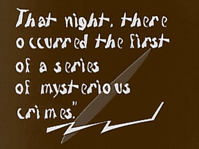
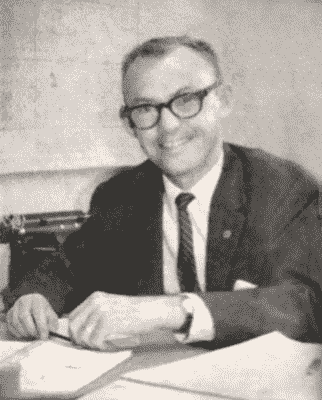
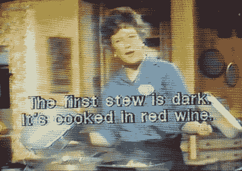
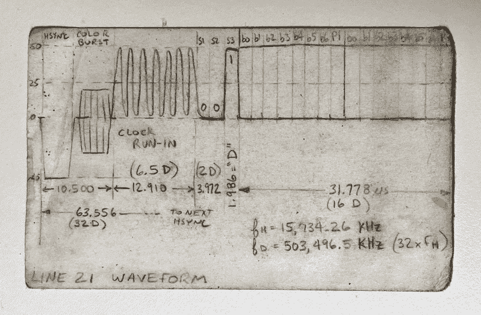
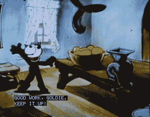
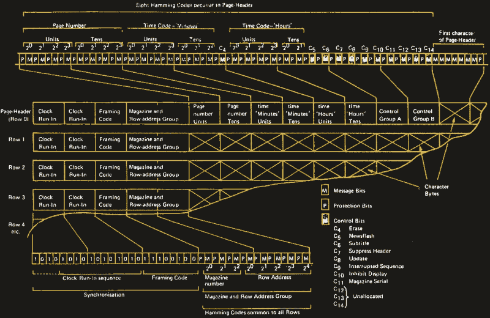
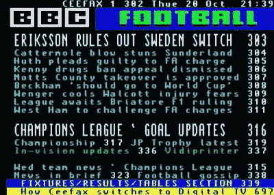
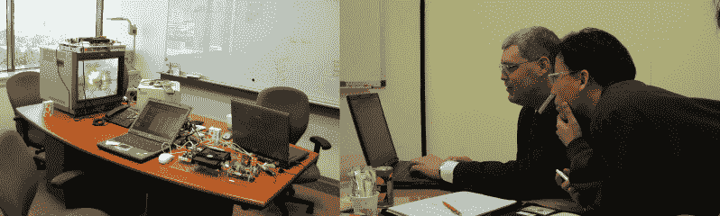
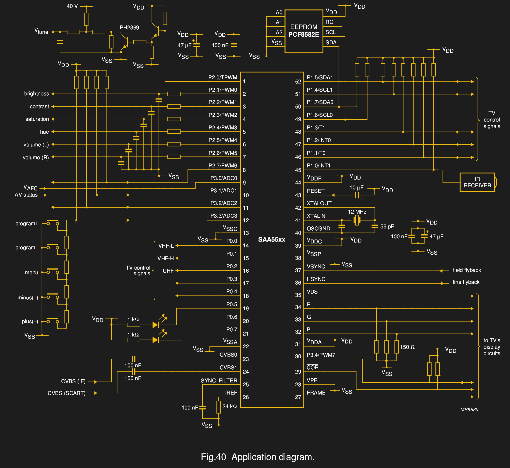
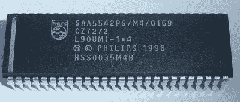

# 隐藏字幕的历史:模拟时代

> 原文：<https://hackaday.com/2021/04/14/history-of-closed-captions-the-analog-era/>

如今，电视上的隐藏式字幕以及 DVD、蓝光和流媒体上的字幕被视为理所当然。但并不总是如此。事实上，要让字幕变得普通是一件相当困难的事情。回到 21 世纪初，我意外地发现自己参与了各种各样的隐藏字幕项目，既设计硬件，也为各种消费电子制造商的工程团队提供咨询。当其他人都转向数字字幕时，我可能是最后一个处理模拟字幕的工程师。

但是在深入研究之前，有许多令人困惑和不精确的语言在这个主题上浮动。让我们建立一些定义。我经常使用单词*字幕*，它包括隐藏字幕和字幕:

**Closed Captions:** Transmitted in a non-visible manner as textual data. Usually they can be enabled or disabled by the user. In the NTSC system, it’s often referred to as Line 21, since it was transmitted on video line number 21 in the Vertical Blanking Interval (VBI).

**Subtitles:** Rendered in a graphical format and overlaid onto the video / film. Usually they cannot be turned off. Also called open or hard captions.

标题中包含的文本通常分为三类。纯对话(仅此而已)通常是你在 DVD 或蓝光上看到的字幕风格。普通字幕包括对话，但偶尔会添加音乐或不可见事件的提示(例如门铃响)。最后，“聋人或重听人字幕”(SDH)是一种更冗长的风格，它添加了关于节目的更多描述性信息，包括演讲者的姓名、镜头外事件等。

粗略地说，隐藏式字幕是针对聋人和重听观众的。字幕面向的是那些可以听到节目，但出于某种原因(比如理解外国电影或学习一门新语言)想观看对话的观众。

## 有声电影前的标题

Intertitles from the 1920 film The Cabinet of Dr Caligari

字幕和电影本身一样古老。由于第一部电影没有声音，他们使用现在所谓的字幕来传达对话和说明信息。这些是全屏的文本，插入(而不是覆盖)到电影的适当位置。有人尝试用第二台放映机叠加字幕，放映员手动切换文本的玻璃幻灯片，希望与对话同步。一个有远见但被忽视的发明家[试验了漫画对话气球](https://the-artifice.com/subtitling-cinema-history)，它出现在说话的演员旁边。这些技术也使得电影在其他国家发行变得相对容易——只有片名需要翻译。

随着 20 世纪 20 年代末“有声电影”的出现，这种情况发生了变化。现在不需要字幕了，因为你可以听到对话。但外国观众仍然需要翻译，各种耗时的光学和化学过程被用来生成我们今天认为的字幕。但是没有为当地观众提供字幕——这无疑激怒了聋人和重听人，他们多年来一直和有听力的人一样享受电影。

## 电视机

Malcolm J. Norwood

随着电视越来越受欢迎，早些年曾有过一些光学字幕的尝试，但这些尝试并不十分成功，也没有被广泛采用。在美国，到 20 世纪 60 年代末，人们对隐藏式字幕系统产生了兴趣。1970 年 4 月，联邦通信委员会收到一份请愿书，要求紧急警报为失聪观众配以文本。这个请求来得正是时候，当时技术已经准备好，各方都感兴趣并准备接受挑战。

就在这个时候，教育部(当时是休)的聋哑官员马尔科姆·诺伍德介入了这个故事。自 1960 年以来，他一直在为聋人部门制作字幕电影。今天，他在社区内被称为隐藏式字幕之父。他是支持这项新技术的最佳领导者，他接受了挑战。

联邦通信委员会原则上同意提出的问题，作为回应，于 1970 年 12 月发布了公告 70-1328。马尔科姆和能源部在 1971 年组建了一个团队，成员包括国家标准局、国家广播协会、美国广播公司和公共广播公司。1971 年 12 月，他们在纳什维尔 (PDF)召开了一次[会议，我们可以说那是隐藏式字幕的发源地。](https://files.eric.ed.gov/fulltext/ED064828.pdf)

First Captioned TV Program in 1972, *The French Chef* hosted by Julia Child. These were Open Captions and could not be turned of by the viewer.

原来，广播字幕的技术实现是建立在现有工作的基础上的。在国家标准局，工程师戴夫·豪一直在开发一个名为 TvTime 的系统，通过无线电发送精确的时间信号。这个系统通过 VBI 的视频线路发送代码，使用的方法最终演变成 CC 标准。他们一直在与美国广播公司、公共广播公司和全国广播公司一起测试这个系统。美国广播公司甚至开始使用这个系统在附属电台之间发送文本信息。

HRB-辛格在会上展示的另一个系统改变了接收器的垂直扫描，使额外的 VBI 线可见，并以数字方式传输字幕文本，但在这些新曝光的线中是可视的。这引起了电视机制造商的一些担忧，谢天谢地，国家统计局系统最终胜出。

经过几次有希望的演示后，1973 年，哥伦比亚地区的 PBS 电视台 WETA 获得了播放隐藏式字幕信号的授权，以进一步发展和完善该系统。这些努力是成功的，1976 年，联邦通信委员会正式为隐藏字幕保留了 21 行。

## 调整 21 号线的广播

This is an index card that kicked around in my briefcase for many years. Can you spot the error?

在其最终形式中，第 21 行上的信号经过几个时钟周期的磨合，以锁定解码器的数据恢复振荡器，然后是 3 位起始模式，最后是两个奇偶校验保护的文本字符。文本编码几乎总是 ASCII，少数例外和特殊符号被认为是任务所必需的。文本总是以字符对的形式传输，并且传统上以全部大写字母发送。控制代码也是字节对，它们执行诸如定位光标、切换字幕服务、改变颜色等功能。因为控制代码对文本的正确显示至关重要，奇偶校验保护是不够的——它们通常被传输两次，如果第一对没有错误，重复的控制代码对被忽略。

|  | 第 21 行数据汇总 |
| --- | --- |
| 基本运费率 | 503.496 kBd (32 x 水平频率) |
| 分组 | 每个 7 位+奇偶校验位字符/视频行 2 个 |
| 编码 | ASCII，有一些修改 |
| 服务 | 奇数场:CC1/CC2，T1/T2 |
|  | 偶数场:CC3/CC4，T3，T4，XDS |
| 规格 | EIA-608，47 CFR 15.119，远程捕捉 II |

今天，由于数字传输和有线/光纤网络，我们已经习惯了近乎完美的视频和音频节目。在现有的协议包中增加几个额外的字节几乎不会让我们停下来。但在当时，还必须考虑其他因素。最终的 CC 标准在漫长而艰苦的现场测试中得到了微调。当通过空中传输时，字幕视频信号必须是健壮的。工程师们不得不处理和解决诸如边缘接收区域的信号强度下降和密集城区的多路径等问题。

Pop-On CC Demo Frame from Felix the Cat

至于字幕方法，有几种不同的类型。到目前为止，最常见的风格是弹出式和卷起来。在弹出字幕中，接收方将输入的文本存储在缓冲器中，直到接收到“翻转记忆”控制码，整个字幕将立即与对白同时出现在屏幕上。这种风格通常用于预先录制的脚本材料，如电影和戏剧。另一方面，滚动字幕，顾名思义，文本从屏幕底部逐行滚动。它被用于直播，如新闻节目和体育赛事。由于现场语音转录过程的性质，文本自然必须从音频延迟。

## 英国人的做法不同，在这个过程中实现了图文电视

在大洋彼岸，BBC 的广播工程师从不同的角度处理这个问题。他们的经理问是否有办法使用发射机发送数据，因为他们每天有四分之一的时间是空闲的。因此，他们致力于最大化可以传输的数据量。

最初的服务像传真机一样扫描、传输和打印报纸版面。最终，BBC 采用了由飞利浦工程师约翰·亚当斯开发的名为 CEEFAX 的全数字方法。与此同时，其他广播公司也开始提供一种竞争性的、不兼容的服务，叫做甲骨文。1974 年，所有人最终决定采用一种被称为世界图文电视系统(WST)的合并标准，即 CCIR 653。北美的广播公司采用了 WST 的一个微小变体，称为北美广播图文电视规范(NABTS)。由于比 CC 更高的数据速率，图文电视对传输错误的容忍度较低。它使用几个不同的汉明码来保护关键数据字段中的错误，并可以选择从错误中恢复。与第 21 行相比，这是一种非常复杂的解码格式。

British Radio Equipment Manufacturer’s Association, [Broadcast Teletext Specification](http://www.bighole.nl/pub/mirror/homepage.ntlworld.com/kryten_droid/teletext/spec/teletext_spec_1974.htm)

至于格式，图文电视服务播放三位数的文本和块图形数据——概念上是一本电子杂志。内容类别按页面分组:

Example of Teletext Magazine Page

*   100 条新闻
*   200 年代-商业新闻
*   300s–运动
*   400-天气和旅行
*   500-娱乐
*   600s–电视和广播列表

这些杂志页面上的文字是包装结构中不可分割的一部分。例如，第 203 页第 4 行的文本属于该页/行的特定包。由于广播公司正在连续传输所有杂志及其页面，您请求的页面可能需要几秒钟才会出现在屏幕上。NABTS 采取了更自由的方式。数据几乎可以被认为是一系列的文本流，就像终端与计算机的连接。如果你需要一个新的文本行，你发送一个 CR/LF 对。

|  | 图文电视数据摘要 |
| --- | --- |
| 基本运费率 | 6.938 MBd |
| 分组 | 360 位/行，40 个可用文本字符 |
| 编码 | 类似于扩展的 ASCII，带有代码页 |
| 服务 | 多页杂志，每页 40×24 字符 |
| 规范 | 欧洲:WST ITU-R BT.653(原 CCIR 653) |
|  | 北美:NABTS EIA-516 |

## 让这一切运转起来的黑客

我的大部分设计是在北美使用的，但我需要为几个候选项目学习欧洲的图文电视。在欧洲，图文电视系统的 888 页被指定传送隐藏式字幕文本。这个页面有一个透明的背景，接收者把它覆盖在视频上。视觉结果实际上与北美相同。但是它提出了一些关于像 VHS 磁带这样的媒体的问题。

图文电视信号无法在典型的家用 VHS 录像机上录制或回放。为了解决这个问题，许多像带都采用了北美 21 线系统，但适用于 PAL 视频格式。这种方法被不同地称为 22 线或 25 线(混淆的是 PAL 线#1 与 NTSC 线#1 是不同的地方)，但基本上是相同的。在 NTSC 产品中有 CC 解码器的制造商可以很容易地使其适应 PAL 国家的工作。

我是怎么得到 PAL VHS 录像带的？我问飞利浦南安普顿的一位工程师同事，他是否可以给我发一些样品带来测试。他的妻子从当地的租赁店买了一些二手的送给我。这是在贝宝时代之前，所以我给她寄了一张 60 美元的国际汇票。这包括了磁带和运费的价格，外加几美元的小费。几周后，我收到他的一封电子邮件，说“你们美国人给小费真大方”。他的妻子收到了我 600 美元的汇款单，而不是 60 美元！这花了好几个月，但最终邮局发现了他们的错误，她退回了多收的部分。

The Author Troubleshooting a DVD Closed Caption problem at LG in 2003

在韩国，一位同事早在 20 世纪 90 年代末就涉足字幕行业。他被邀请参加一个政府小组，考虑在全国范围内采用隐藏式字幕。最终的结果很滑稽——委员会决定为有听力障碍的人免费提供极其响亮的外部电视扬声器，而不是 CC。幸运的是，随着数字电视广播的出现，隐藏式字幕的传统形式已经被采用。

## 后缘设计

到 2000 年，几乎所有的电视都内置了 CC 解码器。因此，有多种 IC 可用于提取和处理 line 21 信号。一个例子是飞利浦半导体(后来成为恩智浦，现在是飞思卡尔)。作为图文电视技术的主要开发商和电视行业的主要芯片供应商，他们提供各种 CC 和图文电视处理器。我开发了几个基于他们 Painter 系列电视控制器芯片的设计。这些是基于 8051 的微控制器，带有图文电视、隐藏字幕和用户菜单所需的所有附加功能。他们有 VBI 数据切片器、字符发生器和只读存储器字体，都集成在一个芯片上。

Philips Saa55xx [datasheet (page 91)](https://www.digchip.com/datasheets/parts/datasheet/364/SAA553-pdf.php)

我仍然记得有一天我在网上搜索时发现画家芯片将书页深埋。当我找不到任何详细信息时，我打电话给当地代表，被告知，“你甚至不应该知道这个零件号，这是一个秘密！”。最终，商业物流问题得到了解决，我被允许使用芯片。那是我做过的唯一一个掩模只读存储器芯片。我仍然能感觉到那天我把 hex 文件送到当地飞利浦办公室时胃里的隆隆声。我和销售代表俯身在电脑前，反复检查他们内部订购系统上的每一个条目。一旦我们按下“发送”,这些比特就不可逆转地被传送到工厂，并被永久地刻录成成千上万的芯片。尽管我们已经在实验室彻底测试和验证了固件，但这仍然是紧张的一天。

Philips Painter Chip

随着我开发其他一些设计，很明显，如果需要合理的寿命，就应该避免使用这些特殊用途的芯片。画家芯片被淘汰，其他几个选项也消失了。不祥之兆是——数字广播将继续存在，芯片制造商不再制造或支持模拟 CC 芯片。我决定未来的 CC 项目必须使用通用 IC 来完成。我计划在未来的文章中深入探讨这一点，以及 CC 技术的意外应用、制作字幕的过程以及字幕如何实现(或未实现)向数字广播和媒体的过渡。