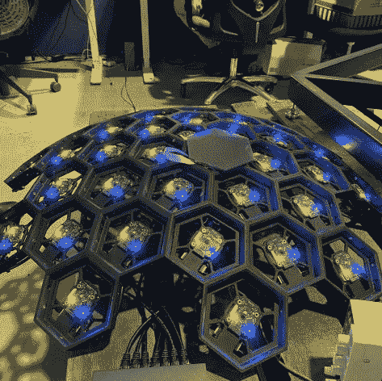

# “变形”LED 球是一个没有勺子，现实弯曲的艺术装置

> 原文：<https://hackaday.com/2021/02/25/morph-led-ball-is-a-there-is-no-spoon-reality-bending-art-installation/>

这个由六边形瓷砖组成的大球构思巧妙，制作精美，将闪亮的发光二极管和电子动画结合成一个无图案的球。

Augmentl 的[Nicholas Perillo]和[mind buffer]，[的创作“morph v2”项目的全部细节尚未公布](https://augmentl.com/work/morphv2)。然而，[在【Nicholas’】Insta](https://www.instagram.com/augmentlstudio/)上记录了一些实用化的构建过程——尤其是通过[跨越过去七个月的故事线索](https://www.instagram.com/stories/highlights/17950883626361296/)中的快照。这个项目的范围被聚焦到数百个热定形插件的延时视频，成束的扭绞线，一堆 1500 个滑轨，装满定制步进电机的箱子，以及厚切的铜母线，以将电力馈送到轴上并输出到面板。

    

休息后的演示视频令人着迷，是由[nburdy]在柏林运动实验室(MotionLab Berlin)的演示期间拍摄的。每个六边形瓷砖背后都有许多发光二极管和一个步进电机组件，让它从球的中心进出。不知何故，它设法看起来像是流动的，因为当它们延伸时，眼睛不会看到瓷砖之间的空隙。

Twitter 帖子补充了一些有趣的细节:“486 个步进电机，86000 个发光二极管和一个 5 通道颗粒合成器引擎(由@_hobson 编写，当然是在@rustlang 中)。”该建筑还包括安装在球核心的扬声器，隐藏在移动的 LED 六边形后面。结果是对现实的艺术攻击，因为光、声和运动的高度协调组合使这种感觉栩栩如生，换句话说，或者只是矩阵中的一个小故障。观看动画的渲染效果，然后在真实的东西上看到它，可以让我们明白，实际效果仍然可以让我们摆脱 21 世纪计算机生成的图形恍惚状态。

如今，将数千个 led 投入一个项目相对容易，因为 PCBA 只是将机器人应用于制造问题。但是除了少数运动部件之外，运动仍然是一个巨大的挑战。但是几年前时代广场的广告牌和变形球都表明这是值得的。

正如你从名字中猜到的，这是该团队合作的第二个变形球。查看 v1 的详细信息，[一个沙滩球大小的移动 LED 球](https://augmentl.com/work/morph)。

> 486 个步进电机，86000 个发光二极管和一个 5 通道颗粒合成引擎(当然是由 [@_hobson_](https://twitter.com/_hobson_?ref_src=twsrc%5Etfw) 写的，在 [@rustlang](https://twitter.com/rustlang?ref_src=twsrc%5Etfw) 中)。【pic.twitter.com/Sn2fp5tuXc 
> 
> — nburdy🐣🏳️‍🌈(@ nburdy)[2021 年 2 月 12 日](https://twitter.com/nburdy/status/1360221185536098304?ref_src=twsrc%5Etfw)