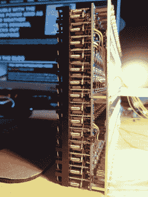
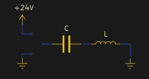

# 30 FPS 倒装点显示使用冷电容技巧

> 原文：<https://hackaday.com/2021/02/24/30-fps-flip-dot-display-uses-cool-capacitor-trick/>

大多数人在谈到翻转点显示器时会发现两个问题:在哪里购买和如何驱动它们。如果你是(Pierre Muth ),你会升级并增加挑战，让它们足够快地与 LCD 等非机械显示器竞争。这是一个成功，导致[一种新颖和快速的方式来控制翻转点显示](https://pierremuth.wordpress.com/2021/02/17/flipping-dots-fast/)。

 

华丽的层叠完成了展示。[Pierre]说焊接 2500 个组件让他在禁闭期间保持理智。如果你幸运的话，你可以从一个旧的公共汽车目的地面板，或者火车站的到达/离开面板上得到一个二手的翻转点面板。但是*有可能买到全新的 1×7 像素条带，这正是【Pierre】所做的。这些没有任何种类的驱动硬件；只有带线圈的磁化点可以通电改变状态。*

问题在于需要反转线圈的极性来实现置位和未置位状态。这里[Pierre]有一个非常有趣的想法:他没有找到一种方法来改变源和宿之间线圈的连接，而是在一端使用一个电容器，可以驱动它变高或变低来翻转这个点。

 利用这种技术，给电容器充电会给显示器上的圆点以足够的反冲。放电时也会发生同样的情况(将点翻转回来)，额外的好处是不使用额外的功率，因为电容器已经在设置像素时被充电。用 CMOS 设计电路板来控制每个电容器。一个 PCB 安装在一个 7 像素条带的背面，创建模块，形成一个更大的显示器，使用 SPI 将数据从一个级联到下一个。结果，正如你在休息后看到的，在 24×14 矩阵上播放*坏苹果*做得很棒。如果你在自己的办公桌上看到了其中的一个，[设计文件和源代码是可用的](https://github.com/pierre-muth/fast-flipdot)。购买这种尺寸显示器的像素令人惊讶地便宜，大约 100 欧元。

我们有点嫉妒[皮埃尔]一直在做的所有有趣的展示。去年秋天，他曾制作了一个 384 霓虹灯显示屏。

 [https://www.youtube.com/embed/6l5hH8V9uUo?version=3&rel=1&showsearch=0&showinfo=1&iv_load_policy=1&fs=1&hl=en-US&autohide=2&wmode=transparent](https://www.youtube.com/embed/6l5hH8V9uUo?version=3&rel=1&showsearch=0&showinfo=1&iv_load_policy=1&fs=1&hl=en-US&autohide=2&wmode=transparent)

