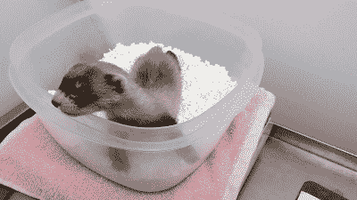
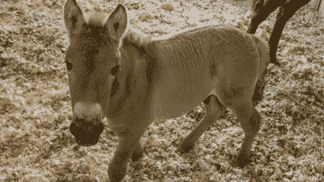

# 我们在克隆“冰冻动物园”里的动物；就像一个种子银行，但对动物来说

> 原文：<https://hackaday.com/2021/03/04/were-cloning-animals-from-the-frozen-zoo-like-a-seed-bank-but-for-animals/>

种子库是对全球生物多样性和农业具有巨大价值的设施。这些设施用于储存各种各样的种子，有助于保持遗传多样性，避免各种植物物种的永久损失。虽然存在一些挑战，但运行一个简单的种子库的基本要求是将精选的种子保持在低温和低湿度下，以最大限度地延长它们的存活寿命。

当涉及到动物时，事情变得更加困难——例如，人们不能简单地在地里种下一颗旧种子，然后长出一只新的猫鼬。动物遗传物质的保存带来了一系列独特的挑战——圣地亚哥“冷冻动物园”并不回避这些挑战。他们最近通过克隆一只死于 1988 年的动物健康出生了一只雪貂，证明了这个项目的可行性。

## 长期储存

世界上只有不到 12 家冷冻动物园，第一家是由 Kurt Benirschke 于 1972 年在圣地亚哥动物园建立的。虽然当时可用的生物技术有限，但人们希望通过冷冻保存动物组织和生殖材料的样本，它们以后可以用于研究或生殖目的。这种想法后来传播开来，世界各地也出现了一些其他设施。根据所讨论的物种，这种设备必须存储各种各样的材料。显然，有活力的配子或生殖细胞是最重要的。来自性成熟动物的卵子和精子可以很容易地从活的和死的标本中获得，并用来产生用于移植的胚胎。

或者，可以保存诸如血液或牛奶的流体，以及肌肉组织、骨骼、毛发或皮肤样本。随着 20 世纪 90 年代开创的克隆技术的发展，从这些非生殖细胞中提取的 DNA 可以植入去核的卵子中。这个卵子可以像其他胚胎一样被移植到代孕母亲体内，然后怀孕到足月。体外受精(IVF)技术在 20 世纪 70 年代还处于萌芽阶段，克隆一个遥远的亮点已经在地平线上，贝尼施克博士当时决定建立第一个冷冻动物园，这显示了相当的远见。

Elizabeth Ann was born in late 2020 – the first clone of a US endangered species. This is a screenshot from [a video from the US Fish and Wildlife Service](https://flickr.com/photos/usfwsmtnprairie/50955786263/in/album-72157718342229772/).

随着几十年来基因测序和体外受精等技术的进步，这些基因材料库开始结出果实。尽管其他物种已经被成功克隆，但这是第一次克隆美国濒危物种 T1——一只名叫伊丽莎白·安的黑脚雪貂。她于去年 12 月 10 日出生于一只充当养母的家养雪貂，她的基因是一只名叫威拉的雪貂的复制品，威拉于 1988 年去世，并被冷冻在圣地亚哥的设施中。

黑脚雪貂长期以来一直是自然资源保护主义者的关注焦点，自 20 世纪中叶被认为已经灭绝以来，他们一直在努力重建这一物种。当 20 世纪 80 年代在一个牧场发现一具死亡标本时，繁殖工作正式开始，数千只雪貂被重新放归野外。至于伊丽莎白·安和任何潜在的未来克隆人，然而，还没有计划释放他们。

## 基因多样性的挑战

然而，育种计划和克隆实验都强调了这项工作的局限性。遗传多样性是在许多代中保持种群繁荣的关键，但作为该计划的一部分，繁殖的雪貂都只能追溯到 7 个个体。类似地，一个克隆项目理论上可以从一个 DNA 样本中产生无限的后代，但是近亲繁殖的衰退将会使这样一个群体不太可能长期繁衍下去。因此，任何旨在为可能的灭绝提供潜在支持的冷冻动物园都需要收集尽可能广泛的基因样本。

Kurt is the world’s first Przewalski’s horse clone, born to a domestic horse surrogate mother. It’s hoped that Kurt will grow up to breed with others of his species, increasing the genetic diversity of the herd.

圣地亚哥工厂也有其他成功的故事。通过与 Viagen 公司合作，科学家们能够从四十岁的冷冻皮肤样本中克隆出库尔特，一匹普氏原羚的马，【with Viagen 公司可能以提供家养宠物克隆服务而闻名。与创造伊丽莎白·安的方法类似，库尔特的遗传物质被用来使一个卵子受精，然后这个卵子被植入一匹充当代孕母亲的家马体内。测序显示，供体组织具有许多在目前活着的人群中没有发现的独特基因，所有这些基因都来自仅仅 12 个以前的个体。人们希望，当库尔特成年后，与其他人交配将显著增加这一濒危物种的遗传多样性。

相似物种怀孕的需要意味着我们不太可能在一段时间内看到冷冻动物园大量生产长毛猛犸象或塔斯马尼亚虎。仅有遗传物质是不够的；一个合适的亲密的生活关系是关键，如果目标是重建种群，还需要前面提到的遗传多样性。然而，已经开发的技术和技巧对于在未来很长一段时间内维持现有物种的生物多样性至关重要，特别是考虑到世界各地仍然存在生境破坏和其他生存威胁。而且，随着科学的不断进步，将来冷冻动物园很可能会第一个邀请你去看他们的新渡渡鸟展览！