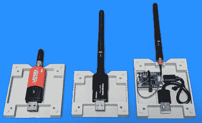

# 如果没有墨盒插槽，它就不是计算机

> 原文：<https://hackaday.com/2021/03/13/its-not-a-computer-if-it-doesnt-have-a-cartridge-slot/>

对于 20 世纪 60 年代以来的科幻电视和电影观众来说，计算机硬件的小型化有些令人失望。是的，我们可以把 1.21 千兆比特存储到一张邮票大小的存储卡上，这是令人惊讶的，但我们被承诺有一个不同的未来。这是一个令人满意的大块数据模块，它激活了从星际飞船到手持数据记录器到恶意的流氓超级计算机的所有东西，并且迄今为止只以游戏控制台的盒式磁带的形式出现。

我们的同事【汤姆·纳尔迪】已经为他的网络平台找到了解决方案，其形式是 [3D 打印的弹壳，可以隐藏常规的 USB 硬件，并与插槽](https://hackaday.io/project/177861-retrocart-usb-cartridge-system)中隐藏的 USB 插座相匹配。到目前为止，他已经为闪存驱动器、WiFi 和蓝牙适配器、Wemos D1 迷你、插座和参数参考设计设计了墨盒。

这有点令人愉快的复古乐趣，但在这一切的背后可能是一个令人惊讶的实用和有用的扩展系统。每个盒子都有足够的空间容纳很多额外的电子设备，所以它几乎是在里面构建 USB 驱动项目的理想格式。最重要的是，由于接口是 USB，它仍然可以使用传统的 USB 插头和插座。我们喜欢这个想法，这将是对任何网络平台项目的一个很好的补充。

我们更习惯于在游戏机上看到自制的墨盒[。](https://hackaday.com/2019/06/07/the-arduboy-community-rolled-their-own-cartridge/)

 [https://www.youtube.com/embed/Fd_4QBuNieg?version=3&rel=1&showsearch=0&showinfo=1&iv_load_policy=1&fs=1&hl=en-US&autohide=2&wmode=transparent](https://www.youtube.com/embed/Fd_4QBuNieg?version=3&rel=1&showsearch=0&showinfo=1&iv_load_policy=1&fs=1&hl=en-US&autohide=2&wmode=transparent)

