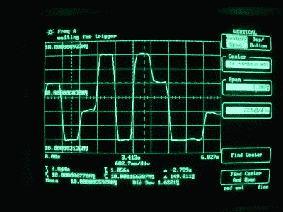
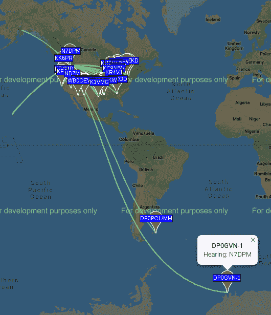
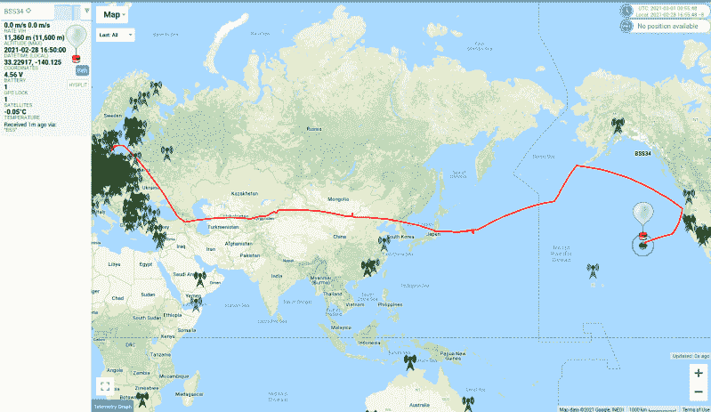

# 50 美元的火腿:环游世界

> 原文：<https://hackaday.com/2021/03/25/the-50-ham-wspr-ing-around-the-world/>

每个人都有一个遗愿清单，在我们最终在错误的草地上醒来之前要完成的事情。许多遗愿清单项目远大于现实；我们当中很少有人能活着看到“太空之旅”实现。即使是更现实的目标，比如多年来一直列在我清单上的南极之旅，也会随着你生活环境的改变而变得越来越不可能——我妻子讨厌寒冷。

幸运的是，我不用一个人去南极了——说真的，那会有什么乐趣呢？—最近，我通过业余无线电爱好者获得了一些世界旅行的满足感。“50 美元的火腿”的最后一部分突出了使用 WSJT-X 的[弱信号数字模式；在那篇文章中，我提到了弱信号传播报告器，或 WSPR。正是这种模式让我测试了极低功率传输的可能性，并让我虚拟地访问了六大洲，包括南极洲和瑞典——顺便去阿拉斯加。](https://hackaday.com/2021/02/10/the-50-ham-digital-modes-with-wsjt-x/)

## 噪音中的低语

随便问一个业余无线电操作员，他或她在任何时候都在想什么，答案很可能是，“乐队现在怎么样？”这是电离层当前状态的简称，它在很大程度上决定了射频信号从包裹地球的各层带电粒子反弹的程度。这些层在日周期内移动和移动，并经历长期的增强和减弱周期，这取决于太阳磁场活动的周期。

评估电离层的状态并找出哪些波段有通往地球上哪些点的路径曾经是 hams 不得不通过旋转刻度盘和监听信标站来完成的事情。信标是从固定的、已知的位置定期发射低功率信号的站。如果你能听到信标，很有可能在你和该频率上的信标的大致区域之间有一条传播路径。

虽然信标很有用，但也有其局限性。他们依赖陌生人的善意，这些陌生人投入资源来运行和维护灯塔站。信标还会受到偶尔维护中断的影响，因此没有听到预期的信标并不一定意味着两点之间没有路径。但也许传统信标最大的局限性在于，它们是以拉模式运行的——你必须坐在你的收音机前，故意调谐到信标的频率，并解码你听到的内容——信标几乎总是使用连续波(CW)模式和莫尔斯码。除此之外，无论你了解到什么样的传播路径，你都只能呆在自己的小屋里，而信标的效用有限。

[WSPR signal](https://commons.wikimedia.org/w/index.php?curid=75422613) by Louis Taber, CC BY-SA 4.0

考虑到这些限制，乔·泰勒(K1JT)在 2008 年开始研究一种数字模式，专门用于探索传播路径。该协议被命名为 WSPR，当然每个人都发音为“whisper”，鉴于其功能，这确实是一个恰当的名称。WSPR 是一种数字模式，采用特殊的数字信号处理算法来解码信噪比(SNR)为-28 dBm、带宽为 2，500 Hz 的信号。

发射时，WSPR 发送一个压缩的 50 位信息，该信息对电台的呼号、网格位置和发射机功率进行编码。该消息使用频移键控以非常低的比特率(小于 1.5 波特)进行调制。这意味着一条带有纠错功能的完整消息几乎需要整整两分钟才能发送完毕。WSPR 软件将传输同步到每个偶数分钟的第一秒，因此精确的时间同步至关重要。

## 可视化传播

The shape of things to come — east coast stations are hitting Antarctica on 20 meters, which means I might too in a few hours when the Sun sets over my QTH.

尽管 WSPR 协议很酷，但 WSPR 的魔力来自其名称的“R”部分:报告。这就是 WSPR 关闭传统信标留下的回路的地方，因为 WSPR 客户端软件可以被配置为将站点接收和解码的任何 WSPR 信号记录到中央数据库。WSPRnet.org 是所有报道都去的地方；该网站包含一个可搜索的数据库，包括所有被报道的“地点”以及一张地图，显示了许多许多站点当前的联系方式。

WSPRnet 上的地图不可否认地有点花哨——它基于谷歌地图，每次加载新视图时都会弹出一个错误对话框。虽然还有其他可视化方式，但即使有这些问题，WSPRnet 的地图也是查看当前可用传播路径的一种很好的方式。

例如，我刚才快速瞥了一眼 20 米波段，发现从我的区域，我已经有了几乎所有北美的可靠路径。更重要的是，我可以看到我没有路径进入欧洲或亚洲，也很少向南进入中美洲和南美洲。但是，通过观察美国东海岸正在发生的事情，那里是太阳正在落山的地方，并且积极地到达南极洲和近海的几个站，我可能会在太阳落山时找到一条通往地球底部的道路。

## 尽我的职责

正如我在我的第一篇弱信号文章中提到的，我目前让 WSJT-X 运行在我专门用于业余无线电的 Raspberry Pi 4 上。WSJT-X 有一个内置的 WSPR 模式，这使得它可以很容易地在探索 WSPR 的可能传播路径和利用该信息使用 FT8 或其他支持的模式之一制作实际的 qso 之间来回切换。

使用 WSJT-X 进行 WSPR 工作的好处在于它基本上是完全自动化的。根据您的设置，您可以是一个专用的 WSPR 接收和报告站，也可以选择也进行传输。

当我要去小屋/办公室时(这几乎总是发生)，我设置 WSJT-X 以 20%的占空比在 WSPR 上传输，也就是说，每五个两分钟的块中有一个将专用于传输。这样，我就可以为 WSPR 地图尽自己的一份力量——在我所在的北爱达荷州，通常没有多少 WSPR 信标在工作，所以我想这是我加入的方式。此外，我偶尔还能获得一个很酷的联系人，就像前面提到的 DP0GVN-1，一艘停在南极洲海岸的德国研究船，我只用了 5 瓦就在 30 米波段上找到了它。

## 瑞典，途经阿拉斯加

虽然知道你已经用比 LED 灯泡更少的电力在大约 10，000 公里的路径上进行了可靠的接触很酷，但当你离开 WSPR 站时，你收到的不寻常的站也有很多要说的。例证:前几天，我看了一眼 WSJT-X，注意到一个奇怪的呼号，SA6BSS。经过一段时间看呼号，你会知道他们来自哪个地区，我怀疑这是一个来自欧洲的“罕见的 DX ”,这对我来说真的很难用我的天线从西北太平洋内陆击中。在 QRZ.com 上快速查找证实 SA6BSS 是一个名叫 Mikael Dagman 的火腿，位于瑞典南部——酷！

我迅速旋转 WSPRnet 地图，惊讶地发现 Mikael 的站报告它的位置来自阿拉斯加而不是瑞典。我把地图放大了一点，发现信号来自阿留申群岛尤纳拉斯卡岛以南数百公里的一个网格。二月份，一只瑞典火腿究竟会在北太平洋做什么？

我给 Mikael 发了一封关于联系人的邮件，他确认我确实收到了来自他的 WSPR 站的正确位置报告，现在正乘着派对气球在世界各地漂浮！自从他在 2 月 23 日放飞气球以来，它已经在大约 11，000 米的高空从瑞典飞到中东，穿越亚洲，越过太平洋，到达俄勒冈州海岸。在那里，它拿起一个钩子，返回大海；当我写这篇文章时，它正大致朝着夏威夷的方向前进。

Literally WSPR-ing around the world — at least halfway so far. SA6BSS launched a balloon carrying a WSPR transmitter on Feb 23 that crossed the Pacific; I copied it when it was south of the Aleutians.

Mikael 好心地在他的气球上提供了一些 WSPR 发射器的信息，这是一个完全由太阳能供电的气球，重量只有 2.6 克。他的设计简洁得近乎滑稽——它只是一个 GPS 模块、一个 ATMega328 和一个用于发射器的 Si5351。这是一个预算可以做什么的完美例子，这与“50 美元火腿”的概念是一致的。因此，构建一个轻量级、廉价的 WSPR 信标自然是本系列下一期文章的基础。