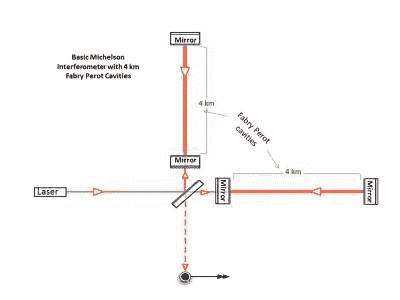
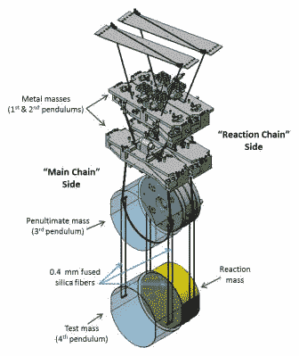
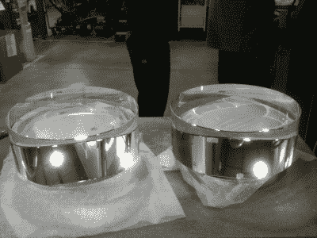
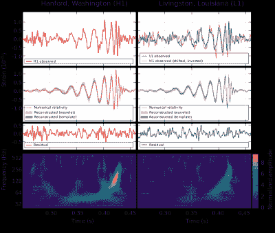

# LIGO 天文台如何探测引力波

> 原文：<https://hackaday.com/2021/03/24/how-the-ligo-observatory-detects-gravitational-waves/>

重力是宇宙中比较明显的力之一，通常被认为是苹果从树上落下的方式。然而，引力背后的潜在机制极其复杂，是迄今为止许多研究的主题。

这项研究的一个主要组成部分是围绕引力波的概念。亨利·庞加莱在 1905 年首次提出，后来成为爱因斯坦广义相对论的主要组成部分，从那以后，这是一代又一代物理学家追逐的现象。对于 LIGO 激光干涉引力波天文台的团队来说，寻找引力波的直接证据只是一天的工作。

## 到底什么是引力波？

引力波是时空本身的波纹，是由具有某种不对称形式的加速质量引起的。例如，一个绕主轴旋转的哑铃不会产生引力波，旋转的球体或平板也不会产生引力波。然而，一个哑铃翻转过来，或者一个明显不对称的哑铃，*会产生引力波。大多数引力波来源于主要的宇宙尺度事件，因为涉及的质量越大，产生的引力波就越大。典型的来源包括双星系统，其中两颗大恒星围绕彼此旋转，或者双星黑洞。超新星爆炸不对称地加速了大量的质量，因此也应该产生引力波。在极少数情况下，不完全是球形的难以置信的密集旋转中子星也应该引起这样的波，因为表面不规则性使它们不对称——尽管这些还没有在实践中被检测到。*

## 探测引力波

引力波会扭曲时空，当它通过时会把时空挤压在一起或拉长。不幸的是，对于世界上努力工作的物理学家来说，引力波和物质之间的相互作用非常弱。结合引力波的强度随着源的距离的倒数而变弱的事实，探测引力波确实非常困难。

The basic layout of the LIGO Interferometer. Note the Fabry Perot cavities that enable the 4 km long interfereometer to extend its functional length to 1200 km.

使用传统的测量设备来研究这种现象是不可行的。LIGO 必须测量小于 1 万倍质子大小(或大约 8.4 x 10 ^(-20) 米)的距离变化，以确定引力波对其探测器的影响。[它用一个 L 型激光干涉仪](https://www.ligo.caltech.edu/page/ligos-ifo)来完成这项工作。一束激光射向一个 45 度的分束器，分束器把一部分光送到 L 形的一边，其余的光送到另一边。每条腿的末端都有一面镜子，可以反射光线。然后，来自每条腿的光被重新组合并照射到光电探测器上。随着 L 形每条边的长度变化，光在每条路径上传播的距离也不同。

当反射光被重新组合时，因为来自每个路径的光相长干涉和相消干涉，所以产生了干涉图案。这种干涉图案可以用来极其精确地确定每条腿的长度，从而用来确定是否有引力波经过，扭曲干涉仪周围的时空。干涉仪的腿越长，它对引力波就越敏感，因此 LIGO 干涉仪的每条腿足足有四公里长。

为了进一步提高灵敏度，干涉仪采用了所谓的法布里-珀罗腔，在光到达光电探测器之前，光在每条腿上来回反射 300 次。这使得激光在到达探测器之前，在每条腿上下传播 1200 公里，大大提高了对每条腿大小微小变化的灵敏度。

## 稳定仪器

LIGO’s mirrors, known internally as “test masses”, are suspended from a four-stage pendulum by glass fibers, acting as a passive stabilisation measure against disturbances.

如果建造一个每边 4 公里的巨型干涉仪听起来还不够困难，不要担心——还有更多困难。在测量距离的微小变化时，即使路过的卡车或远处的地震发出轻微的隆隆声，也足以动摇干涉仪组件，从而破坏任何测量。为了防止这种情况，使用了主动阻尼系统来稳定系统。各种传感器检测震颤和环境振动，并产生反向运动以保持稳定。

此外，镜子本身悬挂在一个称为“四边形”的四级钟摆上，以将干扰降至最低。该系统的镜子，或“测试质量”重达 40 公斤，由于纯惯性，也有助于稳定。整个光路也保持在海平面上一万亿分之一大气压的真空中，因为四处跳动的游离空气分子会产生干扰传感器读数的噪音。

LIGO 系统实际上是世界上体积最大的真空之一，瑞士的大型强子对撞机就是一个著名的更大的例子。实现这一真空绝非易事。首先加热管子，尽可能多地排出残余气体，然后用一系列涡轮泵和离子泵来降低内部压力。花了整整 40 天才把每一管 LIGO 降低到必要的真空水平。自 20 世纪 90 年代以来，干涉仪臂一直保持在真空状态；闸阀用于密封角室，以便在必要时进行维护和升级。

## 一个 200 瓦的激光可不是闹着玩的

End Reaction Masses used in the LIGO interferometer. Each one weighs 40 kg and needs to be absolutely defect free for top performance.

LIGO 使用的激光对探测器的性能也至关重要。有了更强、更有力的激光束，光电探测器拾取的信号就不太可能受到噪声的干扰。“我们希望尽可能多的光子与测试质量相互作用，”LIGO 调试团队的博士后成员 Georgia Mansell 说。先进的 LIGO 升级版为该设施配备了 200 瓦的激光系统，尽管全功率水平尚未在实践中使用。“在我们最后一次观察中，我们遇到了一个问题，其中一个测试质量涂层中有一个点缺陷…它吸收了大量的热量，并在光学元件中产生了一个奇怪的热分布。最后，我们在最后一次观测中使用了 40 瓦。”2021 年 1 月，有缺陷的测试质量被替换，干涉仪开始为下一次观测做准备。

在大型物理设施中，LIGO 的独特之处在于它不是一个单一的设施。相反，整个干涉仪组件被建造了两次，分别位于路易斯安那州的 LIGO·利文斯顿天文台和华盛顿州的 LIGO·汉福德天文台。这有利于系统将两个位置的潜在引力波发现关联起来。这有助于从真正的引力波检测中排除交通或地震活动引起的振动等现象。

## 观察

Signal traces of the first confirmed gravitational wave detection. T-shirts were made celebrating the find, and this author is lucky enough to have one.

第一次直接引力波探测是在 2015 年 9 月 14 日，由当时的两个 LIGO 天文台探测到。从那以后，更多成功的观测已经完成，[最近一次观测在被新冠肺炎](https://www.ligo.caltech.edu/news/ligo20200326)削减之前，已经进行了 55 次探测。随着直接观测证实了引力波的存在，人们正在努力更好地理解这一现象。每次探测都来自不同的恒星事件，并揭示了更多潜在的物理过程。迄今为止最大的探测来自 2019 年 5 月 21 日，[可能是由于两个黑洞的合并](https://www.ligo.caltech.edu/news/ligo20200902)。数据在两个 LIGO 天文台之间进行比较，以及在意大利一个类似的名为处女座的设施，以帮助确定任何观测到的波的来源。

能够探测到引力波使得对传统光学或电磁天文学难以获得的现象的研究成为可能。

> 在 LIGO 之前，我们真的不知道宇宙中有多少二元黑洞……你真的看不见它们。LIGO 敏感的是它们合并的最后时刻…我们正在对二元黑洞的分布做一些很酷的事情…它们可能各向同性地分布在宇宙中，或者在某些系统中可能有更多的黑洞。

随着更多的测量数据不断涌现，物理理论不断发展，从该项目中收集的数据可能会进一步揭示宇宙本身的结构。

LIGO 实验是一个很好的例子，说明了研究物理学前沿现象所需的复杂程度。通常，在提出的理论和成功的实验证实之间有很大的差距；在这种情况下，整整一个世纪过去了，引力波才能被直接探测到。解开宇宙的秘密是一项艰巨的工作，但科学家们一如既往地准备迎接挑战。

感谢 LIGO 项目的 Georgia Mansell 为本文提供咨询！[她在 LIGO 干涉仪上的直播可以在 Twitch.tv](https://www.twitch.tv/enseli) 上看到。]