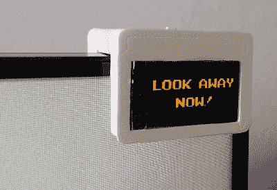

# 视力卫士守护你可怜的学生

> 原文：<https://hackaday.com/2021/03/05/eyesight-guardian-polices-your-poor-pupils/>

我不知道你是怎么想的，但是在过去的一年左右的时间里，我们已经从每天花十到十二个小时在这台电脑上增加到了十六到十八个小时。幸运的是，显示器后面有一个窗口，可以用来休息 20/20/20 分钟，这应该可以防止眼睛疲劳，但很难记住(也很无聊)去做。以自我保健的名义，没有人需要记住另一件事。

 【丹尼尔·辛斯顿】当然同意。正如你将在休息后的令人愉快的视频中看到的，[丹尼尔][将](https://www.instructables.com/Eyesight-Guardian-Protect-Your-Eyes-With-Arduino/)每二十分钟停下来花二十秒钟看至少二十英尺远的一个点的整个过程变成了一个游戏。休息结束后，[Daniel]使用两用启动按钮来确认已经看向别处 20 秒了。该设备旨在夹在任何显示器的角落上，并且[丹尼尔]已经提供了几种尺寸的桥接件，以便每个人都可以找到自己的合适位置。

《卫报》的胆量非常简单 Arduino Pro Mini 运行秒表和 TFT 显示屏来显示 SD 卡上的图形。这是保护你视力的一个很好的方法，把我们都知道应该做的事情游戏化。增加一个可以数到 25 左右的休息计时器可能会更好，这样你就有时间站起来再回来。如果你按下按钮太快，它骂你，你必须开始你的眼睛休息。

最近需要更多的自我护理吗？在这些有趣的时刻，我们自己的[Jenny List]会支持你。

 [https://www.youtube.com/embed/DRDmLbAgXZc?version=3&rel=1&showsearch=0&showinfo=1&iv_load_policy=1&fs=1&hl=en-US&autohide=2&wmode=transparent](https://www.youtube.com/embed/DRDmLbAgXZc?version=3&rel=1&showsearch=0&showinfo=1&iv_load_policy=1&fs=1&hl=en-US&autohide=2&wmode=transparent)

