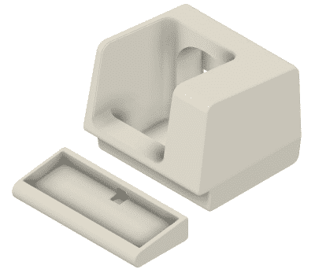

# 2:3 比例的 VT100 是 PDP-8/I 副本的完美配对

> 原文：<https://hackaday.com/2021/03/04/23-scale-vt100-is-a-perfect-pairing-for-pdp-8-i-replica/>

当他去购买一个老式串行终端来搭配他的 PDP-8/I 复制计算机时，[迈克尔盖迪]陷入了严重的贴纸休克症。但他没有气馁，而是推断说，如果他的“复古”电脑能够以现代组件为核心，那么他用来与之对话的终端也可以。凭借他在设计 3D 打印副本硬件方面的丰富经验，[他建造了一个绝对华丽的按比例缩小的 DEC VT100 终端](https://hackaday.io/project/177596-23-scale-vt100-terminal-reproduction)，任何经典电脑爱好者都会很高兴将它放在他们的办公桌上。

 现在要明确的是，【迈克尔】还没有创造出*真正的*串口终端。由于 faux PDP-8/I 运行在 Raspberry Pi 上，他需要做的只是想出一些可以连接到 HDMI 和 USB 端口的东西。简而言之，他基本上只是为 Pi 的显示器和键盘做了一个 3D 打印的外壳。哦，但这是一个多么华丽的围栏啊。

由于[Michael]无法获得真正的硬件，用 CAD 重新制作 VT100 变得更加困难。当然，在 T1 之前，这并没有阻止他。原来 DEC 在他们的原始文档中提供了一些非常详细的终端尺寸，虽然将它们与实际终端的照片进行比较确实发现了一些关键的差异，但整体外观是正确的。他报告说，设计完成后，花了两卷细丝和 200 多个小时打印出外壳的所有部件。

为了帮助销售真实的外观，[Michael]找到了一个合适尺寸的 4:3 LCD，使用现成的便携式机械键盘应该可以使文本输入成为一种乐趣。为了好玩，他甚至为 VT100 设计了一个主题街机控制器，可以与 RetroPie 一起使用。印刷的标志板是一个特别好的触摸，我们非常愿意原谅他不得不以比终端其他部分更大的比例印刷它，以便用他的打印机的 0.4 毫米喷嘴获得所有细节。

在技术层面上，这可能是我们见过的最简单的[迈克尔]的复制品。但是即使在这样一个相对简单的项目中，他对细节和工艺的标志性关注也得到了充分展示。当他有一个新的构造可以炫耀时，这总是一个好日子，我们渴望看到他接下来会有什么。