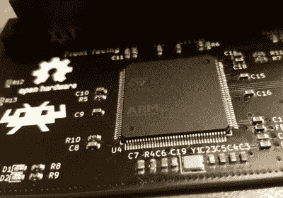

# 追溯开放硬件的目标是即插即用

> 原文：<https://hackaday.com/2021/03/04/retroarch-open-hardware-aims-for-plug-and-play/>

其核心是，RetroArch 项目的存在是为了让在更现代的硬件上玩经典游戏变得更容易。精简的前端及其定制的模拟器集合有助于消除在您喜欢的任何小工具上运行您几十年来最喜欢的游戏的困惑，从您的智能手机到古老的 Raspberry Pi。但是总有改进的空间。

在最近的一篇博客文章中，【RetroArch 背后的人们揭开了一个激动人心的硬件项目的面纱，这个项目已经进行了大约一年。简称为“RetroArch 开放硬件”，目标是开发一个完全开源的盒式适配器，它将与 RetroArch 软件无缝集成。只需插入您的原装墨盒，游戏就像回到了过去的美好时光一样运行起来。

 现在要明确的是，这并不完全是一个新的想法。但 RetroArch 的团队解释说，以前模糊硬件和仿真之间界限的设备非常昂贵，很难找到，最糟糕的是，是专有的。通过创建一个开放的硬件项目，他们希望在社区中真正释放这种能力。不再需要与一家厂商打交道，多家公司将可以自由开发自己的克隆产品，甚至有可能改进核心设计。如果市场上没有一个能满足您的特定需求，您甚至可以自由构建自己的版本，

更重要的是，这个小工具还能让你更容易用自己的光盘盒制作自己的光盘。通过向操作系统显示为 USB 大容量存储设备，用户可以将游戏 ROM 拖放到他们计算机的桌面上。没有神秘的软件从命令行启动；尽管我们可能喜欢这样的事情，但对于游戏社区来说，这并不是很直观。同样的技术也允许用户在不可避免地被时间毁坏之前备份他们保存的进度。该团队展示的设备目前只能在任天堂 64 游戏上运行，但可能在未来会扩展到其他墨盒。

多年来，我们已经看到了许多用于读取和复制游戏卡带的 hombrew 设备。我们甚至已经看到一些[相当精致的例子被作为开放硬件](https://hackaday.com/2020/05/05/an-open-hardware-sega-genesis-cartridge-dumper/)发布。但是这些设备从来没有在仿真场景中得到这样一个众所周知的团体的公开支持，我们很兴奋地看到这种级别的合法性可以刺激什么样的开发和采用。

感谢尼克的提示。]