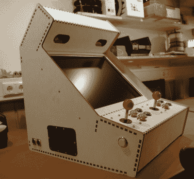

# Boxes.py 包含您的激光切割盒需求

> 原文：<https://hackaday.com/2021/03/10/boxes-py-has-your-lasercut-box-needs-covered/>

我需要一些东西来测试低功率激光切割机，并认为一些小纸箱会很好地符合要求，所以我去网上搜索快速和肮脏的指接盒发电机。并且[最好的](https://hackaday.io/project/10649-boxespy)将在 hackaday . io . Florian Festi 的 [boxes.py](https://www.festi.info/boxes.py/index.html) 上找到，请击鼓。py 不仅有一个可爱的 web 界面，涵盖了大量的盒子样式，并且包括[切口测试](https://www.festi.info/boxes.py/BurnTest?language=en)以确保你的关节紧密，而且它还用易于扩展的 Python 编写，用于当你有*真正*特殊需求时。

 但是你不需要自己设计任何东西。已经有了带活动铰链的[盒子](https://www.festi.info/boxes.py/FlexBox?language=en)、[盒子可以安装 19 英寸的机架](https://www.festi.info/boxes.py/Rack19Box?language=en)、[带激光切割安装轨道的 Eurorack skiff 盒子](https://www.festi.info/boxes.py/EuroRackSkiff?language=en)，甚至还有一个带 PCB 安装耳的[通用电子项目盒子](https://www.festi.info/boxes.py/ElectronicsBox?language=en)。[控制台 2](https://www.festi.info/boxes.py/Console2?language=en) 在后服务口上有集成的夹子。

你需要一个圆形开口的[五角棱镜](https://www.festi.info/boxes.py/RegularBox?language=en)？多大的？我猜一个[完整的街机式游戏机](https://www.festi.info/boxes.py/Arcade?language=en)从技术上来说就是*一个盒子*。自然也有[的齿轮系](https://www.festi.info/boxes.py/Planetary2?language=en)，甚至还有一个[的机械臂设计](https://www.festi.info/boxes.py/RobotArm?language=en)。等等，什么？

每个盒子的设计都是完全可定制的，所以很容易制作类似于[带有定制分隔线](https://www.festi.info/boxes.py/TrayLayout?language=en)的盒子，其中不同的隔间在甜蜜的文本标记中指定。[Florian]为游戏 Agricola 设置的示例框令人惊叹。

支撑这一代码的是一个类似标志的手指关节绘图程序。这使得绘制自己的有趣形状变得相对容易，并且让计算机来处理通过连接手指进行思考的艰苦工作。[Florian]似乎接受新盒子形状的拉动请求，但我还没有想到一个。

关于 boxes.py 有多酷，我不能说太多，大多数演示应用程序本身都值得一看。这是 2017 年 Hackaday 奖的一个项目，从那以后它一直在增长和改进。好样的，[弗洛里安]和公司。