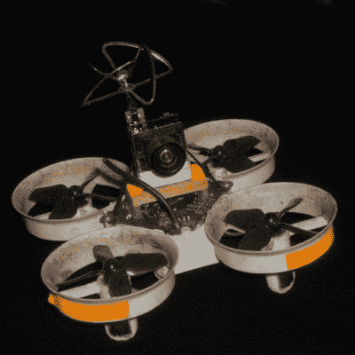

# 丢了一架轻型四轴飞行器？以下是找到它的最佳方法

> 原文：<https://hackaday.com/2021/03/06/lost-a-lightweight-quadcopter-here-are-the-best-ways-to-find-it/>

失踪的飞机很难找到，因为它们本来就很小。它们不仅更难被发现，而且更小的装置缺乏 GPS 跟踪等功能；通常情况下，不可能把它加到一架小型飞机上，因为这种飞机本来就不能承载超过其自身重量的东西。因此，丢失的小股四头肌通常更难恢复。

Fluorescent tape adds negligible weight, and will glow brightly at night under a UV light.

好消息是[Eric Brasseur]分享了一些关于如何更容易定位和找回失踪飞机的简明提示，尤其是轻型飞机。回收飞机是每个飞机爱好者都必须以这样或那样的方式处理的事情，但[Eric]真的收集了一个令人印象深刻的技巧和技术列表，其中一些进入了一些真正有用的附加细节。我们想到，很多这些建议同样适用于户外机器人，或漫游者。

即使是简单的技术也可以改进。例如，在飞机上使用明亮的颜色是增加能见度的一种明显的方式，但是有些颜色比其他颜色更好。明亮的橙色、白色和红色是很好的选择，因为它们很容易被人眼发现，但在自然界中仍然不常见。另一方面，当在室内的工作台上观看时，紫色、蓝色甚至青色可能看起来是不错的选择，但是如果四方形卡在黑暗的灌木丛中，这些颜色将不再显眼。另一个好的建议是考虑在飞机上增加一些荧光胶带。如果其他方法都失败了，晚上带着紫外线灯回来；这些斑块会发出明亮的光，从几十米外就能很容易地看到。

一些提示是在设备仍有电时使用的，而另一些则不依赖于电池。[Eric]很好地总结了这些以及更多内容，所以请看一看。在试飞比 18650 电池、马达和 3D 打印框架稍大一点的四轴飞行器时，它们可能会派上用场。