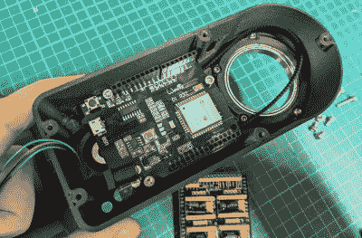

# 用这个 DIY 数码望远镜探索宇宙

> 原文：<https://hackaday.com/2021/03/05/explore-the-cosmos-with-this-diy-digital-telescope/>

近距离观察月球并不是特别困难；即使是一个完全的初学者也可以用一个便宜的望远镜对准我们最近的天体邻居，获得一些令人印象深刻的景象。但是如果你想探索得更远一点，特别是如果你想拍摄你在黑暗中发现的东西，事情会变得很复杂(也很昂贵)。

虽然[建造这个由【Greg Holloway】](https://www.instructables.com/The-Micro-Scope-a-Miniture-GOTO-Telescope/)设计的 3D 打印自动望远镜不一定*便宜*，特别是一旦你考虑到你的时间价值，最终产品肯定看起来比商业领域的大多数产品都要精简。你不需要带着一个单独的望远镜、三脚架、电动追踪器和相机，你只需要这个相对紧凑的一体化设备。

 【格雷格】花了六个月的时间开发他的微型天文台，它显示。CAD 工作是非凡的，一般的文档也是如此。即使你对窥视天空不感兴趣，仔细阅读这个项目的说明页也是值得的。从他为 3D 打印设计的技巧到选择合适的镜头并将其与 Raspberry Pi HQ 相机匹配的信息，每个人都有一些小东西。

当然，如果你*正在*寻找建造自己的电动“GOTO”望远镜，那么这是必读的材料。[Greg]真的做了他的功课，这个项目是一个关于电机控制器、接线、手控器和你需要把它们联系在一起的开源固件的极好的信息来源。他在这里概述的许多想法可以适用于其他望远镜项目，或者真的，[任何需要精确指向天空的东西](https://hackaday.com/2020/12/16/tracking-satellites-the-nitty-gritty-details/)。如果你想开始夜空摄影，并且对你捕捉的东西不挑剔，我们已经看到了一些简单的项目[将相机对准星星，等待事情发生。](https://hackaday.com/2020/12/16/tracking-satellites-the-nitty-gritty-details/)

【感谢尤金的提示。]