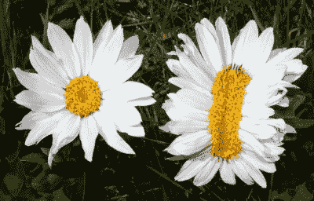
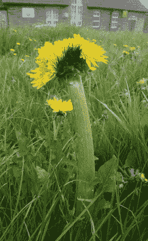
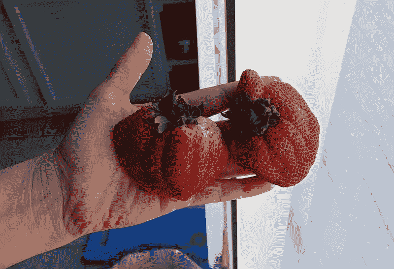

# 迷人的魅力世界

> 原文：<https://hackaday.com/2021/04/22/the-fascinating-world-of-fasciation/>

前几天，我在 reddit 上看到了这个巨大的变异草莓，看起来它要么生长在辐射区，定期去健身房，要么撒上了魔法粉。我立刻对这种被称为[着迷](https://en.wikipedia.org/wiki/Fasciation)的现象产生了浓厚的兴趣。

事实证明，束化是相当罕见的现象，但却发生在多种维管植物中。这些变异草莓看起来可能有点令人不安，但它们完全可以安全食用。唯一的问题是，你更可能在野外遇到迷人的蒲公英或雏菊，而不是杂货店里的草莓或菠萝，因为所谓的丑陋产品往往会被淘汰。

当顶端分生组织(更好地称为植物的生长顶端)偏离以圆柱形方式向上生长，而是展平，产生带状植物茎、细长或多个花头和半圆形草莓时，发生基本上不受控制的组织生长。

Regular and fasciated mule’s ears from [Wikipedia](https://commons.wikimedia.org/w/index.php?curid=10712071)

尽管簇生倾向于表现为扁平的主茎，但这种现象几乎可以发生在植物的任何地方——根、茎、叶、头状花序或果实。它可以局限于一个区域，也可以影响整个工厂。

着迷被比作癌症，因为它有许多原因和表达方式，但它没有那么有害或可怕。有些种类的植物表现出极度的簇生。虽然这不是致命的，但也不理想，因为这种情况会导致组织破裂，组织扭曲，生育能力下降。

## 着迷:它是如何工作的？

One absolute unit of dandelion. Image via [Wild Yorkshire](http://wildyorkshire.blog/2015/05/fasciated-dandelion/)

法西斯化有许多内因和外因。从内部来看，这是由于生长细胞中的激素失衡、细菌或病毒感染或随机基因突变造成的。也有环境原因，如化学品暴露，寒冷和霜冻暴露，或真菌，螨虫和昆虫的攻击。

在维管植物中，丛生的奇迹是没有地理、气候、生态或分类学界限的。它同样影响一年生植物、两年生植物和多年生植物；木本和草本植物；灌木、树木和藤蔓植物。虽然任何维管植物都可能发生束化，但它在玫瑰(包括[草莓](https://en.wikipedia.org/wiki/Strawberry))、豆科、向日葵和仙人掌科中非常常见，并且经常在蒲公英和金鱼草中发现。

一些维管植物容易簇生并因此受到重视，比如鸡冠花。一些着迷的植物群甚至成为了崇敬的对象，就像出现在面包片上的圣母玛利亚。曾经有一棵迷人的南瓜藤生长在南印度。二十英尺长的迷人部分吸引了大量的人来崇拜它，相信藤蔓是眼镜蛇王或毗湿奴神的使者那加·萨帕的化身。

今年春天，我会到处寻找不正常的蒲公英和雏菊。我已经开始在杂货店寻找巨型草莓，发现这两个在同一个盒子里。你不加入我吗？比起四叶草，我们可能更容易找到迷人的水果或花朵。

