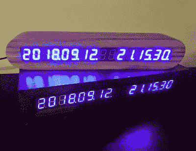
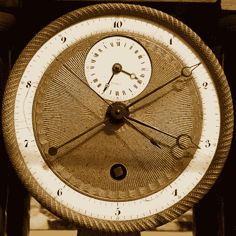

# ISO 8601:结束约会大战，让每个人都同样困惑

> 原文：<https://hackaday.com/2021/04/21/iso-8601-ending-the-date-wars-and-confusing-everyone-equally/>

我必须签署一份文件来完成牛津郡的一项社区责任。在底部，虚线代表签名和日期。我通常潦草的签名，并在下面潦草的日期。然后，处理表格的女士带着困惑的表情浏览了一分钟，然后微笑着接受了表格。她刚刚被隔离了！

I’m telling you, you’ve got Pi Day wrong. Evan Shelhamer, [CC BY 2.0](https://commons.wikimedia.org/wiki/File:Pi_Day_pie_(13346244934).jpg).

在我来自英国的地方，按升序表示日期是一种规范:日、月、年。因此，当把 2021 年 3 月 4 日写在表格上时，它就变成了 04/03/2021。这是完全符合逻辑的，而且考虑到用英语和其他语言大声说出日期的方式，这也是完全有意义的。

同时，在美国，用不同的方式表示日期是一种规范:月、日、年。因此，当把 2021 年 3 月 4 日写在表格上时，它就变成了 03/04/2021。这也是完全符合逻辑的，而且考虑到日期在美国英语中的发音方式，这也是完全有意义的。

作为一个工作需要跨越大西洋的语言学家，我经常被被一种共同语言分割的有趣怪癖所迷惑。2021 年 3 月 4 日是 4 月 3 日还是 3 月 4 日？“为什么美国人不能用一种符合逻辑的日期格式！”我哭了，因为在遥远的大西洋彼岸，我听到我的朋友在那边哀叹我们讨厌的欧洲方式。这种分歧是否会导致任何卫星坠毁，这是值得怀疑的，但它肯定会令人恼火。

## 让所有人困惑了三十多年

所以我表明了立场。几十年前，我在书写日期时采用了 ISO 8601，这一国际标准已经伴随我们三十多年了。这也是[表达时间](https://xkcd.com/1179/)的一种完全合乎逻辑的方式，但与前面提到的两种方式不同，它没有任何语言上的古怪。相反，它从最大的单位开始，以降序表示日期或时间，并从日期扩展到时间。因此，我表格上引起困惑的日期是 2021-03-04。我猜，在 Hackaday 这里，我是在向唱诗班布道，因为我肯定不会是这里唯一一个在日常生活中使用 ISO 8601 的人，但当我们在我们的社区中谈论替代日期格式时，这是一个评估情况的机会。

Just in case you thought UNIX time wasn’t practical, [take a look at this epoch clock](https://hackaday.io/project/161257-gpsclock).

Unix 时间可能是我们所有测量方案中最容易识别的，它是从 1970-01-01T00:00:00+00:00 UTC 的 UNIX 纪元开始计算的秒数。巧合的是，对许多读者来说，这也是一个吉祥的日子，[因为这是我们的生日](https://hackaday.com/2020/01/01/happy-50th-birthday-to-all-you-epoch-birthers/)。如果我把 3 月 4 日写成 1614816000，我会完全不理解，所以除了偶尔聚在一起观察一次翻转，这不是我们在编码之外使用的东西。

但这确实引出了另一个问题:既然 UNIX 时间在文本中通常以十进制数字表示，为什么我们的时钟时间以 60 为基数表示秒，以 12 或 24 为基数表示小时，然后以 12 为基数表示月呢？为什么我们不用十进制的时间系统呢？

我们的年历和一天的长度来自地球的轨道，这是有意义的，因为我们用日期来衡量季节，用时间来衡量每天的进展，而不仅仅是过去的时间。我们的 12 小时昼夜归功于古希腊人，我们的 60 秒和 60 分钟归功于古巴比伦人，而我们的 12 个月则来自古罗马人。很明显，一年有 365.24 天，一年有四个季节，不能简单地分成十个月，所以当我们谈论日期的时候，我们要受我们自己的一套天体的支配。但是说到时间，我们肯定可以从古希腊和巴比伦继续前进吧？

## 自由、平等、准时！

A 10-digit Revolutionary French clock. DeFacto, [CC BY-SA 4.0](https://commons.wikimedia.org/wiki/File:Decimal_Clock_face_by_Pierre_Daniel_Destigny_1798-1805.jpg)

十进制日历最著名的尝试可能发生在法国大革命之后；法国共和历也许明智地坚持了 12 个月，但把每个月都变成了三个 10 天的星期，然后把一天分成 10 个小时，每一个进一步的细分都以 10 为基数。每个月有 30 天，剩下的 5 天(或闰年的 6 天)是公共假日。

当引入它的革命政府被拿破仑的政府取代时，它就正式结束了。不像其他法国共和党的测量方法，如米，它显然没有提供足够的优势，其受欢迎程度超过其政治起源。

1971 年英国货币的十进制化有一个有趣的相似之处。以前，一英镑是 20 先令，每先令是 12 便士。后来，一英镑变成了 100 新便士，就这样被卡住了。尽管有些人对旧制度留恋不去，十进制的效用是不言而喻的。

法国时间十进制化故事的寓意是，人们简单地使用日历和时间系统来表示日期和时间。当你需要做频繁的算术时，比如货币、距离或重量，通过小数会变得容易得多。但是当大自然给了你四个季节，你却被压缩成了十二个月。也许当我们摆脱地球的束缚时，我们会使用十进制日期，但与此同时，ISO 可能就是我们要走的路。

表头:Rama， [CC BY-SA 2.0 FR](https://commons.wikimedia.org/wiki/File:Breguet_MG_2576.jpg) 。