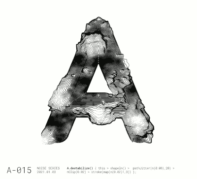

# 柏林噪音有助于使 Trippy 印刷艺术

> 原文：<https://hackaday.com/2021/03/10/perlin-noise-helps-make-trippy-typographic-art/>

柏林噪声最好用视觉术语来解释:如果真正随机噪声的 2D 切片看起来像均匀而粗糙的静态，那么柏林噪声的随机 2D 切片将具有自然的斑点结构，具有平滑的梯度。[Jacob Stanton] [使用柏林噪音作为起点，创造了一些有趣的矢量艺术作品](http://www.jacobstanton.com/generative-typography-a-study/)，展示了各种不同的视觉效果。[Jacob]发现他的结果通常表现出一种自然的品质，视觉效果唤起了人们对苔藓、鳞片、山丘、皮毛以及“其他难以描述的奇怪事物”的感觉

 这个艺术项目【Jacob】从这一切中创造了一系列海报，展示了一些更引人注目的例子，每一个都展示了以不同方式修改的“A”。这里显示了一些，其他结果的集合也是可用的。

《柏林噪音》是肯·柏林在 80 年代早期制作原版电影《创 1》时创作的，来自于对当时计算机生成图像的失望。他的作品产生了巨大而持久的影响，并有助于艺术家创造更自然的纹理。[处理](https://processing.org/)有一个[柏林噪声函数](https://processing.org/reference/noise_.html)，这实际上是【雅各布】整个项目的起点。

*噪音*毕竟是一个宽泛多变的名词。从制作[生成艺术](https://hackaday.com/2015/08/28/building-a-business-around-generative-design/)到智能音箱的[静音锥](https://hackaday.com/2019/01/17/win-back-some-privacy-with-a-cone-of-silence-for-your-smart-speaker/)，它有许多实际和艺术应用。