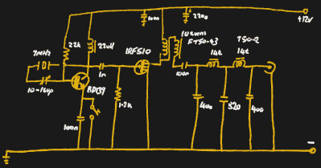

# 用 10 分钟左右的业余无线电发报机进行广播

> 原文：<https://hackaday.com/2021/03/11/getting-on-the-air-with-a-10-minute-ish-ham-transmitter/>

人工约束的设计可能是最具挑战性的项目之一，也是最值得考虑的。业余无线电界对此并不陌生，自制的无线电设计在沙滩上划出了某种界限。这样的设计通常以令人愉快的极简主义和对基本原则的深刻指导而告终，这是我们如此喜欢它们的一个原因。

关于这种设计哲学的完美例子，看看[【VK3YE】对经典的“10 分钟发射机”](https://www.youtube.com/watch?v=cPPi7uLGtgY)的扭曲。(视频，嵌在下面。)

 这个设计至少可以追溯到 20 世纪 80 年代，当时[G4RAW]提出了一个挑战，要在 15 分钟内用垃圾箱的零件组装出一个可以工作的发射器，并建立联系——10 分钟用于组装，5 分钟用于工作波段。[VK3YE]在他的 10 分钟发射机中使用了“oner”——一个晶体管——设计，但投入了一些额外的时间来添加低通滤波器以保持信号干净，并添加了一个功率放大器以稍微提高输出。

即使经过精心设计，这个设计还是非常简单易懂。构建是标准的[“丑陋的风格”](https://hackaday.com/2016/05/04/getting-ugly-dead-bugs-and-going-to-manhattan/)阻碍了像这样的快速构建。没有很难找到的零件，所有的东西都装在一个小金属盒里。下面的视频展示了设计和构建，以及使用 WebSDR 接收机的一些实验，以检查使用和不使用功率放大器的范围。

看到这些类型的建造真的让我们有心情去做一些低能量的动作。这样的事情会出现在[《50 美元火腿》系列](https://hackaday.com/tag/the-50-ham/)中吗？很有可能是的。

 [https://www.youtube.com/embed/cPPi7uLGtgY?version=3&rel=1&showsearch=0&showinfo=1&iv_load_policy=1&fs=1&hl=en-US&autohide=2&wmode=transparent](https://www.youtube.com/embed/cPPi7uLGtgY?version=3&rel=1&showsearch=0&showinfo=1&iv_load_policy=1&fs=1&hl=en-US&autohide=2&wmode=transparent)

