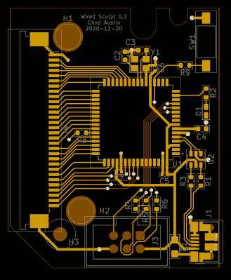

# 系绳塔梅什气质打字

> 原文：<https://hackaday.com/2021/03/18/tether-tames-temperamental-typing/>

[chadaustin]有一个最喜欢的键盘，它具有非常符合人体工程学的形状、键行程距离和大小，但在切换到 Windows 10 后，无线连接引入了可怕的延迟。更糟糕的是，众所周知，接收器容易受到 USB 3.0 集线器的干扰。为了提供 128 位 AES 加密，接收器在出厂时与键盘配对，不能更换。如果你失去了这一点，你会得到一个高度符合人体工程学的纸张重量。chadaustin 的解决方案是[拴上键盘](https://chadaustin.me/2021/02/wired-sculpt/),并在此过程中接受一些硬件黑客的速成课程。正如在 [ycombinator](https://news.ycombinator.com/item?id=26223805) 上对这个项目的回应所证明的那样，许多 2013 年推出的微软 Sculpt 人体工程学键盘的长期粉丝也遇到了类似的问题。

KiCad USB controller board layout

我们非常感谢 chadaustin 采取渐进的方法，一次解决一个问题，并在许多复杂步骤的第一次尝试中获得他人的帮助。概念验证包括将键盘矩阵测试焊盘的每根引线手工焊接到一个 [QMK Proton C](https://qmk.fm/proton-c/) 上，它可以工作，但无法放入键盘外壳。为了更持久和整洁的解决方案，[chadaustin]尝试了带状电缆分线板和其他微控制器，但这些都不够紧凑，无法装入机箱。这需要一个定制的 PCB，另一个是 chadaustin。

经过一天的 KiCad 介绍后，[chadaustin]深入研究了数据手册，完成了电路板原理图，并慷慨地分享了选择元件和创建布局的过程。[chadaustin]订购了一块电路板，发现安装孔的位置需要改变。

有了[johnmilkspip]映射的完整矩阵，将 QMK 闪存到 AT90USB1286 控制器上相当顺利。[chadaustin]选择将拆分空格键的两侧映射回空格键，但通过重新调整电池指示灯 LED 的用途添加了一个功能，即 Caps Lock。结果呢？

USB controller fits into the plastic case, wires added to ISP for bootloader button

根据用[做的测试，它是否爽快？](https://isitsnappy.com/)，延迟从无线的 78 毫秒下降到 USB 的 65 毫秒。更重要的是，这种延迟现在是一致的，不受 USB 集线器的影响，并且没有接收器会丢失。当然，[chadaustin]有未来改进的想法，包括重新获得多媒体功能键，因为这些类型的黑客从未真正完成；它们只是在当前的修订中。没有关于分离的数字键盘的命运的消息，但这可能需要它自己的系绳，是一个改天的项目。

谢谢你的提示[莱纳斯·索德林德]