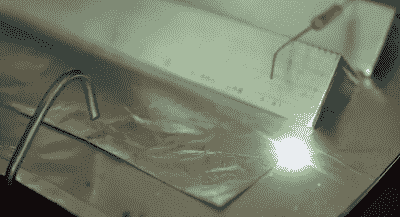

# 魔鬼在这个露天激光器的细节中

> 原文：<https://hackaday.com/2021/03/17/the-devil-is-in-the-details-for-this-open-air-laser/>

通常，我们认为激光是非常复杂和令人生畏的设备:充满气体的大玻璃管，仔细排列的镜子，防止整体熔化的冷却水，诸如此类。让我们甚至不要开始谈论固态激光器内部发生的黑魔法。但是正如[杰伊·鲍尔斯]在他最新的*等离子频道*视频中所展示的，[从零开始制造激光器实际上并没有你想象的那么困难](https://www.youtube.com/watch?v=YFkUOPl0tUw)。尽管这也不容易。

横向激发大气(TEA)激光器使用通过一对平行电极的高电压来激发标准大气压下空气中的氮气，因此不需要管子，也不需要抽真空。该装置从氮气中抖出如此多的紫外光子，以至于它甚至不需要任何镜子。事实上，你应该可以从五金店买到几乎所有茶叶激光器的零件。例如，Jay 最终使用的六边形电极实际上是末端被切掉的 8 毫米六角键。

An earlier version did more cooking than lasing.

当然，你需要相当大的功率来启动自制激光器。幸运的是，[Jay]最近的大部分实验都是用电视回扫变压器制成的廉价且易于制造的高压电源进行的。他已经制作了一个视频，一步一步地教你如何采购合适的部件并组装好所有的东西，如果你有兴趣在预算有限的情况下做 HV 实验，这个视频一定要看。

虽然原则上制造 TEA 激光器可能很容易，但实际上让它可靠地发射却完全是另一回事。在一些摆弄和几次错误的开始之后，[Jay]联系上了[著名的~~疯子~~激光爱好者【StyroPyro】](https://hackaday.com/2018/08/31/diy-long-distance-laser-telescope-does-some-damage/)，他根据自己的茶叶激光项目给他一些建议。这最终成为这些设备如何挑剔的一个很好的例子，因为他的构建只需要稍微调整一下就能产生一个坚固的光束。老实说，谁会想到用 500 号砂纸打磨六角键呢？

我们已经看到了多年来制造的许多茶叶激光器，从坚固的专业外观的装置到令人愉快的古怪手摇版本的 T2。)但[杰伊]组装的这款产品简单优雅，是我们最有可能在自家厨房餐桌上复制的产品。

 [https://www.youtube.com/embed/YFkUOPl0tUw?version=3&rel=1&showsearch=0&showinfo=1&iv_load_policy=1&fs=1&hl=en-US&autohide=2&wmode=transparent](https://www.youtube.com/embed/YFkUOPl0tUw?version=3&rel=1&showsearch=0&showinfo=1&iv_load_policy=1&fs=1&hl=en-US&autohide=2&wmode=transparent)

