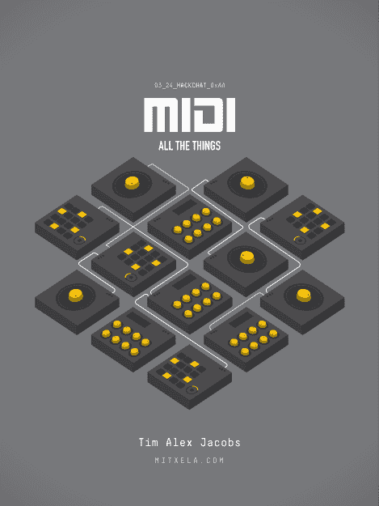

# MIDI 所有的东西黑客聊天

> 原文：<https://hackaday.com/2021/03/22/midi-all-the-things-hack-chat/>

加入我们太平洋时间 3 月 24 日星期三中午的[MIDI All Things Hack Chat](https://hackaday.io/event/178148-midi-all-the-things-hack-chat)与 [Tim Alex Jacobs](https://hackaday.io/hacker/189839-mitxela) ！

在我们这个技术复杂的世界里，标准是一把双刃剑。虽然它们显然使小部件和小玩意之间的互操作成为可能，但随着时间的推移，由于进步甚至市场力量的推动，它们也往往会偏离它们的初衷。如果你对标准有什么期望的话，那就是它们会产生其他标准。

一个经受住时间考验的标准是乐器数字接口(MIDI ),当然也有修改。自从 MIDI 在 20 世纪 80 年代初首次出现以来，它对音乐世界的影响怎么强调都不为过。MIDI 起源于一个竞争激烈的专有同步标准的狂野西部，很快成为连接电子乐器的事实上的接口。随着它的出现，它从严格意义上的专业级设备转向了低端市场的专业消费者和家庭用户，这在一定程度上得益于个人电脑革命。

蒂姆·亚历克斯·雅各布斯(Tim Alex Jacobs)在他的 YouTube 频道(T1)上更为人所知的名字可能是 Mitxela，他长期以来一直对将 MIDI 应用于音乐世界中不寻常的角落很感兴趣。我们已经看到他 [MIDI 化那些勉强称得上是乐器的东西](https://hackaday.com/2021/02/10/simple-slide-whistle-gets-a-midi-makeover/)，还制作了[一个复音合成器，小到可以放入 DIN 连接器](https://hackaday.com/2019/10/28/worlds-smallest-midi-synth-now-even-better/)的外壳中，这与 MIDI 标准紧密相关。Tim 本周加入了我们的 Hack Chat，谈论他使用 MIDI 的经历，并帮助我们理解在我们的构建中使用接口的所有方法。

 我们的黑客聊天是 [Hackaday.io 黑客聊天群发消息](https://hackaday.io/messages/room/2369)中的社区直播活动。本周，我们将在太平洋时间 3 月 24 日星期三中午 12:00 坐下来讨论。如果时区束缚了你，我们有一个[方便的时区转换器](https://www.timeanddate.com/countdown/generic?iso=20210324T12&p0=224&msg=MIDI+All+the+Things+Hack+Chat&font=cursive)。

点击右边的那个发言气泡，你会被直接带到 Hackaday.io 上的黑客聊天群，不用等到周三；随时加入，你可以看到社区在谈论什么。

