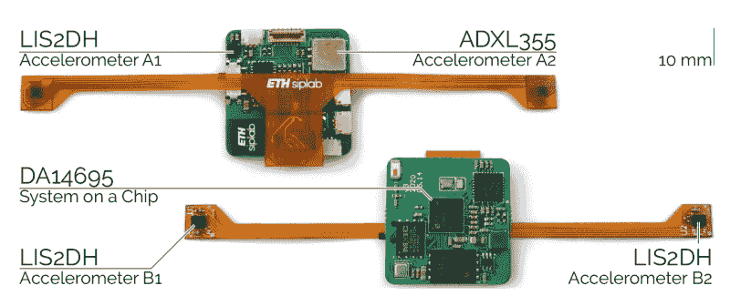

# 骨骼振动将打字带入 VR

> 原文：<https://hackaday.com/2021/03/16/bone-vibration-brings-typing-into-vr/>

虚拟现实越来越成为一种东西，现在我们有高质量的耳机和计算能力来产生有吸引力的环境。许多虚拟现实系统使用举在半空中的控制器，或基于摄像机的系统，跟踪肢体和手进行交互。然而，生产力场景通常需要长时间的长时间交互，这通常需要在允许身体间歇休息的表面上工作。为了帮助实现这一点，[苏黎世联邦理工学院的一组研究人员开发了 TapID](https://siplab.org/projects/TapID) ，包括将在本月晚些时候的 IEEE VR 2021 上展示的[预印论文](https://siplab.org/papers/vr2021-TapID.pdf) (PDF)。

TapID 由一个带两个运动传感器的腕带组成，每个手腕上戴一个。这使得 TapID 可以单独检测用户每个手指的敲击，这要归功于一种机器学习算法，它可以分析通过你骨骼系统的独特振动。这被证明对虚拟现实环境很有用，在虚拟现实环境中，用户可以使用他们的手指在虚拟键盘上打字，或者与表面上的虚拟物体进行交互，就像在现实世界中一样。这是一种传感器融合，具有现代 VR 头戴设备的功能，包括手部跟踪。TapID 腕带提供了细微运动的粒度和检测，而通过耳机安装的传感器和基于摄像头的检测，这种精度远远不够。

Test hardware includes 4 accelerometers. Two on flexible PCBs are the sensing hardware used by the system, the other two on the rigid PCB are used as a baseline during testing but do not contribute to the tap detection.

当显示器和真正的键盘更有触感、更便宜时，我们并不完全相信坐在虚拟环境中用假键盘打字的效用。然而，拥有一个可以精确确定单个手指交互的设备肯定会在 VR 中有应用。无论演示的用例是否可行，这项技术确实有效。

看到腕带外形令人兴奋。这让我想起了在非 VR 用途的智能手表中改善 tap 交互的可能性。我们设想用和弦键盘式手势来检测哪些手指在敲击，但不需要精确的位置。

那些虚拟现实界面的实验者可能会发现，对市场上已经出现的东西进行逆向工程是很有用的，正如我们之前所介绍的。或者，你可以简单地[建立你自己的！](https://hackaday.com/2016/12/29/making-vr-controllers-from-the-ground-up/)休息后的视频。

 [https://www.youtube.com/embed/cZl_Sn2dhZY?version=3&rel=1&showsearch=0&showinfo=1&iv_load_policy=1&fs=1&hl=en-US&autohide=2&wmode=transparent](https://www.youtube.com/embed/cZl_Sn2dhZY?version=3&rel=1&showsearch=0&showinfo=1&iv_load_policy=1&fs=1&hl=en-US&autohide=2&wmode=transparent)

