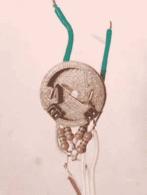

# 机械臂仅通过伺服系统就能达到惊人的精度

> 原文：<https://hackaday.com/2021/03/19/robot-arm-achieves-amazing-accuracy-with-just-servos/>

虽然我们很少有人在日常生活中需要机器人手臂，但它们是制造商的热门产品。通常，最容易获得的构建将一些 RC 伺服系统和 3D 打印部件扔在一起，由于选择的组件精度有限。[[Adam bck strm]决定采用这样的设计，并将其发挥到极致，然而，结果却令人震惊。](https://create.arduino.cc/projecthub/adamb314/robot-arm-built-with-completely-re-made-servos-15f1d2)

Part of the “special sauce” that makes this arm so capable is the custom optical encoders installed in the servo motors themselves.

[亚当]的第一个机器人手臂建造是一个很大的失望，当他为建造购买的伺服系统被证明是可怕的保持一个角度。在资金有限的情况下，他决定改进现有的设备，并在此过程中学习了大量的精确控制技术。[Adam]自学了如何使用业余硬件实现工业强度控制回路，在伺服系统中实现额外的编码器，除了位置之外还考虑速度和扭矩。通过伺服输出轴上的磁性编码器和电机内部手工构建的微型光学编码器，控制系统可以补偿齿隙，从而实现更高的精度。

结果是惊人的，[亚当]的机械臂能够在其运动范围内令人难以置信地平稳移动。也许这方面最好的演示是铅笔演示，机器人手臂小心翼翼地将铅笔芯穿过自动铅笔的尖端而不会折断。我们希望看到这些技术得到更多的应用；[我们想象他们会是像这样一个](https://hackaday.com/2020/08/14/robotic-arm-sports-industrial-design-3d-printed-cycloidal-gears/)建筑的一个很好的补充。休息后的视频。

 [https://www.youtube.com/embed/RkNgRe8X4iY?version=3&rel=1&showsearch=0&showinfo=1&iv_load_policy=1&fs=1&hl=en-US&autohide=2&wmode=transparent](https://www.youtube.com/embed/RkNgRe8X4iY?version=3&rel=1&showsearch=0&showinfo=1&iv_load_policy=1&fs=1&hl=en-US&autohide=2&wmode=transparent)

