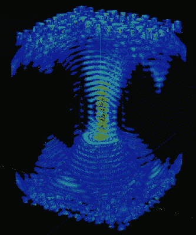
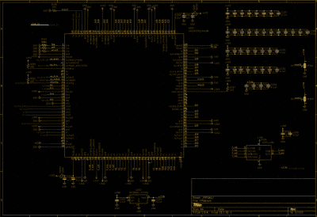
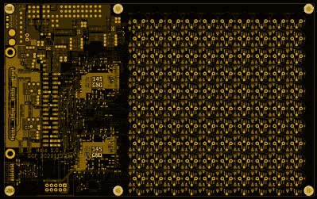

# 冲浪，一个泡沫聚苯乙烯球乘风破浪，创造了一个立体展示

> 原文：<https://hackaday.com/2021/03/19/surfs-up-a-styrofoam-ball-rides-the-waves-to-create-a-volumetric-display/>

我们是 POV 显示器的忠实粉丝，尤其是那些由 T2 制作的 3D 显示器。要做到这一点，他们需要比 2D 的兄弟们走得更快。[【danfoisy】建造了一个立体显示器](https://www.youtube.com/watch?v=hCC1C5KIeUA)，它不会在空间中移动 led 或任何其他数字显示器，也不会将光线投射到移动的表面上。所有在这里移动的都是一粒聚苯乙烯泡沫塑料，移动速度高达每秒 1 米。当试图刹车时，低质量当然有所帮助，但我们超越了自己。

[danfoisy]和儿子用[PhysicsGirl] 制作了一个声学漂浮器[套件，它启发了这个年轻人的关于声音的科学展览项目。参见【物理女孩】](https://www.tindie.com/products/Makerfabs/acoustic-levitator-kit/)的[视频，了解驻波中悬浮的解释。【danfoisy】偶然看到](https://www.youtube.com/watch?v=ABjRnSYw-4k)[在《自然》杂志](https://www.nature.com/articles/s41586-019-1739-5)上发表的一篇论文，这篇论文讲述了一种将一维驻波扩展为三维的立体显示器。该论文描述了使用超声换能器的相控阵列，每个换能器具有 40 kHz 的波形。

在阅读了论文并决定如何重现实验后，[danfoisy]建立了一个 2D 模拟，然后又建立了一个 3D 模拟来验证这种方法。我们对展示的物理和编程水平印象深刻，并且相同的代码贯穿于构建中。

[danfoisy]没有停止模拟，为每个 100 x 100 10 x 10 网格的传感器设计和制造控制板。每个网格由 2 个英特尔 Cyclone FPGAs 驱动，所有网格都由一个 Raspberry Pi Zero W 提供 3D 形状。显示器的体积为 100 mm x 100 mm x 145mm，泡沫球的定位精确到 0.01mm，尽管目前定位存在相当大的失真。

休息之后，请观看视频，了解模拟、设计和测试显示器的过程。其中有许多技巧，包括如何测试传感器的极性，以及如何使用 Python 脚本在 KiCad 中放置传感器和驱动器的网格。

 

但是等等，还有更多。在显示体积的每个上角有 3 瓦 RGB LEDs，通过 PWM 控制来照亮泡沫球，为每个体素添加 7 位颜色信息。最初的论文使用了相同的相控阵用于触觉反馈和可听声音，但[danfoisy]表示，现在实现这一点是行不通的。所有的[板文件和代码都在 GitHub](https://github.com/danfoisy/vdatp) 上，所以让我们知道你接下来会把它带到哪里。

 [https://www.youtube.com/embed/hCC1C5KIeUA?version=3&rel=1&showsearch=0&showinfo=1&iv_load_policy=1&fs=1&hl=en-US&autohide=2&wmode=transparent](https://www.youtube.com/embed/hCC1C5KIeUA?version=3&rel=1&showsearch=0&showinfo=1&iv_load_policy=1&fs=1&hl=en-US&autohide=2&wmode=transparent)

