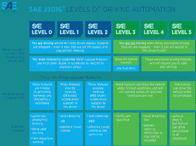

# 多层次的自主驾驶

> 原文：<https://hackaday.com/2021/05/28/the-many-levels-of-autonomous-motoring/>

多年来，我们一直被告知自动驾驶汽车将是下一个大事件，我们已经看到一些公司——是的，特斯拉，但也有其他公司——以“自动驾驶”和“自动驾驶”等名称宣传当前和计划中的功能。透过营销炒作来揭示真正的含义是很困难的。但是描述这些能力有一个标准，将它们分为 0 到 5 个级别。

现在，我们迎来了一条新闻，本田已经在日本的展厅中展示了少量车辆[，这些车辆据称是第一批商业化的 3 级自动驾驶汽车](https://global.honda/newsroom/news/2021/4210304eng-legend.html)。这种说法是有争议的，例如奥迪曾在他们的一款豪华轿车上短暂地拥有 3 级功能，尽管没有几个地方可以合法使用它。但是本田 Legend SENSING Elite 可以理直气壮地向公众宣称，它是目前市场上唯一一款具备这一功能的汽车。它有一组传感器来跟踪它的司机、位置和周围的路况。该车拥有“交通堵塞试点”模式，该模式“*使自动驾驶系统能够在特定条件下代替驾驶员驾驶车辆，例如当车辆在高速公路上拥堵时*。

听起来令人印象深刻，但什么是 3 级自动驾驶汽车，其他级别是什么？

## 这都是在水平

The SAE have produced [this handy char](https://www.sae.org/news/press-room/2018/12/sae-international-releases-updated-visual-chart-for-its-%E2%80%9Clevels-of-driving-automation%E2%80%9D-standard-for-self-driving-vehicles)t explaining the different levels.

汽车工程师协会，俗称 SAE，是汽车工业的标准机构。如果你曾经给你的汽车换过油，并注意到罐上有类似 SAE 10W-40 的粘度等级，你可能对它们很熟悉。他们的标准支撑着汽车的大部分功能，所以当提到自动驾驶汽车时，这是他们定义自动驾驶汽车的等级系统，这一点也不奇怪。

驾驶自动化由 SAE J3016 定义，它有从 0 到 5 的六个级别。0 级是正常的肉控车，几乎没有自动安全功能，5 级是反乌托邦科幻小说中的无方向盘自动出租车。

前三个级别要求驾驶员增加辅助级别，如自适应巡航控制和车道居中。级别 1 提供辅助技术，同时要求驾驶员保持控制，而级别 2 可以允许驾驶员将手从方向盘上拿开，但要求他们将注意力集中在道路上。

同时，最后三个级别允许增加车辆的完全自主性，第三级汽车，如本田，在某些情况下允许完全自主驾驶，驾驶员可以将注意力从道路上转移开，但在某些情况下，汽车需要他们再次控制。最后两个级别提供完全的自主性，第五级不需要任何人类驾驶控制。

## 当代人并不像市场宣传希望我们相信的那样有自我驱动力

新本田处于 3 级的重要特点是，这是第一次向公众出售汽车，这种模式下，司机不需要将注意力放在道路上。相比之下，广为宣传的[特斯拉自动驾驶仪](https://en.wikipedia.org/wiki/Tesla_Autopilot)仍处于 2 级，迄今为止要求司机保持警惕准备接管。[甚至这家加州汽车制造商即将推出的“全自动驾驶”技术也仍处于 2 级](https://en.wikipedia.org/wiki/Tesla_Autopilot)，将误导性语言的界限弯曲到了临界点。我们都读过特斯拉自动驾驶出问题的故事，但这些故事总是涉及到未能尊重这一点的司机。因此，本田抢在了竞争对手的前面，但鉴于许多国家仍然禁止 3 级车或只限于测试，这与其说是商业上的胜利，不如说是公关上的胜利。

SAE [已经制作了一个方便的图表来显示不同级别](https://www.sae.org/news/press-room/2018/12/sae-international-releases-updated-visual-chart-for-its-%E2%80%9Clevels-of-driving-automation%E2%80%9D-standard-for-self-driving-vehicles)的微妙之处，并且它很好地解释了它们。也许我们还需要一段时间才能在现实世界中看到更高的水平，但至少当我们看到时，它应该有助于打破销售行话。