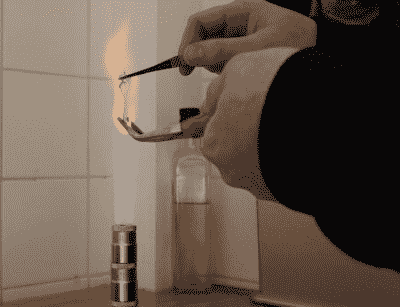

# 复制复制机:2021 年维修圆筒留声机

> 原文：<https://hackaday.com/2021/03/20/reproducing-a-reproducer-servicing-a-cylinder-phonograph-in-the-year-2021/>

[Jan Derogee]前几天拿出他的留声机，想听一个有 100 多年历史的蜡筒颤声“It 's a Long Way to Tipperary”，但找不到复制机——这是一个小的圆形钻头，用于固定唱针，并将凹槽驱动的振动传递到薄振膜的中心，该振膜振动到喇叭中。这无疑是圆筒留声机最重要的部分。当你丢失了你的复制机，你会怎么做？你可以在易趣上搜索替代品，但这远没有你自己复制你的复制品有趣。

 传统上，振膜由云母或赛璐珞制成，爱迪生盘式留声机使用七层浸过虫胶的宣纸。复制机通常在薄膜周围有一个 Dagwood 夹层垫圈，但它们不必如此复杂才能工作——一个单一的坚固薄膜就可以了。问问[Jan]就知道了，他制作了一个新的复制机，配有 3D 打印的外壳、手拉玻璃唱针和用于振动膜的一次性铝箔盘。

我们很难说出哪一部分看起来更有趣——在一堆扳手套筒聚焦的火焰下，在煤气灶上拉伸玻璃碎片，或者切开自行车内胎，使用汽车千斤顶在 3D 打印的模具上挤压铝成型。整个视频非常棒，你可以在休息后看看。

正如[Jan]在视频和项目网站上指出的，玻璃触控笔应该真正由硼硅酸盐制成，因为它比普通的钠钙玻璃更坚硬(这就是为什么[他们经常用它制作疫苗瓶](https://hackaday.com/2020/12/28/the-high-tech-valor-glass-vials-used-to-deliver-the-coronavirus-vaccine/))。普通玻璃可以工作，达到可拉阶段需要更少的时间和气体，所以这就是[Jan]在视频中使用的，但它会磨损得更快。幸运的是，这是一个临时的解决方案，因为[Jan]一替换，丢失的复制品就出现了。

Want to see a stylus bounce around in the groove up close? [[Ben Krasnow] used a scanning electron microscope to make some groovy animations](https://hackaday.com/2015/06/16/phonographs-through-the-eye-of-an-electron-microscope/).

 [https://www.youtube.com/embed/FNFQkcbY5cQ?version=3&rel=1&showsearch=0&showinfo=1&iv_load_policy=1&fs=1&hl=en-US&autohide=2&wmode=transparent](https://www.youtube.com/embed/FNFQkcbY5cQ?version=3&rel=1&showsearch=0&showinfo=1&iv_load_policy=1&fs=1&hl=en-US&autohide=2&wmode=transparent)

