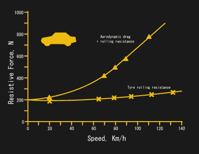
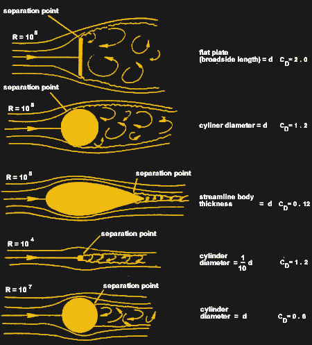
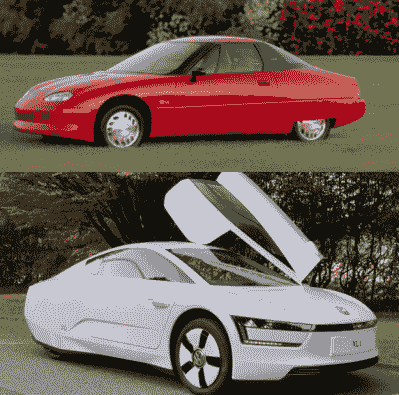
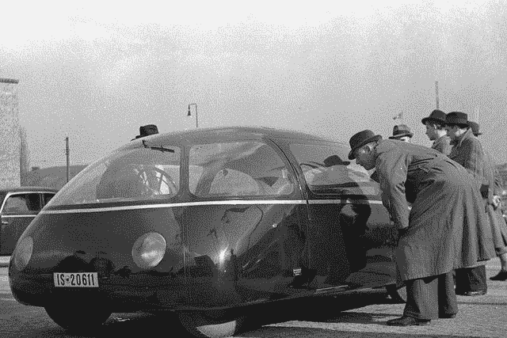

# 看看有史以来最符合空气动力学的汽车

> 原文：<https://hackaday.com/2021/04/20/a-look-at-the-most-aerodynamic-cars-ever-built/>

无论是汽油、柴油还是电动汽车，汽车制造商都在努力让他们的汽车行驶尽可能多的里程。大部分努力都是为了优化空气动力学。降低阻力是研发最新高效车型的工程师的主要关注点，多年来催生了大量创新设计。我们将看看为什么减少阻力如此重要，以及从这些流线型努力中产生的一些独特的车辆。

## 空气阻力

A graph showing the rise in aerodynamic drag and rolling resistance as speed increases. Note the much higher contribution of aerodynamic drag, particularly at highway speeds.

无论你是在寻找更低的燃油经济性，还是只是想让你的电池尽可能多的行驶里程，阻力都是你的敌人。在空气中推动一辆车需要做功，你走得越快，空气反推得越多。不幸的是，阻力与速度的平方成正比，所以当速度增加一倍时，阻力会增加四倍。在大约 20 公里/小时(12.4 英里/小时)以上，空气阻力是对汽车最大的阻力，随着速度的增加，它超过了滚动阻力。

当然，可以采取措施来减少这种阻力。创造一辆外形更光滑的汽车会有所帮助，它可以微妙地将空气在前面分开，让它在后面轻轻地重新结合。减少突起的尺寸和数量会有所帮助，减少汽车的整体正面面积也是如此。仔细关注这些因素，汽车制造商有可能大大减少阻力，并随之提高效率。

汽车的滑溜性经常用阻力系数来谈论，或 C [d] 。这是一个无量纲系数，用于量化给定物体通过流体(如水或空气)时产生的阻力。在一些分析中，考虑 C [d] A 也很重要——阻力系数乘以车辆的正面面积。两辆车在设计上可以是同样的流线型，但是如果一辆比另一辆大，自然会经历更多的阻力。

Drag coefficients of various basic shapes. Note that the way the air comes back together around an object is important, not just the front-on profile.

作为一个指南，[一个平板试图强行穿过空气，其 C [d] 为 1.28](https://www.grc.nasa.gov/www/k-12/airplane/shaped.html) ，而一颗亚音速子弹的速度可能为 0.295。典型的现代轿车和双门轿车的风阻系数约为 0.25 至 0.3，而 SUV 由于其较高、较大的设计，风阻系数通常在 0.35 至 0.45 之间。注重下压力的跑车自然会有更高的 C [d] 数值，因为空气动力学元素会产生诱导阻力。

1999 年的本田 Insight，一款早期的混合动力车，在这个范围的底部，声称 C [d] 为 0.25，这个数字在当时被认为是一流的。然而，该领域的新竞争对手在这方面有了进一步的改进。梅赛德斯-奔驰 S 350 BlueTec 的得分为 0.24，2012 年推出的特斯拉 Model S 也是如此。从那以后，新款保时捷 Taycan 的 C [d] 仅为 0.22，而新款 2021 年款特斯拉 Model S 的这一数值仅为 0.208。然而，最新的梅赛德斯 EQS 两者都有，其数值仅为 0.2。

## 不仅仅是你的长相

有趣的是，虽然 20 世纪 90 年代的早期混合动力车采用了明显的俯冲式流线型设计，但现代汽车却没有采用这种不成形的蛋形，让这些数字黯然失色。通常，空气动力学增益可以通过以微妙的方式仔细塑造气流来找到，而不是专注于汽车整体的宏观形状。通过技术进步可以获得其他收益；例如，电动汽车取消了前面的大型散热器，因此保险杠更加流线型。

Streamlined designs are common on efficiency-focused concept cars like the GM EV1 and VW XL1\. Covered rear wheels are one of the most common choices to attempt to cut down on obvious sources of drag, albeit at the expense of easy tyre replacement.

然而，量产车在设计选择上自然受到限制，这迫使汽车制造商在流线型方面做出妥协。一些优化很容易，比如用低剖面鲨鱼鳍取代鞭状天线，或者给车轮增加空气动力学罩。其他的就更难了——法规规定侧视镜在大多数司法管辖区是强制性的，而许多汽车制造商推动采用摄像头来剃掉突起以最小化阻力。即使看起来很小的规则，如大灯到地面的距离或发动机罩高度的规定，也会对设计产生重大影响。顾客对车内舒适度和行李空间的期望也是一个问题。因此，一些公布的最低阻力数值来自实验性概念车。

1996 年的通用汽车 EV1 因其低得惊人的 C T2 d T3 仅为 0.19 而引人注目。这是通用汽车公司试图为大众制造一种真正的、可用的电动汽车。该车吸引了有限租赁计划参与者中的铁杆粉丝，但受限于其有限的范围和双座内饰。这些汽车在租期结束时被召回，绝大多数都被撞坏了。同样，大众 XL1 在 2013 年发布时匹配 EV1 的 0.19 的 C [d] 。旨在从主席弗雷德里克皮赫紧凑的简报拧出一升柴油 100 公里。装配了一台 35 千瓦的两缸发动机和一台 20 千瓦的电动机，量产版在真实世界的测试中行驶了 0.9 升/100 公里。这款车的生产量只有 200 辆，没有侧视镜或后视镜，也没有后挡风玻璃。乘客一前一后地坐在一起，而不是并排，以最小化正面面积，实现最高效率。更进一步来说，[像参加世界太阳能挑战赛](https://hackaday.com/2020/12/21/world-solar-challenge-over-30-years-of-engineering-competition/)的车辆都是为最佳性能而设计的，以充分利用有限的太阳能。1987 年的 Sunraycer 参赛作品采用流线型车身，C [d] 仅为 0.125，[迫使驾驶员几乎仰卧在车内。](https://auto.howstuffworks.com/sunraycer.htm)同样，壳牌生态马拉松的参赛作品也遵循着同样的理念，2018 年的生态跑者 8 以 0.045 的成绩获得冠军。

## 20 世纪 30 年代是这种俯冲造型的绝佳时期

The Schlörwagen (also known as the “Göttinger Egg”) was a design concept far ahead of its time, based on a rear-engined Mercedes chassis and built in the 1930s.

然而，简化汽车的历史远早于 1973 年后的燃料危机，当时美国人开始成群结队地购买紧凑型汽车。让物体在空中滑行背后的基本空气动力学概念很久以前就被应用了，20 世纪 30 年代的流线型狂热触及了从火车到汽车到烤面包机的所有东西。Tatra T77A 是第一批专注于空气动力学设计的汽车之一，但更先进的设计也取得了成果。

或许这个早期时代最极端的设计是一款名为 schlrwagen 的汽车，以其设计师 Karl Schlö的名字命名。原型基于后置引擎的梅赛德斯底盘，[据报道 C [d] 为 0.15。](https://www.wired.com/2014/09/german-aerodynamic/)它通过当时被认为是疯狂的设计选择实现了这一目标；整辆车被塑造成一个光滑的蛋形，突起最少，因此被称为“哥廷根蛋”。它不仅完全封闭了后轮，还封闭了前轮，需要一个 2.10 米宽的车身，这在当时被认为是可笑的超大尺寸。窗户安装得尽可能平齐，以减少对空气的任何干扰，使汽车看起来远远领先于其时代。然而，尽管这款车的设计令人印象深刻，但它从未被认真考虑过投入生产。

总的来说，随着电动汽车领域里程之战的升温，我们很可能会看到主要汽车制造商的未来车型继续保持下降趋势。由于监管机构在有关镜子和其他技术的规则上进展缓慢，可能会进一步提高数字，因此仍有大量收益。也就是说，消费者将继续要求最低标准的舒适性、空间和安全性，这意味着我们不太可能在短期内驾驶尖尖的泪珠车。