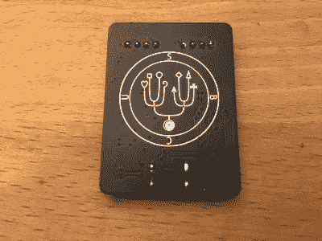
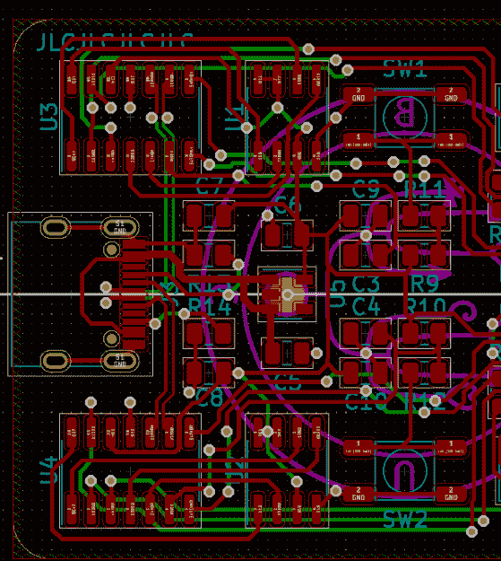

# 被诅咒的 USB-C:当插头方向很重要时

> 原文：<https://hackaday.com/2021/03/22/cursed-usb-c-when-plug-orientation-matters/>

USB-C 插头的卖点之一是，据说没有办法错误地插入它。正如[皮姆·德·格鲁特]用一个被诅咒的 USB-C 2.0 设备展示的那样，当涉及 USB-C 中的 USB 2.0 兼容性时，现实有点复杂。他制作了一个 PCB，优雅地展示了问题的简单性，具有两个 led。USB-C 插头只有一个方向会导致其中一个 led 亮起绿色，而另一个方向会使两个 led 都闪烁红色。

Sigil on the back of the cursed USB-C 2.0 device, by Pim de Groot.

这种行为的原因很简单:正如[Pim]解释的那样，尽管 USB-C 插头只有一对用于 USB 2.0 连接的数据线(D+/-)，但接收器在其引脚的两侧复制了这些数据线，引出了两对 D+/-线。通常情况下，您会将这些线对中的匹配线连接在一起，以确保无论插头方向如何，都有一致的行为，但您不必这样做。

通过将每个 USB 2.0 数据对引导到其自己的 SAMD11C MCU，只有一个 MCU 连接到 USB，导致连接的 MCU 闪烁 led。只要增加一点电路，就可以检测插头插入的方向，并在单个 MCU 系统中使用这一信息，改变其行为。虽然乍一看这似乎只不过是一个有趣的聚会把戏，但它也提供了对 USB-C 2.0 设备的可能故障模式的洞察力，其中由于断裂的迹线或焊盘，只有一个插头方向工作。

Board view of [Pim]’s Cursed USB-C 2.0 Device.

(标题图片:被诅咒的 USB-C 2.0 设备，作者皮姆·德·格鲁特)