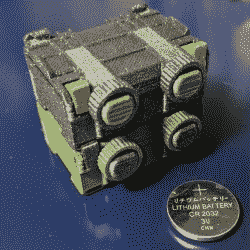

# 给喜欢小盒子的人:专为你设计的 3D 打印设计

> 原文：<https://hackaday.com/2021/03/28/to-lovers-of-small-boxes-a-3d-printable-design-just-for-you/>

Print them at 50% scale for a far cuter (and much less useful) result.

[Jacob Stanton]设计的 [3D 打印、堆叠和锁定盒](https://www.thingiverse.com/thing:4727313)是可制造性设计(DFM)的一个很好的例子。微堆栈显示了良好的 DFM 是如何将制造方法的优缺点考虑在内的。[Jacob]的盒子是专门为 3D 打印设计的，无论是有人正在制作一个还是几十个，这都是很好的设计。

这些盒子具有坚固的部件，无需任何支撑、紧固件或后处理即可打印。此外，由于没有两台 3D 打印机是完全相同的，有些打印机比其他打印机打印得更好，因此零件的设计也非常宽容宽松的公差。即使在一台没有达到预期效果的打印机上，这种设计也应该可以工作。这些盒子还有一个很好的堆叠功能:坚固的燕尾榫结合滑动标签意味着一旦盒子堆叠起来，它们就不会意外分开，除非在这个过程中有什么东西打破了。

设计的盒子足够大，可以存放 AA 电池。不适合你吗？不需要支持的 3D 打印设计的一个好处是，统一放大或缩小模型的大小以满足个人的需求，而不会在此过程中引入任何打印复杂性。您可以在下面的视频中观看[Jacob]组装和演示他的设计。

 [https://www.youtube.com/embed/S5n9HQzOJZc?version=3&rel=1&showsearch=0&showinfo=1&iv_load_policy=1&fs=1&hl=en-US&autohide=2&wmode=transparent](https://www.youtube.com/embed/S5n9HQzOJZc?version=3&rel=1&showsearch=0&showinfo=1&iv_load_policy=1&fs=1&hl=en-US&autohide=2&wmode=transparent)

随着 3D 打印机变得越来越普遍，按需打印物体的能力导致了专门的存储和组织解决方案，如[可堆叠表面贴装元件存储](https://hackaday.com/2020/10/05/spare-smd-storage-with-stacking-smt-tape-reels/)，甚至是由空丝线轴制成的[组织器](https://hackaday.com/2017/11/02/creating-modular-storage-out-of-used-filament-spools/)。