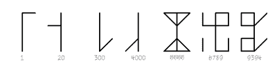

# 哦，兄弟，你看到这个西多会钟了吗

> 原文：<https://hackaday.com/2021/03/29/oh-brother-would-you-look-at-this-cistercian-clock/>

当谈到 RGB 时钟时，我们开始认为我们已经看到了一切，但是[andrei.erdei]找到了一条快速回到我们心中的道路。[这个时钟是一个古老数字系统的数字表示，由 13 世纪的西多会僧侣使用](https://www.instructables.com/Cistercian-Digital-Clock/)在我们今天所知道和喜爱的印度-阿拉伯系统接管之前。这是一个紧凑的系统(至少对于数字 1-9，999 来说是这样),它产生的数字看起来有点像发疯的 16 段显示器。

Image via [Wikipedia](https://en.wikipedia.org/wiki/Cistercian_numerals)

每个数字中间都有一条线，系统使用它周围的四个象限来显示从右上角开始的一位、十位、百位和千位。

[andrei]修改了系统来显示时间，将十个小时分配给左下角的千位象限，将小时分配给右下角的百位象限，将十分钟分配给左上角，将分钟分配给右上角。棘手的部分是，该系统没有零，但[andrei]只是将适当的象限变暗以表示零。

计时由 ESP-01 完成，包括中间位在内共有 31 个 RGB LEDs，像一个合适的数字时钟一样闪烁，并兼作秒针。像往常一样，[安德烈]已经提供了你需要的一切来为自己建造一个。我们承认这个系统需要一点时间来学习，但是即使你从来没有费心去学习，这也会成为一个很好的谈资或者坐下来凝视的焦点。休息之后，花一分钟来看看它的运行情况。

我们喜欢一个好的时钟，不管它是如何工作的。[埋头研究这个由音叉驱动的时钟](https://hackaday.com/2021/02/13/tuning-fork-keeps-this-throwback-digital-clock-ticking/)。

 [https://www.youtube.com/embed/cE0lxmV3CmA?version=3&rel=1&showsearch=0&showinfo=1&iv_load_policy=1&fs=1&hl=en-US&autohide=2&wmode=transparent](https://www.youtube.com/embed/cE0lxmV3CmA?version=3&rel=1&showsearch=0&showinfo=1&iv_load_policy=1&fs=1&hl=en-US&autohide=2&wmode=transparent)

